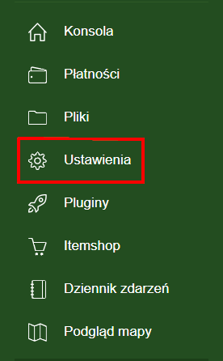
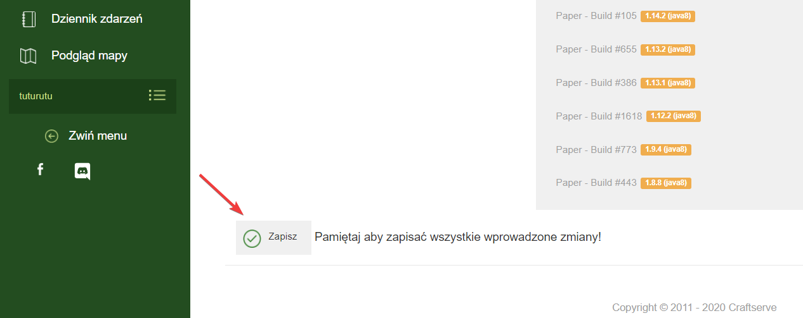
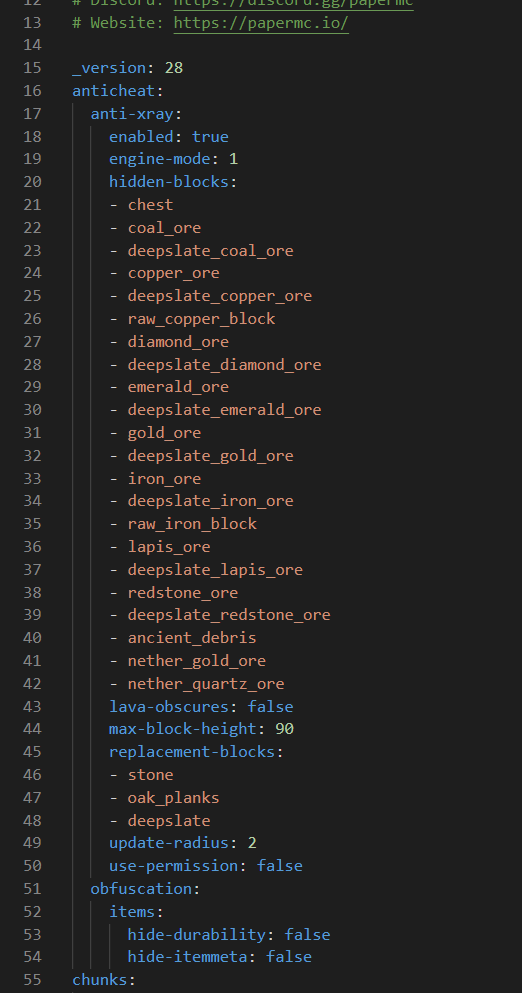
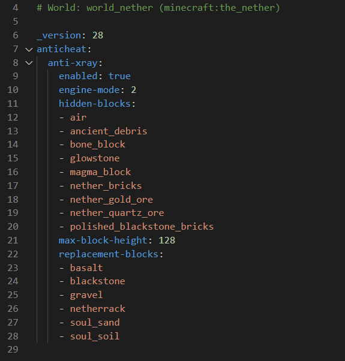

## Wybór odpowiedniego silnika
Aby używać anty-xray'a bez konieczności wgrywania dodatkowych pluginów, należy wgrać na nasz serwer silnik `Paper` lub jego forki (**Purpur, Yatopia**)
oraz wybrać wersję swojego serwera. Aby zrobić to na hostingu [**Craftserve**](https://craftserve.pl/), należy przejść do zakładki **Ustawienia** *(Zdjęcie 1)*
a następnie wybrać `Silniki`. Aby wybrać silnik, który nas interesuje, należy przejść do zakładki `Spigot - alternatywne wersje`, wybrać go i zatwierdzić *(Zdjęcie 2)*. Następnie należy zrestartować serwer.

 

## Opis trybów
* `engine-mode: 1`: Rudy zostają zamienione na kamień, ale tylko te, które nie sąsiadują z blokiem powietrza lub cieczą (wodą lub lawą). Po włączeniu x-ray'a widać tylko te rudy, które nie mogły zostać ukryte przez bloki stojące obok.

* `engine-mode: 2`: Rudy nie są ukrywane, lecz kamień, andezyt, dioryt są zamieniane na losowe złoża rud, których gracz nie jest w stanie rozróżnić od tych prawdzinych. Oszukane rudy zamieniają się na bloki prawdziwe, gdy blok obok nich znajdzie się blok powietrza lub cieczy. Gdy na serwerze występują lagi, czasami można odkryć losowe rudy które pojawiają się przy kopaniu, jednak gracz nie będzie w stanie ich wydobyć.

### Wybrane tryby dla normalnego świata

### Wybrane tryby dla netheru


## Konfiguracja plików `1.19`
Istnieją 4 pliki, w których konfiguruje się antyxray'a:
* `paper-world-defaults` - Znajduje on się w folderze **config** w głównym katalogu serwera. Znajdują się tu ustawienia dla wszystkich światów tzn. jeśli dodamy tu jakiś blok, to będzie on ukrywany w normalnym świecie, netherze itp. Domyślnie po wejściu do pliku w 16 linijce powinniśmy zobaczyć poniższy tekst:
```yml
anticheat:
  anti-xray:
    enabled: false
    engine-mode: 1
    hidden-blocks:
    - copper_ore
    - deepslate_copper_ore
    - gold_ore
    - deepslate_gold_ore
    - iron_ore
    - deepslate_iron_ore
    - coal_ore
    - deepslate_coal_ore
    - lapis_ore
    - deepslate_lapis_ore
    - mossy_cobblestone
    - obsidian
    - chest
    - diamond_ore
    - deepslate_diamond_ore
    - redstone_ore
    - deepslate_redstone_ore
    - clay
    - emerald_ore
    - deepslate_emerald_ore
    - ender_chest
```
* `paper-world`  
  * Z folderu **world**
  * Z folderu **world_nether**
  * Z folderu **world_the_end**  

  W każdym z powyższych plików znajdują się ustawienia dla oddzielnych światów. Jeden nie wpływa w żaden sposób na działanie drugiego.

## Zalecane ustawienia dla Engine-mode: 1
### Dla `paper-world-defaults`
```yml
anticheat:
  anti-xray:
    enabled: true
    engine-mode: 1
    hidden-blocks:
    - chest
    - coal_ore
    - deepslate_coal_ore
    - copper_ore
    - deepslate_copper_ore
    - raw_copper_block
    - diamond_ore
    - deepslate_diamond_ore
    - emerald_ore
    - deepslate_emerald_ore
    - gold_ore
    - deepslate_gold_ore
    - iron_ore
    - deepslate_iron_ore
    - raw_iron_block
    - lapis_ore
    - deepslate_lapis_ore
    - redstone_ore
    - deepslate_redstone_ore
    - ancient_debris
    - nether_gold_ore
    - nether_quartz_ore
    lava-obscures: false
    max-block-height: 90
    update-radius: 2
    use-permission: false
```
### Dla `paper-world`
- z `world`
```yml
anticheat:
  anti-xray:
    enabled: true
    engine-mode: 1
    hidden-blocks:
    - chest
    - coal_ore
    - deepslate_coal_ore
    - copper_ore
    - deepslate_copper_ore
    - raw_copper_block
    - diamond_ore
    - deepslate_diamond_ore
    - emerald_ore
    - deepslate_emerald_ore
    - gold_ore
    - deepslate_gold_ore
    - iron_ore
    - deepslate_iron_ore
    - raw_iron_block
    - lapis_ore
    - deepslate_lapis_ore
    - redstone_ore
    - deepslate_redstone_ore
    lava-obscures: false
    max-block-height: 64
    update-radius: 2
    use-permission: false
```
- z `world_nether`
```yml
anticheat:
  anti-xray:
    enabled: true
    engine-mode: 1
    hidden-blocks:
    - ancient_debris
    - nether_gold_ore
    - nether_quartz_ore
    max-block-height: 128
```
- z `world_the_end`
```yml
anticheat:
  anti-xray:
    enabled: false
```
## Zalecane ustawienia dla Engine-mode: 2
### Dla `paper-world-defaults`
```yml
anticheat:
  anti-xray:
    enabled: true
    engine-mode: 2
    hidden-blocks:
    - air
    - copper_ore
    - deepslate_copper_ore
    - raw_copper_block
    - diamond_ore
    - deepslate_diamond_ore
    - gold_ore
    - deepslate_gold_ore
    - iron_ore
    - deepslate_iron_ore
    - raw_iron_block
    - lapis_ore
    - deepslate_lapis_ore
    - redstone_ore
    - deepslate_redstone_ore
    - ancient_debris
    - bone_block
    - glowstone
    - magma_block
    - nether_bricks
    - nether_gold_ore
    - nether_quartz_ore
    - polished_blackstone_bricks
    lava-obscures: false
    max-block-height: 64
    replacement-blocks:
    - chest
    - amethyst_block
    - andesite
    - budding_amethyst
    - calcite
    - coal_ore
    - deepslate_coal_ore
    - deepslate
    - diorite
    - dirt
    - emerald_ore
    - deepslate_emerald_ore
    - granite
    - gravel
    - oak_planks
    - smooth_basalt
    - stone
    - tuff
    - netherrack
    - soul_sand
    - soul_soil
    - basalt
    - blackstone
    update-radius: 2
    use-permission: false
```
### Dla `paper-world`

- z `world`
```yml
anticheat:
  anti-xray:
    enabled: true
    engine-mode: 2
    hidden-blocks:
    - air
    - copper_ore
    - deepslate_copper_ore
    - raw_copper_block
    - diamond_ore
    - deepslate_diamond_ore
    - gold_ore
    - deepslate_gold_ore
    - iron_ore
    - deepslate_iron_ore
    - raw_iron_block
    - lapis_ore
    - deepslate_lapis_ore
    - redstone_ore
    - deepslate_redstone_ore
    lava-obscures: false
    max-block-height: 64
    replacement-blocks:
    - chest
    - amethyst_block
    - andesite
    - budding_amethyst
    - calcite
    - coal_ore
    - deepslate_coal_ore
    - deepslate
    - diorite
    - dirt
    - emerald_ore
    - deepslate_emerald_ore
    - granite
    - gravel
    - oak_planks
    - smooth_basalt
    - stone
    - tuff
    update-radius: 2
    use-permission: false
```
- z `world_nether`
```yml
anticheat:
  anti-xray:
    enabled: true
    engine-mode: 2
    hidden-blocks:
    - air
    - ancient_debris
    - bone_block
    - glowstone
    - magma_block
    - nether_bricks
    - nether_gold_ore
    - nether_quartz_ore
    - polished_blackstone_bricks
    max-block-height: 128
    replacement-blocks:
    - basalt
    - blackstone
    - gravel
    - netherrack
    - soul_sand
    - soul_soil
```
- z `world_the_end`
```yml
anticheat:
  anti-xray:
    enabled: false
```

## Jak to powinno wyglądać w plikach
- `paper-world-defaults` <br>


- `paper-world` (tutaj nether) <br> 



