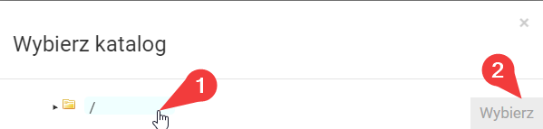

# Instalacja modpacka BetterMC (Fabric)

### Wymagania

* Serwer Minecraft wspierający modyfikacje Fabric (w przypadku Craftserve: pakiet Diamond, KM)

### Instalacja

1. Usuń obecne pliki map z serwera. Można posłużyć się funkcją **Formatuj** -> **Wszystkie pliki**, znajdziesz ją w ustawieniach.
*Uwaga: Formatowanie serwera spowoduje utratę wszystkich plików, w tym wszystkich elementów zapisanych na mapie.*

    
2. Wybierz odpowiedni silnik Fabric dla wersji modpacka BetterMC (w tym przypadku: 1.19.2).
   - Silnik Fabric możesz ustawić w zakładce **Ustawienia** -> **Silniki** -> **Cauldron** panelu Craftserve.
   
     
   - Należy pamiętać o zapisaniu silnika po jego wyborze. W tym celu udaj się na dół strony i kliknij przycisk **Zapisz**.
   
     
3. Pobierz server pack BetterMC z [**TEJ STRONY**](https://www.curseforge.com/minecraft/modpacks/better-mc-fabric/files).

    
4. Pobranego zipa wgraj na serwer przy użyciu [FTP](ftp.md).
5. Przejdź do panelu Craftserve i wybierz zakładkę **Pliki**.
6. Odszukaj wgrany plik zip oraz wybierz przy nim opcję **Rozpakuj**.

    
    - Jako folder docelowy wybierz **/**.

      
7. Po rozpakowaniu możesz usunąć plik zip.
8. W głównym folderze serwera powinien pojawić się rozpakowany folder z paczką BetterMC, otwórz go.
9. Przenieś pliki znajdujące się w tym folderze do głównego folderu serwera. Głównie chodzi o foldery **mods**, **config**, **defaultconfigs** oraz plik **server.properties**.
    - Możesz skorzystać z funkcji **Przenieś** przy każdym z tych elementów, wybierając **/** jako folder docelowy.

      
10. Usuń folder z rozpakowaną paczką BetterMC, nie ma w nim już ważnych elementów.
11. Uruchom serwer i poczekaj na jego uruchomienie.

### Uwagi
- Wejście na serwer możliwe jest tylko jeśli gracz ma wgraną u siebie tę samą wersję modpacka BetterMC. 
- W przypadku problemów z uruchomieniem serwera, sprawdź czy wersja silnika Fabric jest zgodna z wersją modpacka BetterMC.
- [Strona modpacka BetterMC](https://www.curseforge.com/minecraft/modpacks/better-mc-fabric)
