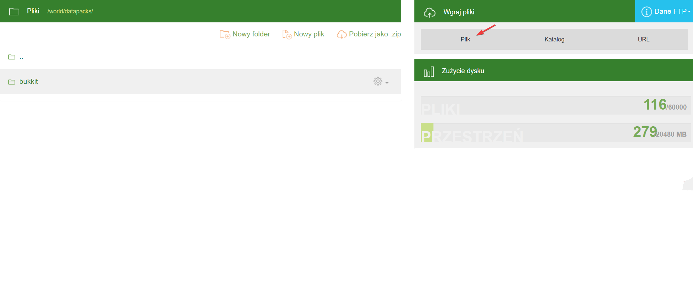
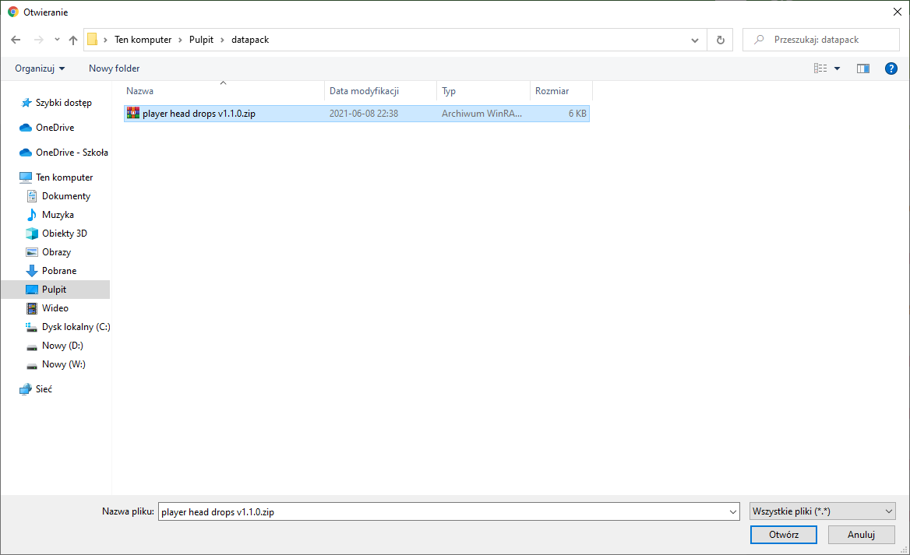
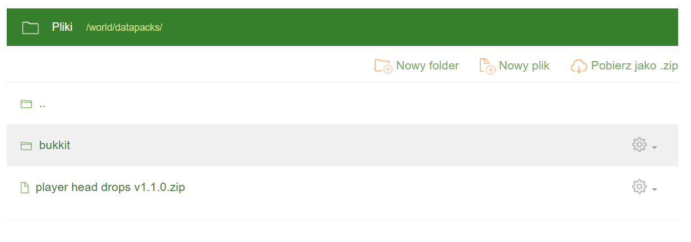

# Instalacja datapacków
Żeby wgrać na serwer datapacka, musimy go najpierw skądś pobrać. Znajdziemy je m. in. na stronach [Planet Minecraft](https://www.planetminecraft.com/data-packs/), [Vanilla Tweaks](https://vanillatweaks.net/picker/datapacks/) oraz [VoodooBeard](http://mc.voodoobeard.com/).

Następnie w plikach serwera otwieramy folder **world**, a w nim folder **datapacks**. Tam wgrywamy nasze datapacki **w formacie .zip**. Żeby to zrobić, należy nacisnąć przycisk **Plik** z zakładki **Wgraj pliki**.

Następnie wybieramy naszego datapacka i klikamy **otwórz**.

Nasz datapack po tym powinien pojawić się w panelu serwera.

Następnie włączamy serwer i wpisujemy komendę **/minecraft:reload** lub jeśli taka nie istnieje to **/reload**.

## Datapacki można również wgrać za pomocą [FTP](https://github.com/Craftserve/docs/blob/master/ftp.md). Większość osób uważa tę formę wgrywania plików za wygodniejszą.
