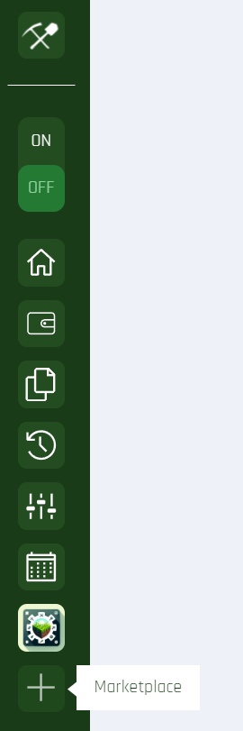
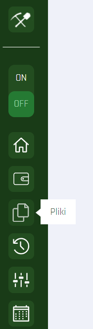
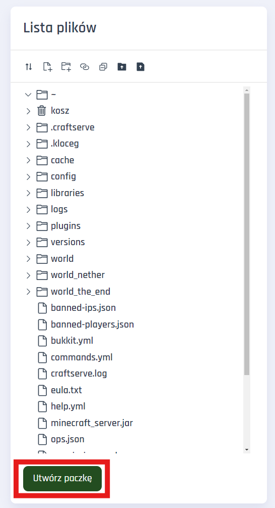
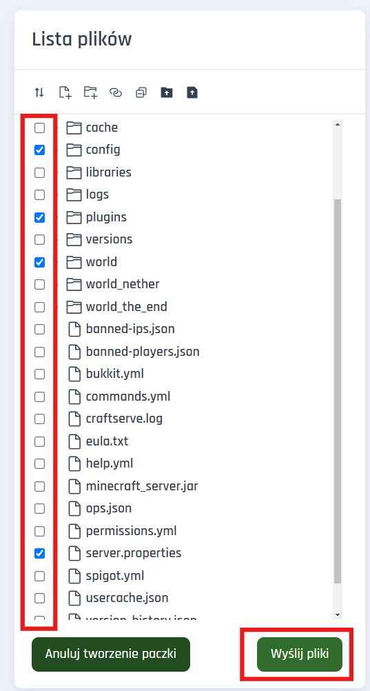
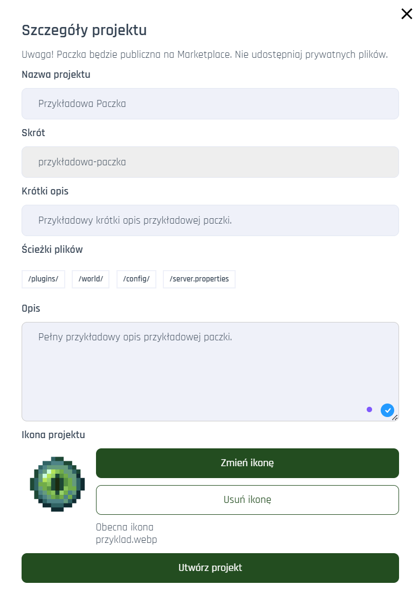

# Craftserve Marketplace

## Czym jest Marketplace?
Marketplace to miejsce, gdzie użytkownicy Craftserve mogą publikować swoje mody, pluginy, mapy, paczki modyfikacji/pluginów/zasobów, konfiguracje serwerów, silniki i więcej.

## Jak zainstalować coś z Marketplace?

1. Otwórz **Marketplace**
    
2. Wybierz interesujący Cię zasób na Marketplace, np. plugin. W przykładzie poradnika będzie to aplikacja panelowa CSRV Minecraft Manager.
    
3. Kliknij **Zainstaluj najnowszą wersję** lub jeśli potrzebujesz danego zasobu na starszą wersję gry (ponieważ jest to na przykład modyfikacja), kliknij **Lista wersji** i wybierz interesującą Cię wersję.
4. Poczekaj na instalację.
5. Gotowe!

## Jak zrobić i opublikować paczkę na Marketplace?

1. Ustal zawartość swojej publikowanej paczki oraz upewnij się, że wszystkie pliki które mają się w niej znaleźć, są na Twoim serwerze.
2. Przejdź do zakładki **Pliki** na swoim serwerze.
    
3. Kliknij przycisk **Utwórz paczkę** pod listą Twoich plików.
     
4. Zaznacz pliki i foldery, które mają znaleźć się w paczce i kliknij **Wyślij pliki**. Zostanie wyświetlone okno publikowania paczki.
    
5. W wyświetlonym oknie szczegółów projektu uzupełnij wszystkie pola. Nadaj ciekawy tytuł, napisz zachęcający do pobrania opis, dodaj ładną ikonę, itp.
    
6. Gdy wszystko będzie zrobione, kliknij "Utwórz projekt".
7. Gotowe!
