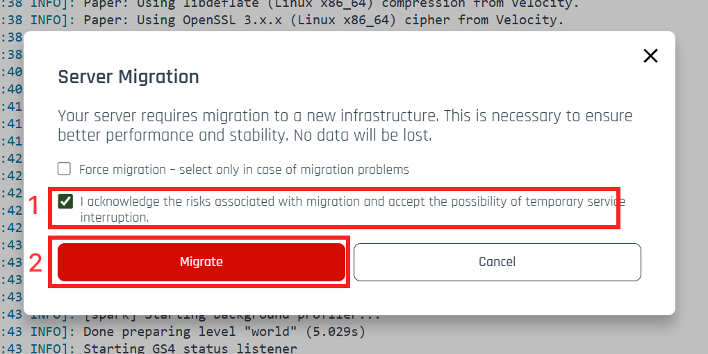
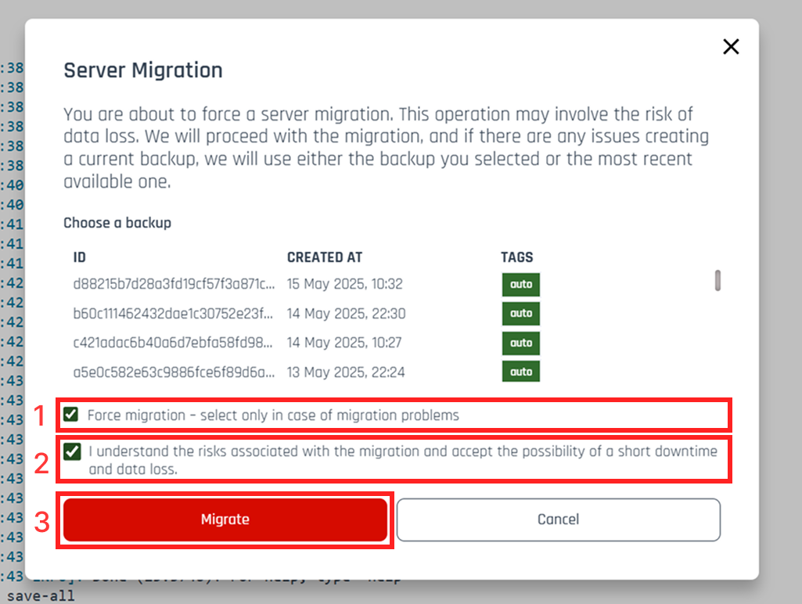

# 🔍 Server migrations

Migration is a process that involves transferring data to a new node, for example, due to infrastructure issues or excessive load. Its purpose is to:

-   improve server performance,
-   increase stability,
-   ensure compatibility with the latest technical solutions.

---

## ⚠️ I Received a Migration Notification — What Should I Do?

1. **Check the box to agree to the migration** (this will be visible in the notification).
2. **Click the “Migrate” button**, as shown in the illustration below.

🕒 The migration will take approximately **15 minutes**, during which your server may be temporarily unavailable.

<strong>✅ This migration process is completely safe.</strong> There is no risk of data loss.

---

## 🚧 Migration Isn’t Working — What Now?

If the standard migration fails:

1. Choose the **“Force Migration”** option.
 

 ⚠️ Warning: This option <strong>may result in the loss of recent data on the server</strong> due to loading the latest or a user-selected backup (see point 4).
  

2. **Check the box to agree to the migration**.
3. **Click the “Migrate” button**, as shown in the illustration below.

4. Optional: Select a backup to use in case the latest server data cannot be restored.

    - If you don’t select a backup — the system will use the most recent one available.
    - If you do select one — in case of failure, the system will use the backup you chose.

---

## 🆘 Need Help?

If none of the above steps work, contact our technical support team:

📧 **[support@craftserve.pl](mailto:support@craftserve.pl)**

## ✅ Key Information at a Glance:

| 🔧 Task            | 🕒 Duration      | 💾 Data            |
| ------------------ | ---------------- | ------------------ |
| Standard Migration | about 15 minutes | Safe               |
| Forced Migration   | about 15 minutes | Possible data loss |

---
