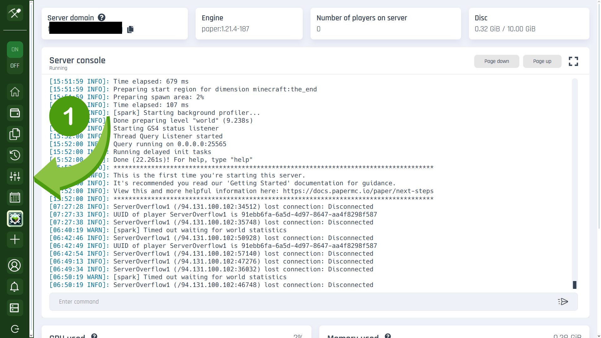
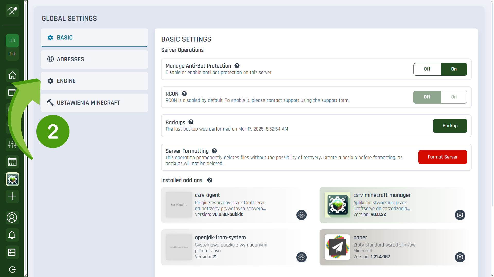
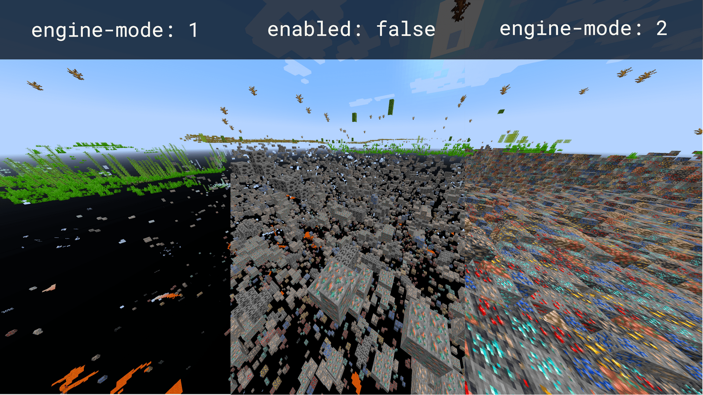
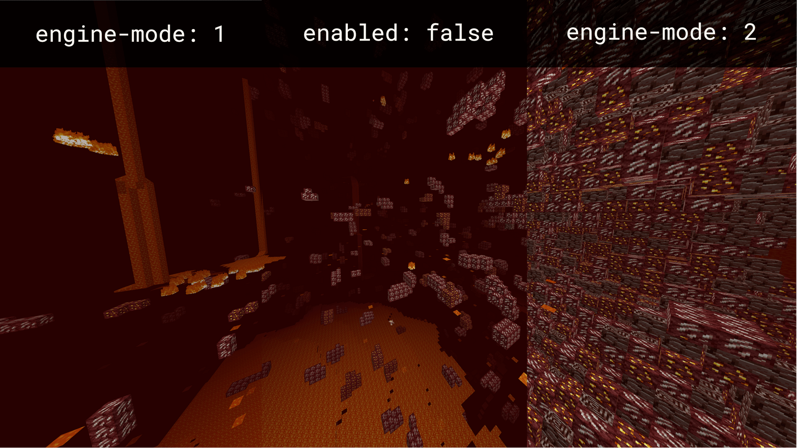
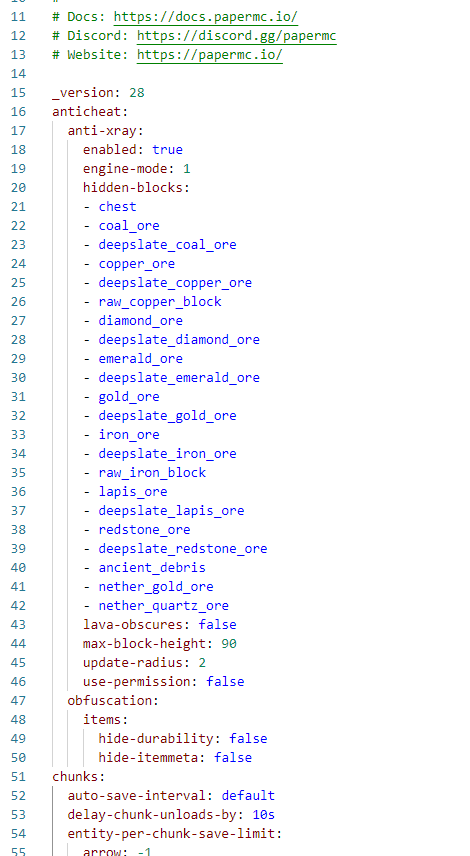
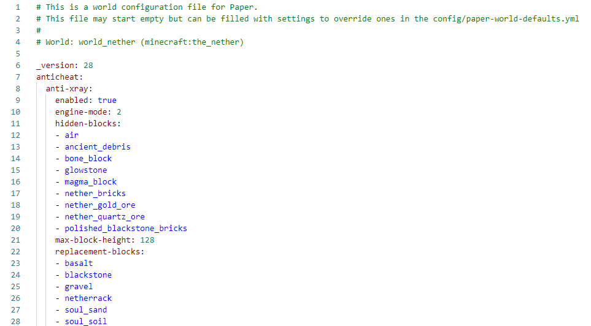

## Choosing the Right Engine
To use Anti-Xray without the need to install additional plugins, you need to install the `Paper` engine or its forks (**such as Purpur**) on your server and select your server version. To do this on the [**Craftserve**](https://craftserve.com/) hosting platform, go to the **Settings** tab in the **Main Panel**, then select `Engine`. From the list of engines, choose the one you need and click `Install`.




## Mode Description
Anti-Xray can operate in two different modes:
* `engine-mode: 1`: Ores are replaced with stone, but only those that are not adjacent to an air block or liquid (water or lava). When X-ray is enabled, only ores that could not be hidden by surrounding blocks are visible.

* `engine-mode: 2`: Ores are not hidden; instead, stone, andesite, and diorite are replaced with random ore deposits, making it impossible for a player to distinguish real ores from fake ones. Fake ores turn into real blocks when an air or liquid block is placed next to them. If the server experiences lag, random ores may appear while mining, but players will not be able to mine them.

### Recommended Modes for the Overworld

### Recommended Modes for the Nether



## Configuration Files for `1.19`
There are four files where Anti-Xray is configured:
* `paper-world-defaults` - Located in the **config** folder in the main server directory. This file contains settings for all worlds, meaning if a block is added here, it will be hidden in the Overworld, Nether, etc. By default, after opening the file, around line 16, you should see the following:
```yml
anticheat:
  anti-xray:
    enabled: false
    engine-mode: 1
    hidden-blocks:
    - copper_ore
    - deepslate_copper_ore
    - gold_ore
    - deepslate_gold_ore
    - iron_ore
    - deepslate_iron_ore
    - coal_ore
    - deepslate_coal_ore
    - lapis_ore
    - deepslate_lapis_ore
    - mossy_cobblestone
    - obsidian
    - chest
    - diamond_ore
    - deepslate_diamond_ore
    - redstone_ore
    - deepslate_redstone_ore
    - clay
    - emerald_ore
    - deepslate_emerald_ore
    - ender_chest
```
* `paper-world`  
  * Located in the **world** folder
  * Located in the **world_nether** folder
  * Located in the **world_the_end** folder  

  Each of these files contains settings for separate worlds. One does not affect the operation of another. Compared to the previous file, after opening one of these, you will see only a few lines, e.g., for `paper-world` from **world**:
```yml
# This is a world configuration file for Paper.
# This file may start empty but can be filled with settings to override ones in the config/paper-world-defaults.yml
# 
# World: world (minecraft:overworld)

_version: 28
```
To enable Anti-Xray, simply copy and paste the following settings into the appropriate files.

## Recommended Settings for Engine-mode: 1
### For `paper-world-defaults`
```yml
anticheat:
  anti-xray:
    enabled: true
    engine-mode: 1
    hidden-blocks:
    - chest
    - coal_ore
    - deepslate_coal_ore
    - copper_ore
    - deepslate_copper_ore
    - raw_copper_block
    - diamond_ore
    - deepslate_diamond_ore
    - emerald_ore
    - deepslate_emerald_ore
    - gold_ore
    - deepslate_gold_ore
    - iron_ore
    - deepslate_iron_ore
    - raw_iron_block
    - lapis_ore
    - deepslate_lapis_ore
    - redstone_ore
    - deepslate_redstone_ore
    - ancient_debris
    - nether_gold_ore
    - nether_quartz_ore
    lava-obscures: false
    max-block-height: 90
    update-radius: 2
    use-permission: false
```
### For `paper-world`
- From **world**
```yml
anticheat:
  anti-xray:
    enabled: true
    engine-mode: 1
    hidden-blocks:
    - chest
    - coal_ore
    - deepslate_coal_ore
    - copper_ore
    - deepslate_copper_ore
    - raw_copper_block
    - diamond_ore
    - deepslate_diamond_ore
    - emerald_ore
    - deepslate_emerald_ore
    - gold_ore
    - deepslate_gold_ore
    - iron_ore
    - deepslate_iron_ore
    - raw_iron_block
    - lapis_ore
    - deepslate_lapis_ore
    - redstone_ore
    - deepslate_redstone_ore
    lava-obscures: false
    max-block-height: 64
    update-radius: 2
    use-permission: false
```
- From **world_nether**
```yml
anticheat:
  anti-xray:
    enabled: true
    engine-mode: 1
    hidden-blocks:
    - ancient_debris
    - nether_gold_ore
    - nether_quartz_ore
    max-block-height: 128
```
- From **world_the_end**
```yml
anticheat:
  anti-xray:
    enabled: false
```
## Recommended Settings for Engine-mode: 2
### For `paper-world-defaults`
```yml
anticheat:
  anti-xray:
    enabled: true
    engine-mode: 2
    hidden-blocks:
    - air
    - copper_ore
    - deepslate_copper_ore
    - raw_copper_block
    - diamond_ore
    - deepslate_diamond_ore
    - gold_ore
    - deepslate_gold_ore
    - iron_ore
    - deepslate_iron_ore
    - raw_iron_block
    - lapis_ore
    - deepslate_lapis_ore
    - redstone_ore
    - deepslate_redstone_ore
    - ancient_debris
    - bone_block
    - glowstone
    - magma_block
    - nether_bricks
    - nether_gold_ore
    - nether_quartz_ore
    - polished_blackstone_bricks
    lava-obscures: false
    max-block-height: 64
    replacement-blocks:
    - chest
    - amethyst_block
    - andesite
    - budding_amethyst
    - calcite
    - coal_ore
    - deepslate_coal_ore
    - deepslate
    - diorite
    - dirt
    - emerald_ore
    - deepslate_emerald_ore
    - granite
    - gravel
    - oak_planks
    - smooth_basalt
    - stone
    - tuff
    - netherrack
    - soul_sand
    - soul_soil
    - basalt
    - blackstone
    update-radius: 2
    use-permission: false
```
### For `paper-world`

- From **world**
```yml
anticheat:
  anti-xray:
    enabled: true
    engine-mode: 2
    hidden-blocks:
    - air
    - copper_ore
    - deepslate_copper_ore
    - raw_copper_block
    - diamond_ore
    - deepslate_diamond_ore
    - gold_ore
    - deepslate_gold_ore
    - iron_ore
    - deepslate_iron_ore
    - raw_iron_block
    - lapis_ore
    - deepslate_lapis_ore
    - redstone_ore
    - deepslate_redstone_ore
    lava-obscures: false
    max-block-height: 64
    replacement-blocks:
    - chest
    - amethyst_block
    - andesite
    - budding_amethyst
    - calcite
    - coal_ore
    - deepslate_coal_ore
    - deepslate
    - diorite
    - dirt
    - emerald_ore
    - deepslate_emerald_ore
    - granite
    - gravel
    - oak_planks
    - smooth_basalt
    - stone
    - tuff
    update-radius: 2
    use-permission: false
```
- From **world_nether**
```yml
anticheat:
  anti-xray:
    enabled: true
    engine-mode: 2
    hidden-blocks:
    - air
    - ancient_debris
    - bone_block
    - glowstone
    - magma_block
    - nether_bricks
    - nether_gold_ore
    - nether_quartz_ore
    - polished_blackstone_bricks
    max-block-height: 128
    replacement-blocks:
    - basalt
    - blackstone
    - gravel
    - netherrack
    - soul_sand
    - soul_soil
```
- From **world_the_end**
```yml
anticheat:
  anti-xray:
    enabled: false
```

## Examples of Configured Files
- `paper-world-defaults` <br>



- `paper-world` (Nether example) <br> 



## Source
https://docs.papermc.io/paper/anti-xray
