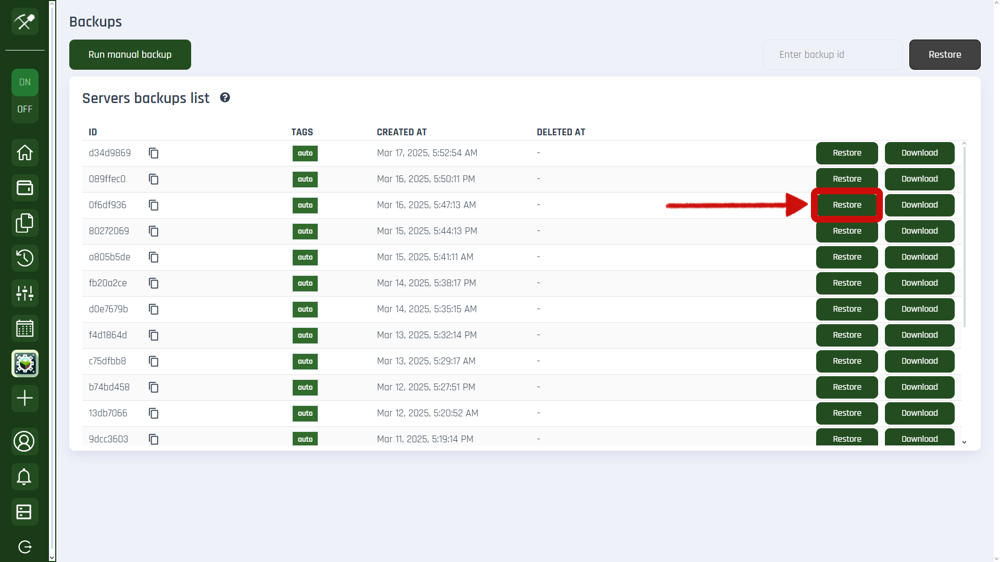

# Backups

Sometimes, server files get corrupted, accidentally deleted, sucked into a black hole by griefers, or even eaten by a dog (along with your homework). That's where **backups** come to the rescue.

We won't make copies of important files on your personal computer for you (but you should!), but we will take care of your Minecraft server backups on Craftserve.

## Where can I find my backups?

In your server panel, on the left-hand menu, you'll find the **"Backups"** tab.  

After opening this tab, you'll see a list of your backups.  

## How do I create a backup?
Backups are automatically created at regular intervals and in specific situations, such as before formatting the server, restoring another backup, migrating to another machine, and more.

However, you can manually create a backup whenever you like. To do this, go to the **Backups** tab (see the [section above](#where-can-i-find-my-backups)), then click the **Create Backup** button.

## How do I restore my server to a previous state?

1. Go to the **Backups** tab.
2. Determine the date and time of the backup you need. When did the griefing occur on your server? When were the files corrupted? Look through the available backups and select the one that suits you best. If you're unsure, you can try multiple backups—restore one at a time, check if it's the right one, and if not, repeat the process with the next one.
3. Once you've chosen the backup to restore, simply click the **Restore** button on the right side. An automatic backup will be created before restoring, and then the selected backup will be applied.  

## How can I download server files to my computer?

1. Go to the **Backups** tab.
2. Choose the backup date and time of the files you want to download. Look through the available backups and select the one that suits you best.
3. Click the **Download** button next to the selected backup.  

