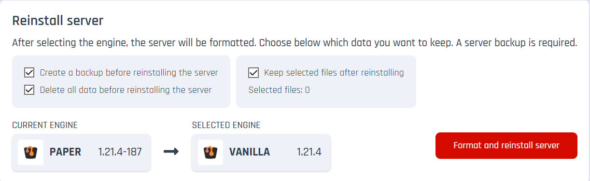

# Engines

## How to Change the Server Engine?

1. Go to the **Settings** tab on the right menu in your server panel.  
   
2. Select the **Engine** menu.  
   
3. Choose the engine you need from the available category and list.  
   
4. After selecting the engine, scroll down to the bottom of the page.
5. Confirm the deletion of all files from your server and the creation of a backup. If necessary, you can exclude specific files and folders from formatting to prevent them from being deleted. **We recommend using this option only if you have important data on the server, such as progress stored in the `world` folder.**  
   
6. Click the **Format and Reinstall Server** button.
7. Wait for the process to complete.
8. Done!
