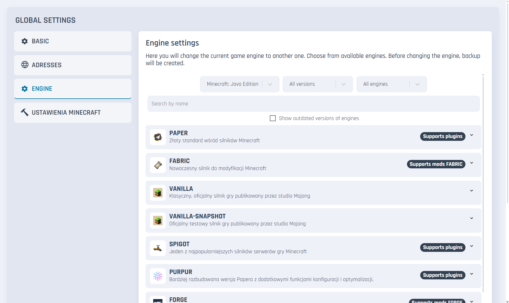
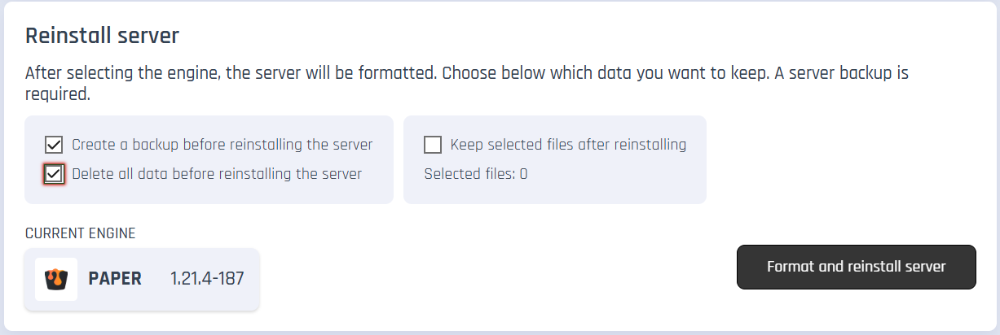
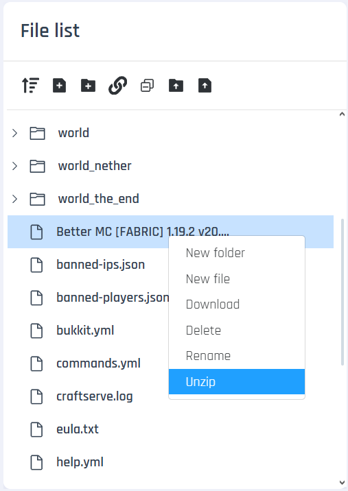

# Installing the BetterMC (Fabric) Modpack

### Requirements

* A Minecraft server supporting Fabric modifications (for Craftserve: Amethyst package).

### Installation

1. Select the appropriate Fabric engine for the BetterMC modpack version (in this case: 1.19.2).
   - You can set the Fabric engine in the Craftserve panel under **Settings** -> **Engine** -> **Fabric**.
     
     
   - Confirm server formatting to avoid issues during installation. If you really need to save any files, 
   *Note: Formatting the server will result in the loss of all files, including all items saved on the map.*
     
     
2. Download BetterMC from [**THIS PAGE**](https://www.curseforge.com/minecraft/modpacks/better-mc-fabric/files). Make sure to download the server version of the pack, labeled "Server Pack."

    
3. Upload the downloaded zip file to the server using [FTP](ftp.md).
4. Go to the Craftserve panel and navigate to the **Files** tab.
5. Locate the uploaded zip file and right-click on it. From the list, select **Unzip**.
    

6. After unzipping, you can delete the zip file.
7. Start the server and wait for it to fully load.

### Notes
- Players can only join the server if they have the same version of the BetterMC modpack installed on their client (not the server version, but the regular "client" version).
- If you encounter issues starting the server, ensure that the Fabric engine version matches the BetterMC modpack version.