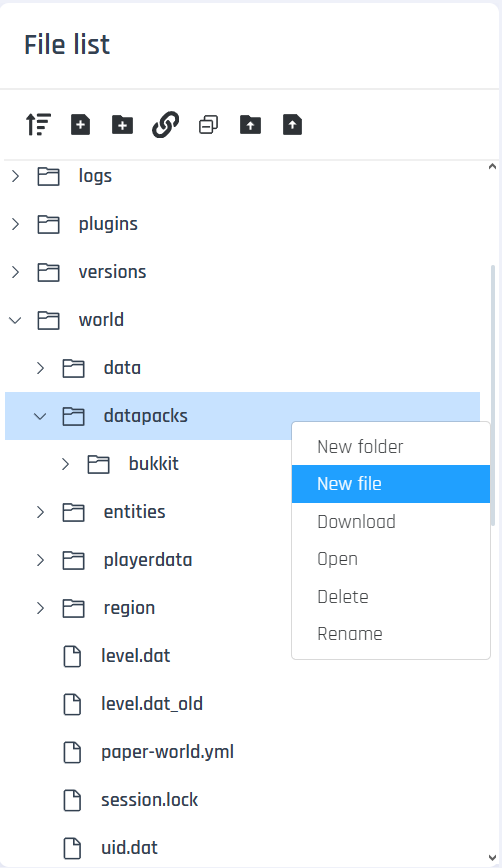
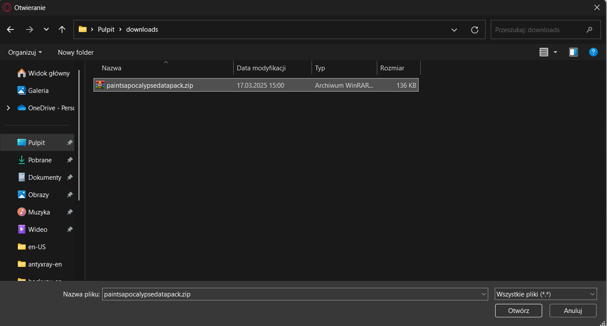
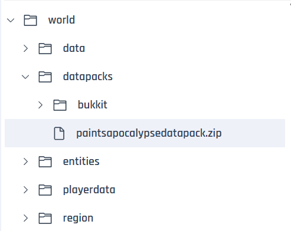

# Installing Datapacks
To upload a datapack to the server, we first need to download it from somewhere. You can find datapacks on websites such as [Planet Minecraft](https://www.planetminecraft.com/data-packs/), [Vanilla Tweaks](https://vanillatweaks.net/picker/datapacks/), and many others.

Next, navigate to the **world** folder in the server files, and then open the **datapacks** folder. Here, you will upload the datapacks **in .zip format**. To do this, click on the **File** button under the **Upload Files** tab.

Then select your datapack and click **Open**.

After this, the datapack should appear in the server panel.

Next, start the server and type the command **/minecraft:reload**, or if it doesn't exist, use **/reload**.

## Datapacks can also be uploaded using [FTP](https://github.com/Craftserve/docs/blob/master/ftp.md). Most people find this method of file uploading more convenient.
