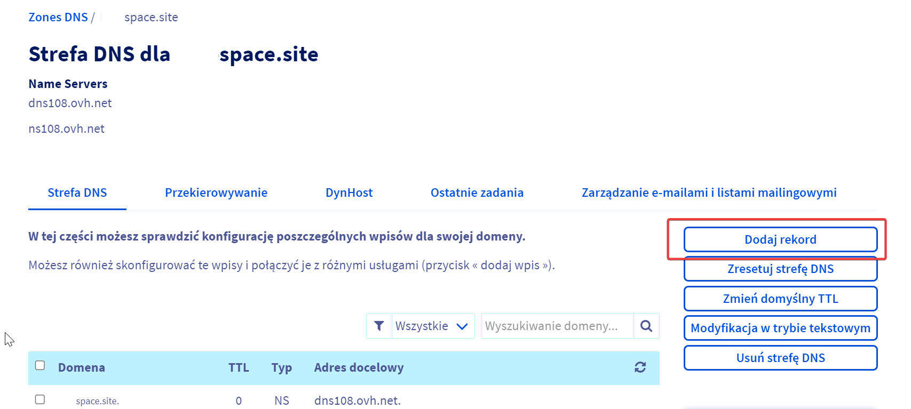
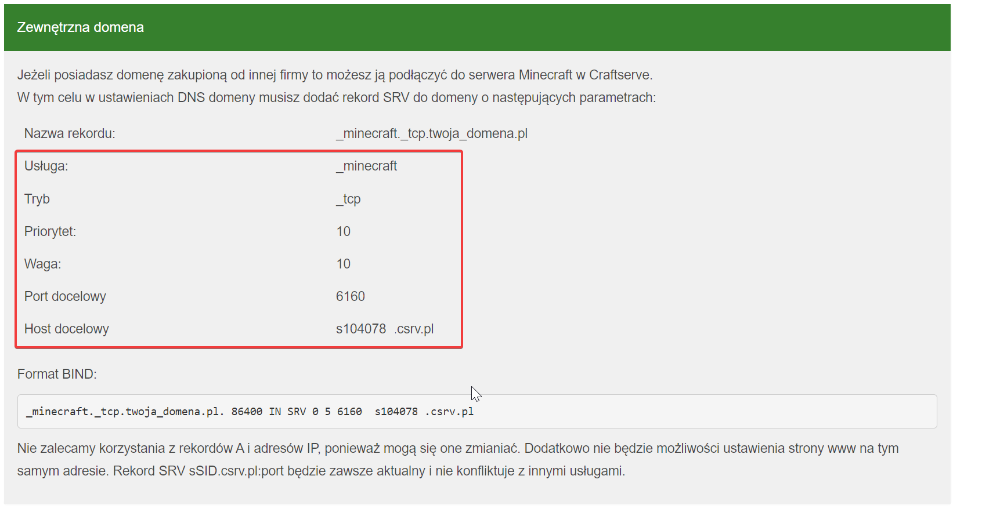

# Setting Up a Custom Domain for a Minecraft Server

### Requirements

  * A purchased domain from one of the available services (e.g., [OVH](https://www.ovhcloud.com/en/domains/))
  * A Minecraft server

### Steps

1. Open the DNS management panel for your domain.
    - Typically, this panel looks like this:
    - 
2. Add a new SRV record.
    - Copy the necessary information from the Craftserve panel, specifically from the **Settings** -> **Domain** -> **External Domain** tab. It should look like this:
    - 
    - An example SRV record would look like this:
    - 
    - In the subdomain/name field, enter the name of the subdomain where the server will be available. If you want the server to run on the main domain, leave this field with the value `_minecraft._tcp.domain.com` (sometimes the suffix is automatically added).
3. Save the changes. **The record update may take from a few minutes to several hours**.

### Notes
- Please note that domain configuration may vary depending on the service where the domain was purchased. For other services, search for the appropriate DNS management panel.
- To connect to the server, enter your domain in the Minecraft server address field. For the main domain, enter `domain.com`, and for a subdomain, enter `subdomain.domain.com`.
