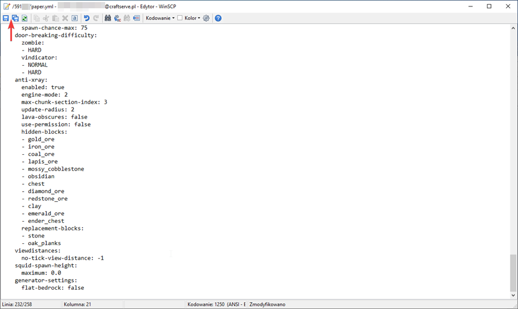

# FTP Guide - Connecting to Craftserve

FTP (File Transfer Protocol) is a network protocol that enables file transfer between a server and your computer. It allows you to easily upload datapacks, download worlds, and manage configurations.

The most convenient way to edit server files is by using FTP.
One of the best programs that support this protocol is WinSCP.

## Installation

To download it, visit [this page](https://winscp.net/eng/download.php). Then, click **DOWNLOAD**.

## Logging into the Server

After installing and launching the program, this window should appear:

However, if this window does not appear or if we accidentally close it, we can open it by clicking the **New Session** button in the upper left corner of the program.

To connect to our server, we need to:

- Select **File protocol**: FTP
- Enter **Host name**: ftp.craftserve.com
- Enter **User name**: the email address associated with your Craftserve account
- Enter **Password**: the password for your Craftserve account
- Select port **21**
Example of a correctly filled-out form:

After filling out the form, log in by clicking the **Login** button. If everything has been done correctly, we should connect to the server.

## How to Use

The WinSCP window is split into two parts - one for local files (your computer) and one for remote files (server):

In the window marked **1**, you can see the files on your computer. This allows quick access to any folder or drive.

Window **2** contains the server files - each folder with a name consisting of random characters corresponds to a server assigned to the account (this is its ID, e.g., `2ae6dfal6adw1`).

To access the files of a specific server, open the corresponding folder:

To upload a file to the server, simply drag it from the first window to the second, or from the desktop to the second window.

By double-clicking on a **text file**, we can edit it. After making changes, remember to save the file. You can do this by using the keyboard shortcut **Ctrl + S** or by clicking the button in the upper left corner:

## Notes

For the server to load all our changes, it is necessary to **restart** it. Using the `/reload` command **is not safe** on modded or plugin-enabled servers, as it often causes errors.

To download a file from the server to your computer, select the file and click **F5** - this will move the selected file to the directory open on the left side of WinSCP. It is also more intuitive to drag the file to your desktop or into any folder.

**WARNING** Uploading your own engine will fail. Craftserve only allows the use of engines found in the **Settings/Engine** tab. If you need an engine that is not listed in this tab, you can contact support to request it, and the possibility of adding the engine will be reviewed.
