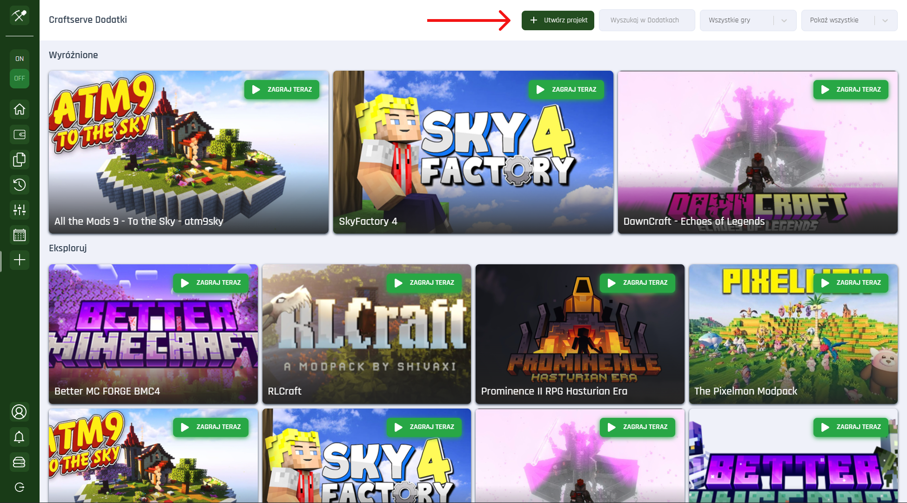

# 📦 How to create your own add-on on Craftserve Addons?

> Note: Creating projects and versions requires a purchased service.  
> Purchase the service now at [craftserve.com](https://craftserve.com/#offers)

Here is a proposal for a clear and aesthetic **table of contents** in the style of technical documentation, which you can add at the beginning of the document (e.g., right below the title):

## 📚 Table of Contents

1. [🔧 Creating a new project](#creating-project)

    - 1.1 [📋 Form fields, icons and media](#form_fields)
    - 1.2 [🌐 Visibility and category](#visibility)
    - 1.3 [📝 Description and translations](#translations)

2. [📦 Creating a version](#creating-version)

    - 2.1 [📁 Adding files and choosing a server](#files)
    - 2.2 [🔢 Versioning and semver](#semver)
    - 2.3 [📎 Dependency selection](#depends_on)
    - 2.4 [⚙️ Version operators: `^`, `~`, `=`](#selectors)

3. [🧪 Advanced options](#advanced)
    - 3.1 [🧩 Custom dependencies and tags](#advanced)
    - 3.2 [🏷️ Labels and package manifest](#advanced)

## Creating a project 🔨

#### To make your project downloadable and visible in the Addons gallery, you must first create a new project.

#### 1. Go to the server management panel, then to the Addons Gallery, and click the “Create Project” link



<a id="form_fields"></a>

#### 2. In the project creator, fill in the following fields

-   **Project name** – Displayed in the marketplace, and users will be able to search for your project by this name.

-   **Slug** – This field is auto-generated based on the name you enter and serves to identify the project in the URL.

-   **Short description** – Appears when clicking on the project, above the “Play Now” or “Install Latest Version” button (depending on the project type). It also appears in the tile in the list of installed packages in the server settings view.

-   **Project icon** – Attracts attention and serves as a showcase for your package! Appears in the tile in the list of installed packages in the settings view, and on the “Addons” subpage when the package category is different from “Server package.”

<a id="visibility"></a>

3. **Project visibility**

-   **Public**: Available to everyone; displayed in the package list in the Addons gallery.

-   **Non-public**: Not displayed in the package list in the Addons gallery, but can be shared via a link.

-   **Private**: Available only to you.

> To find an unlisted or private project, use the “My Projects” button in the [Addons gallery](https://craftserve.com/m). The button is available after logging into your account.

4. **Project category** – Should precisely define what your package is. It helps users search for packages in the Addons gallery.

-   **Game** – Specifies which game your package is intended for.

-   **Video** (optional) – Plays when hovering over the project tile, and when clicking on the project. Should be in WebM format, maximum 720p resolution, max 30fps, and file size should not exceed 50 MiB.

-   **Thumbnail** – Displayed on the project tile in the Addons gallery, and in the selected project view if no video is added.

-   **Gallery** – Displayed on your project’s subpage. Use the gallery if you want to include screenshots or other images of your addon.

<a id="translations"></a>

-   **Detailed project description**

    -   **Translations**  
         On Craftserve, we offer two ways to translate package descriptions into other languages:

        1. **Manual translation** – Select the desired language by clicking the corresponding button, then edit the content in that language. You can switch between languages and add translations manually.
        2. **AI-powered automatic translation** – Simply prepare the description in the project’s default language. Within 30 minutes after publication, translations will be automatically generated and updated each time you update the project. To change the source language for translations, use the **“Default project language”** option available under the translation input fields.

        > **Note:** Automatic translations will only be generated for languages where the translation field is empty. If any character has been entered in a given language (e.g., English, Polish, or German), the translation will not be overwritten.

    -   **Crafting the description**  
         In the description, include:

        -   The requirements of your package,
        -   The features and capabilities it offers.

        If you are creating a mods package, also add installation instructions for the user—so that after installing the package on their server, users can easily join.  
         Try to write in an accessible manner so that non-technical users can install it without issues.

4. Once you have completed your project, click the “Publish” button to confirm the changes.

### Done! 🚀

To view your project, go to the **“Addons”** tab, then select **“My Projects”**.  
Remember that if your project is not public or has no version added, **it will not appear in the main view of the Addons gallery**. In that case, use the **“My Projects”** tab, where you will always find all your publications.

&nbsp;

# Creating a version 📦

#### You already have your project, but it lacks a version—meaning there are no files added to the project that users will download when they install it on their server. To add a version, enter your project, then click “Version List.”

1. Click **“Version List”**
2. Click **Releases list**
3. Fill in the **Release type** – this field indicates the development stage of the version.

    - **Stable** means a stable release that has passed full testing, intended for users who expect a fully functional addon.
    - **Private** means the version is private, targeted to a specific audience (e.g., developers or your testers). It does not have to be stable and may require additional testing.
    - **Latest** is the newest version, which may or may not be stable, for users who want the latest features.

4. Choose the **Installation method**. There are two installation methods:

    - **Erease server data and install package** – Before installing your addon, we will recommend that the user wipe their server data and then install your addon on a clean instance.
    - **Add to existing server** – We will add your package files to the user’s current server state.

5. **Package version** <a id="semver"></a>  
   This field should contain your project’s version number in **SemVer** (_Semantic Versioning_) format, e.g., `1.2.3`. The installation system uses this field to automatically resolve conflicts during project installations.  
   The format consists of three numbers separated by dots:

    **MAJOR.MINOR.PATCH**, meaning:

    - `1` – **MAJOR**: changes when you introduce incompatible changes (e.g., remove or alter existing features),
    - `2` – **MINOR**: changes when you add new, backwards-compatible features,
    - `3` – **PATCH**: changes when you fix bugs without adding new features or changing behavior.

    **Examples of valid versions**:

    - `1.0.0` – first release,
    - `1.2.0` – new features added,
    - `1.2.1` – minor bug fixes,
    - `2.0.0` – breaking changes introduced.

> **Note:** Using the correct version format helps users recognize the significance of changes in the package and simplifies update management. To learn more about semantic versioning, visit [semver documentation](https://semver.org)

6. **Content version** – This value will be displayed to the user as the installed addon version. You can enter the same value as in the **Package version** field, or use your own **custom versioning** (e.g., `beta`, `dev-2025-06-11`, `v2-fixes`, etc.). This field **is not validated**—you can enter any value that best describes the project’s content version from your perspective.

> **Note:** This field is optional and only serves to additionally label content changes—it does not affect the package’s technical functionality.

<a id="files"></a>

7. **Server**  
   Choose the server from which you want to share the files for your package. These files will be installed on the user’s server when they install your package.
    - Depending on the package type:
        - If you are creating a **mod package**, select the files to be installed on the user’s server (e.g., mods, plugins).
        - If you want to share a **game world**, select the appropriate world folder.

> **Note:** Pay special attention to the directory structure when selecting files.  
> Example: if you select only `.jar` files from the `plugins` folder, they will be installed in the server’s root directory.  
> To install them correctly in the `plugins` folder, also select the `plugins` folder itself with its contents. Your target file paths on the server must match the correct file paths.

---

### 8. **Select packages**

<a id="depends_on"></a>

Select other packages that should be automatically installed **before** your package. The system will automatically detect which packages you have installed on the server from which you are uploading files.

Check the required dependencies if your package needs them. By default, we will show dependencies used by your other addons—you can select them by clicking the package name, which will expand the options list.

#### Examples:

-   `Require paper^1.21` – requires **Paper** version **`>= 1.21.0` and `< 2.0.0`**
-   `Require game-engine` – requires **any game engine**, regardless of version or platform
-   `Require minecraft-java-server` – requires **any Minecraft Java server engine**, regardless of version
-   `Require paper-api=1.20.1` – requires any package that provides `paper-api` in exactly version `1.20.1`
-   `Require paper=1.21.5` – requires package `paper` in exactly version `1.21.5`
-   `No requirements` – your package has no dependencies and can operate standalone

---

### 🔎 What’s the difference between `^`, `=`, and `~`?

<a id="selectors"></a>

Let’s recall how semantic versioning works:

**MAJOR.MINOR.PATCH**, meaning:

-   `1` – **MAJOR**: changes when you introduce incompatible changes (e.g., remove or alter existing features),
-   `2` – **MINOR**: changes when you add new, backwards-compatible features,
-   `3` – **PATCH**: changes when you fix bugs without adding new features or changing behavior.

    **Examples of valid versions**:

-   `1.0.0` – first release,
-   `1.2.0` – new features added,
-   `1.2.1` – minor bug fixes,
-   `2.0.0` – breaking changes introduced.

Knowing this theory, we can create the following version requirements:

| Operator           | Meaning                                                       | Example         | Version range      |
| ------------------ | ------------------------------------------------------------- | --------------- | ------------------ |
| `^` (caret)        | **Backward-compatible updates** within the same major version | `^1.2.3`        | `>=1.2.3 <2.0.0`   |
| `~` (tilde)        | **Patch updates** within the same minor version               | `~1.2.3`        | `>=1.2.3 <1.3.0`   |
| `=` (equals)       | **Exact version**                                             | `=1.2.3`        | only `1.2.3`       |
| `*` (asterisk)     | **Any version**                                               | `*`             | matches everything |
| `-` (hyphen range) | **Range from–to (inclusive)**                                 | `1.2.3 - 1.4.0` | `>=1.2.3 <=1.4.0`  |

#### Example:

-   `^1.20.0` → matches `1.20.1`, `1.21.0`, `1.99.99`, but **not** `2.0.0`
-   `~1.20.0` → matches `1.20.1`, `1.20.9`, but **not** `1.21.0`
-   `=1.20.0` → matches only `1.20.0`

For more information, see [documentation](https://github.com/Masterminds/semver?tab=readme-ov-file#caret-range-comparisons-major)

<a id="advanced"></a>

9. **Advanced options (optional)** – In this section, we will create custom dependencies for your project. After clicking **“Show advanced options”**, a “Add dependency” button will appear. Clicking it allows you to **add your own dependency**. The form consists of 3 fields.

-   All fields are related. The dependency will be constructed based on `NAME+TAG`.

-   **Name** – Should specify the dependency name for which you will configure custom requirements, e.g., `paper-api` or `paper`.

-   **Tag** – Used to determine a custom selector. If you know your addon will require paper (the value from the **Name** field) in a custom range, e.g., `paper^1.20.1`, then use `^1.20.1` for this field’s value. Filling in **Name** and **Tag** yields: `paper^1.20.1`.

-   **Labels (optional)** Each package includes its manifest. You can additionally specify which labels must appear in it. For example, you might want the required package not only to satisfy the dependency `paper` in versions `^1.20.1` but also to have in its `labels` field a label with the key `craftserve.com/mod-loader` and value `minecraft-java`.

<details>
    <summary>Click here to see example package labels</summary>
    <br/>

    | Key                                        | Sample value            | Description                                                       |
    | ------------------------------------------ | ----------------------- | ----------------------------------------------------------------- |
    | `"craftserve.com/game"`                    | `"minecraft-java"`      | The game for which the addon is intended (here: Minecraft Java)   |
    | `"craftserve.com/type"`                    | `"plugin"`              | Package type (e.g., `plugin`, `mod`, `map`)                       |
    | `"craftserve.com/package/time"`            | `"2025-04-11 15:25:15"` | Package creation date and time                                    |
    | `"craftserve.com/release/time"`            | `"2025-04-11 15:25:15"` | Package publication date and time                                 |
    | `"craftserve.com/require-empty-workspace"` | `"yes"`                 | Whether the package requires a clean server instance (`yes`/`no`) |

</details>

<details>
<summary>Click here to see an example package manifest</summary>

```json
{
    "manifestVersion": "v2",
    "ManifestHash": "sha256-725770a3ffad4d6335fb6828c65b8bd4c558a1c21b817d3155668267f2d04a52",
    "name": "paper",
    "subdir": "/marketplace/paper/sha256-725770a3ffad4d6335fb6828c65b8bd4c558a1c21b817d3155668267f2d04a52",
    "version": "1.21.3-29",
    "versionFormat": "semver",
    "depends": ["java:21"],
    "provides": [
        "game-engine",
        "minecraft-java-server:1.21.3",
        "minecraft-java-server:1.21.x",
        "paper-api:1.21.3",
        "spigot-api:1.21.3",
        "bukkit-api:1.21.3",
        "paper:1.21.3",
        "paper:1.21.x"
    ],
    "set-env": [
        {
            "key": "MINECRAFT_VERSION",
            "value": "1.21.3"
        },
        {
            "key": "21",
            "value": "21"
        }
    ],
    "labels": {
        "craftserve.com/game": "minecraft-java",
        "craftserve.com/java/version": "21",
        "craftserve.com/minecraft-java/version": "1.21.3",
        "craftserve.com/mod-loader": "paper",
        "craftserve.com/package/time": "2024-11-15 15:30:09.385604",
        "craftserve.com/release/time": "2024-11-15 09:09:36.732000",
        "craftserve.com/type": "mod_loader"
    },
    "fileshash": "k1:ff0ad7f85bab891c2d9174d87602f478dd031e206a7cc029ab132ca089da3e0e",
    "downloadfiles": [
        {
            "name": "minecraft_server.jar",
            "url": "https://api.papermc.io/v2/projects/paper/versions/1.21.3/builds/29/downloads/paper-1.21.3-29.jar",
            "hash": "sha256-eb58806b3535646272a2e2ca3b46aae50b7a4ab8f173a493650092f0c1859b89"
        }
    ]
}
```

</details>

&nbsp;

10. **Detailed version description**: Here you can describe exactly what your version requires and what has changed compared to previous versions. Remember to fill in your descriptions thoroughly.

11. Once all fields are filled in, click the **“Add Version”** button.

### The version has been created and is now available for download. **Congratulations** 🚀
