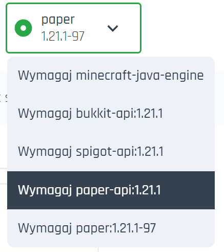

### How to Create a Package for Craftserve Add-ons?

###### Note: Creating projects and versions requires a purchased service. Purchase the service now at [craftserve.com](https://craftserve.com/#offers)

- [Creating a new add-on gallery project](#1-creating-a-project)
  - [Form fields, inserting videos and images](#form_fields)
- [Adding a version to an existing project](#2-creating-a-version)
  - [Advanced options](#advanced)

#### 1. Creating a Project

##### To make your project downloadable and visible to users in the add-on gallery, you must first create a new project.

&nbsp;&nbsp;1.1 Go to your server management panel, then navigate to the Add-ons Gallery, and click on the "Create Project" link.  
&nbsp;&nbsp;

&nbsp;&nbsp;1.2 In the project wizard, fill out the respective fields.  
&nbsp;&nbsp;

&nbsp;&nbsp;&nbsp;&nbsp;1.2.1 **Project Name** – Displays in the marketplace, and with this field, users will be able to search for your project by name.

&nbsp;&nbsp;&nbsp;&nbsp;1.2.2 **Short Name** • This field is automatically filled based on the name you provide, and it is used for identifying the project in the URL.

&nbsp;&nbsp;&nbsp;&nbsp;1.2.3 **Short Description** – Appears after clicking the project, above the "Play Now" or "Install Latest Version" button (depending on the project type). It also appears in the tile in the list of installed packages in the server settings view.

&nbsp;&nbsp;&nbsp;&nbsp;1.2.4 **Project Icon** • Captures attention and acts as your package’s business card! It appears in the tile in the list of installed packages in the settings view and on the "Add-ons" subpage when the package has a different project category than "Server Package".

&nbsp;&nbsp;&nbsp;&nbsp;1.2.5 **Project Visibility**

&nbsp;&nbsp;&nbsp;&nbsp;&nbsp;&nbsp;&bull; **Public**: Available to everyone, displayed in the package list in the
add-on gallery.

&nbsp;&nbsp;&nbsp;&nbsp;&nbsp;&nbsp;&bull; **Unlisted**: Not displayed in the add-on gallery’s package list,
but can beshared via a link.

&nbsp;&nbsp;&nbsp;&nbsp;&nbsp;&nbsp;&bull; **Private**: Available only to you.

> As the project author, you will always see your project in the list
> of projects in the add-on gallery, regardless of which visibility you choose.

&nbsp;&nbsp;&nbsp;&nbsp;&nbsp;&nbsp;1.2.6 **Project Category** – Should specify what your package is about. This is used for searching packages in the add-on gallery and determines how your project will be displayed. There are two variants:

&nbsp;&nbsp;&nbsp;&nbsp;&nbsp;&nbsp;&nbsp;&nbsp;&bull; Variant for projects **_NOT MARKED_** as "Server Package"  
&nbsp;&nbsp;&nbsp;&nbsp;

&nbsp;&nbsp;&nbsp;&nbsp;&nbsp;&nbsp;&bull; Variant for projects **_MARKED_** as "Server Package"  
&nbsp;&nbsp;&nbsp;&nbsp;

&nbsp;&nbsp;&nbsp;&nbsp;**Note:** When a project is set to "Server Package", if a user attempts to install it, the server will be forced to reinstall and format before installing the target package.  
<a id="form_fields"></a>
&nbsp;&nbsp;&nbsp;&nbsp;1.2.7 **Game** – Specifies which game your package is intended for.

&nbsp;&nbsp;&nbsp;&nbsp;1.2.8 **Video** – Plays when hovering over the project tile and on the subpage of your project (optional). It should be in WebM format, have a maximum resolution of 720p, 30fps, and the file size should not exceed 50 MiB.

&nbsp;&nbsp;&nbsp;&nbsp;1.2.9 **Thumbnail** – Appears on the project tile in the add-on gallery and in the selected project view when no video is added.

&nbsp;&nbsp;&nbsp;&nbsp;1.2.10 **Gallery** – Appears on the subpage of your project (optional).

&nbsp;&nbsp;&nbsp;&nbsp;1.2.11 **Detailed Project Description** – Use the user-friendly markdown editor to fully describe your project. Include what your package requires and what it focuses on or what problem it solves.

&nbsp;&nbsp;  
&nbsp;&nbsp;

&nbsp;&nbsp;1.3 When your project is complete, click the "Publish" button to confirm the changes.

&nbsp;&nbsp;1.4 Done! To view your project, go to "Add-ons" and search for it in 
the search bar.

#### 2. Creating a Version

###### You already have your project, but it’s missing a version, meaning it lacks the files that will be downloaded when a user wants to install it on their server. To add a version, go to your project and click "Version List."

&nbsp;&nbsp;

&nbsp;&nbsp;2.1 Click "Add Version"

&nbsp;&nbsp;

&nbsp;&nbsp;2.2 The project version wizard consists of the following fields:

&nbsp;&nbsp;&nbsp;&nbsp;2.2.1 **Version Type**

&nbsp;&nbsp;&nbsp;&nbsp;&nbsp;&nbsp;&bull; **Stable** means a stable version that has passed full testing. It is aimed at users who expect a fully functional package.

&nbsp;&nbsp;&nbsp;&nbsp;&nbsp;&nbsp;&bull; **Private** means the version is private, targeted to a specific group of recipients, such as developers or testers. It doesn’t have to be stable and may require further testing.

&nbsp;&nbsp;&nbsp;&nbsp;&nbsp;&nbsp;&bull; **Latest** is the latest version, which may or may not be stable. It is aimed at users who want the latest features.

&nbsp;&nbsp;&nbsp;&nbsp;2.2.2 **Project Version** (e.g., number). It’s your choice how you mark your versions. This field has restrictions and does not allow the use of white spaces (e.g., spaces) or special characters (e.g., $, @, !).

&nbsp;&nbsp;&nbsp;&nbsp;2.2.3 **Server** – Choose the server from which you want to provide files for the package. The selected files will be installed on the user’s server who installs your package. 1.7.4 **Choose packages** that should be installed before installing your package. We automatically detect which packages are installed on your server from which you are uploading files. Check if your package requires another package or a specific version of the engine to function.

> **Example:** My package is a server map with several additional plugins. I know that my plugins require the Paper engine for version 1.12.1. Additionally, I want users to have the above version, as older versions might cause the map to load incorrectly. Therefore, I select:



&nbsp;&nbsp;&nbsp;&nbsp;If you know that your files require, for example, Spigot engine version 1.21.1, select spigot-api version 1.21.1. If you want the dependency to be verified along with the build version, choose the option that ends with "-". Example: paper:1.12.1-97. This will require the user to have the Spigot package in version 1.21.1 with build 97. When the user attempts to install your package, compatibility with their server will be checked based on the selected requirements.

&nbsp;&nbsp;&nbsp;&nbsp;&nbsp;&nbsp; <a id="advanced"></a> 2.2.4 **Advanced Options (optional)** - After clicking **"Show advanced options"**, a "Add dependency" button will appear. By clicking on it, you can **add your own dependency**. The form consists of 4 fields:

&nbsp;&nbsp;&nbsp;&nbsp;&nbsp;&nbsp;&nbsp;&nbsp;&bull; **Name** – Should specify the name of the package for which you will configure custom requirements (e.g., "paper-api").

&nbsp;&nbsp;&nbsp;&nbsp;&nbsp;&nbsp;&nbsp;&nbsp;&bull; **Expression** – Defines the logic for verifying dependencies. The field uses the syntax of the [Expr](https://expr-lang.org/#documentation) expression language. In this field, you have access to all values of the selected package. The expression should ALWAYS return a boolean value (true/false). Example package object for Paper:

> **Package Example**

```json
{
  "manifestVersion": "v2",
  "ManifestHash": "sha256-725770a3ffad4d6335fb6828c65b8bd4c558a1c21b817d3155668267f2d04a52",
  "name": "paper",
  "subdir": "/marketplace/paper/sha256-725770a3ffad4d6335fb6828c65b8bd4c558a1c21b817d3155668267f2d04a52",
  "version": "1.21.3-29",
  "versionFormat": "semver",
  "depends": ["java:21"],
  "provides": [
    "game-engine",
    "minecraft-java-server:1.21.3",
    "minecraft-java-server:1.21.x",
    "paper-api:1.21.3",
    "spigot-api:1.21.3",
    "bukkit-api:1.21.3",
    "paper:1.21.3",
    "paper:1.21.x"
  ],
  "set-env": [
    {
      "key": "MINECRAFT_VERSION",
      "value": "1.21.3"
    },
    {
      "key": "21",
      "value": "21"
    }
  ],
  "labels": {
    "craftserve.com/game": "minecraft-java",
    "craftserve.com/java/version": "21",
    "craftserve.com/minecraft-java/version": "1.21.3",
    "craftserve.com/mod-loader": "paper",
    "craftserve.com/package/time": "2024-11-15 15:30:09.385604",
    "craftserve.com/release/time": "2024-11-15 09:09:36.732000",
    "craftserve.com/type": "mod_loader"
  },
  "fileshash": "k1:ff0ad7f85bab891c2d9174d87602f478dd031e206a7cc029ab132ca089da3e0e",
  "downloadfiles": [
    {
      "name": "minecraft_server.jar",
      "url": "https://api.papermc.io/v2/projects/paper/versions/1.21.3/builds/29/downloads/paper-1.21.3-29.jar",
      "hash": "sha256-eb58806b3535646272a2e2ca3b46aae50b7a4ab8f173a493650092f0c1859b89"
    }
  ]
}
```

> Using knowledge of how the package structure looks, we can **declare dependencies**, for example:

&nbsp;&nbsp;&bull; Check if the package contains any of the plugin-loading APIs.

> - **||** - OR operator - means the expression will return `true` if **at least one of the conditions** connected by this operator is true.
> - **`value`**: The element you want to check (e.g., `"spigot-api"`).
> - **`in`**: Operator checks if an element is present in an array or if there is a key in an object with the given value.
> - **`key`**: The name of the array key whose value you want to check (e.g., `provides`).

```js
"spigot-api" in provides || "bukkit-api" in provides || "paper-api" in provides; // Returns a boolean value
```

&nbsp;&nbsp;-&bull; Check if the package has a version newer than (including the build number).

> - **&&** - AND operator - this means that the expression will return `true` only when both A and B are true **A && B**. For example, for expression A: 10 > 5 and expression B: 3 < 4, `10 > 5 && 3 < 4` will return **true**.
> - **`split(version, "-")`**: Splits the `version` string into parts. The result is an array: `"1.21.3-29"` → `["1.21.3", "29"]`.
> - **`split(version, "-")[0]`**: Selects the part before `"-"` (the version) – that is, the first element of the array.
> - **`split(version, "-")[1]`**: Selects the part after `"-"` (the build number) – that is, the second element of the array.
> - The condition first checks the version, and if they are equal, it compares the build number to determine whether, even though the version is the same, the build is newer.

```js
split(version, "-")[0] > "1.19.2" ||
  (split(version, "-")[0] == "1.19.2" && int(split(version, "-")[1]) > 29);
```

&nbsp;&nbsp;&bull; **semverInRange** (helper function):

> - `semverInRange(tag, {VALUE})` is a helper function that allows checking semantic versions (without the build number, e.g., 1.12.1, 1.23.2).
> - **`VALUE`**: The condition that must be met with respect to the package's semantic version. For example, if the semantic version must be greater than or equal to 1.12.1, the value should be `">=1.12.1"`.

```js
semverInRange(tag, ">=1.12.1");
```

&nbsp;&nbsp;&nbsp;&nbsp;&nbsp;&nbsp;&bull; Learn more about the capabilities of [Expr](https://expr-lang.org/#documentation) by [clicking here](https://expr-lang.org/docs/language-definition), or get help on our [Discord](https://discord.gg/craftserve-387222965131149313).

&nbsp;&nbsp;&nbsp;&nbsp;&nbsp;&nbsp;&bull; **tag** - If you require a specific version, you should use this field. For example, for the **tag** field value of 1.12.1 and the **name** field value of paper-api, you would require paper-api version 1.21.1 - `paper-api:1.12.1`.  
**NOTE! The tag field should be empty if the "Expression" field contains a value.**

&nbsp;&nbsp;&nbsp;&nbsp;&nbsp;&nbsp;&bull; **Labels** - You can additionally specify which labels (labels, see: **package example**) must be present in the package from the **name** field. For example, for the key `craftserve.com/mod-loader`, the value must be `minecraft-java`.

&nbsp;&nbsp;2.2.5 **Detailed Description**: Here you can describe exactly what your version requires, as well as explain what has changed (e.g., compared to an earlier version). Be sure to fill in your descriptions thoroughly.

&nbsp;&nbsp;2.2.6 Once all fields are completed, click the "**Add Version**" button.

2.3 The version has been created and is now available for download. **Congratulations**!
