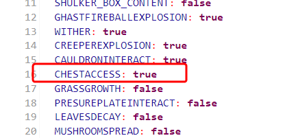

# Installation and Configuration of LogBlock on Craftserve

### Requirements

* A Minecraft server supporting plugins (Spigot, Paper, Purpur, etc.)
* LogBlock plugin
* A MySQL database created (Craftserve panel -> Settings -> MySQL -> Create)

### Installation and Database Connection

1. Shut down the server.
2. Download the LogBlock plugin for your server version:
    - [1.13.2](https://www.iani.de/jenkins/job/LogBlock/64/artifact/target/LogBlock.jar)
    - [1.14.4](https://www.iani.de/jenkins/job/LogBlock/90/artifact/target/LogBlock.jar)
    - [1.15.2](https://www.iani.de/jenkins/job/LogBlock/99/artifact/target/LogBlock.jar)
    - [1.16.5](https://www.iani.de/jenkins/job/LogBlock/132/artifact/target/LogBlock.jar)
    - [1.17.1/1.18.2](https://www.iani.de/jenkins/job/LogBlock/161/artifact/target/LogBlock.jar)
    - [1.19](https://www.iani.de/jenkins/job/LogBlock/lastSuccessfulBuild/artifact/target/LogBlock.jar)
3. Place the downloaded plugin in the `plugins` folder on your server. You can use [FTP](ftp.md) or the Craftserve panel (Files tab).
4. Start the server.
5. If the following message does not appear in the console:
```
   [de.diddiz.lib.com.zaxxer.hikari.HikariDataSource] LogBlock-Connection-Pool - Start completed.
   ```
   it means the plugin was not automatically configured by Craftserve. **Restart the server**.
6. If the message from step 5 still doesn't appear, it means the plugin wasn't automatically configured. Configure it manually:
 - Shut down the server.
 - In the `plugins/LogBlock` folder, find the `config.yml` file. Open it.
 - In the file, locate the `mysql` section. Fill it with the data from the Craftserve panel (Settings -> MySQL).
 
   The values for `host`, `port`, `requireSSL`, and `useSSL` are the same for every server on Craftserve, as shown in the image above.
 - Save the file.
 - Start the server.

### Configuration

#### Permissions

To allow checking block change history with a wooden pickaxe, players must be granted appropriate permissions. For this, use the [LuckPerms](https://luckperms.net/) plugin.

Permissions can be granted as follows:

For all players:
```
/lp group default permission set PERMISSION
```

For a specific player:
```
/lp user GRACZ permission set PERMISSION
```

Most commonly used LogBlock plugin permissions:

| Permission           | Description                                                                                                            |
|----------------------|------------------------------------------------------------------------------------------------------------------------|
| logblock.lookup      | allows searching for block change history using the /lb lookup command                                                |
| logblock.tools.tool  | grants access to the /lb tool command to summon the wooden pickaxe and use it to check the history of a clicked block |
| logblock.spawntools  | useful for disabling the ability to summon the wooden pickaxe (set to false)                                           |

Other permissions can be found in the [plugin documentation](https://github.com/LogBlock/LogBlock/wiki/Permissions).

Example of granting permissions:
```
/lp group default permission set logblock.lookup
/lp group default permission set logblock.tools.tool
```
### Saving History of Changes in Chests

By default, the plugin does not save the history of changes in chests. To change this, follow these steps:

1. Open the `world.yml` file (this file is named after the world) in the `plugins/LogBlock` folder.
2. Find `CHESTACCESS` and set its value to `true`.

   
3. Save the file.
4. Restart the server.

This process must be repeated for each world on the server.

### Notes

* [Plugin documentation](https://github.com/LogBlock/LogBlock/wiki)
* [Plugin page on spigotmc.org](https://www.spigotmc.org/resources/logblock.67333/)
