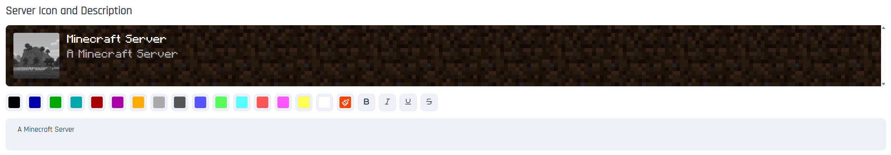

# Minecraft Settings
You can find them in the "Minecraft Settings" tab in your panel.
___

## Server Icon and Description

## Basic Server Settings
Settings related to server operation. You can find list of them below:

Show command info to ops:
`broadcast-console-to-ops`

Notify ops of RCON usage:
`broadcast-rcon-to-ops`

Run server in diagnostic mode:
`debug`

Toggle command blocks:
`enable-command-block`

Enable JMX monitoring:
`enable-jmx-monitoring`

Toggle server info query:
`enable-query`

Enable RCON access:
`enable-rcon`

Toggle server status query:
`enable-status`

Force secure player profiles:
`enforce-secure-profile`

Enforce whitelist:
`enforce-whitelist`

Entity broadcast range %:
`entity-broadcast-range-percentage`

Force fixed game mode:
`force-gamemode`

Min permission for functions:
`function-permission-level`

Hide online players:
`hide-online-players`

Initially disabled packs:
`initial-disabled-packs`

Initially enabled packs:
`initial-enabled-packs`

Max neighbor updates:
`max-chained-neighbor-updates`

Max players:
`max-players`

Server MOTD:
`motd`

Compression threshold:
`network-compression-threshold`

Use official accounts:
`online-mode`

Op permission level:
`op-permission-level`

Player idle timeout:
`player-idle-timeout`

Block proxy/VPN connections:
`prevent-proxy-connections`

Server query port:
`query.port`

Rate limit:
`rate-limit`

RCON password:
`rcon.password`

RCON port:
`rcon.port`

Server IP address:
`server-ip`

Server port:
`server-port`

Sync chunk writes:
`sync-chunk-writes`

Text filter config:
`text-filtering-config`

Enable native transport:
`use-native-transport`

Whitelist enabled:
`white-list`

## World Settings
Customize world settings to your needs.

Allow flight:
`allow-flight`

Enable Nether access:
`allow-nether`

World difficulty:
`difficulty`

Default game mode:
`gamemode`

Toggle structures:
`generate-structures`

Gen settings:
`generator-settings`

Hardcore mode:
`hardcore`

World name:
`level-name`

World seed:
`level-seed`

World type:
`level-type`

Max tick time:
`max-tick-time`

Max world size:
`max-world-size`

Enable PvP:
`pvp`

Sim distance:
`simulation-distance`

Animal spawn:
`spawn-animals`

Monster spawn:
`spawn-monsters`

NPC spawn:
`spawn-npcs`

Spawn protection:
`spawn-protection`

View distance:
`view-distance`

## Resource Pack Settings
Add your own resource pack to the server.

Force resource pack usage:
`require-resource-pack`

Resource pack URL:
`resource-pack`

Resource pack prompt:
`resource-pack-prompt`

Resource pack SHA1:
`resource-pack-sha1`

Resource pack ID:
`resource-pack-id`

## Inne ustawienia

No description:
`previews-chat`