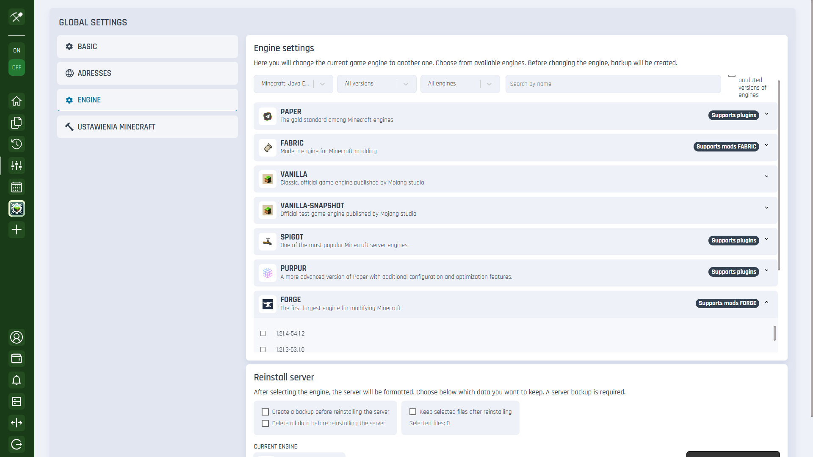
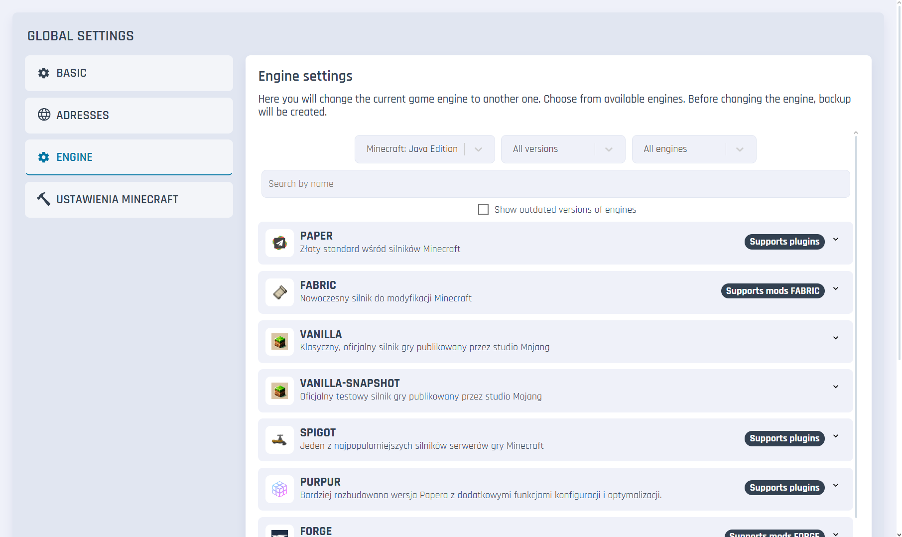
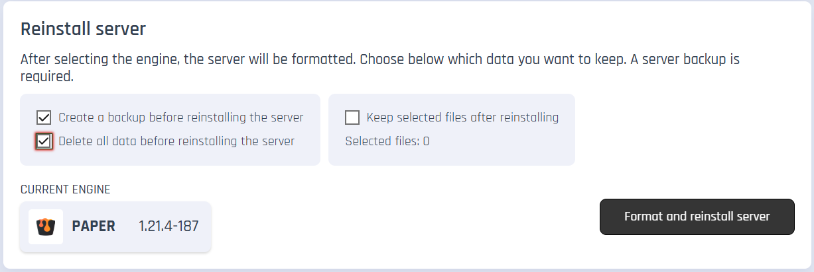
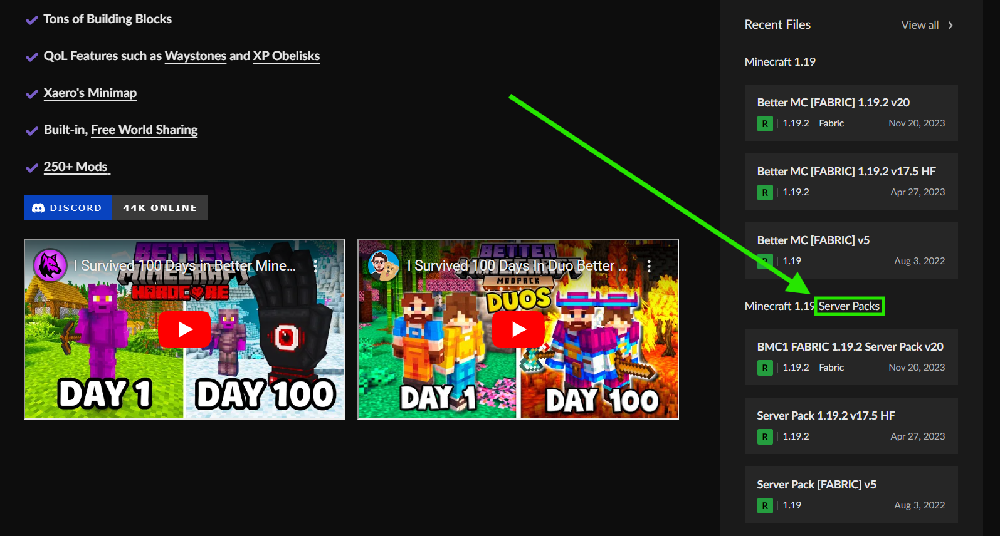
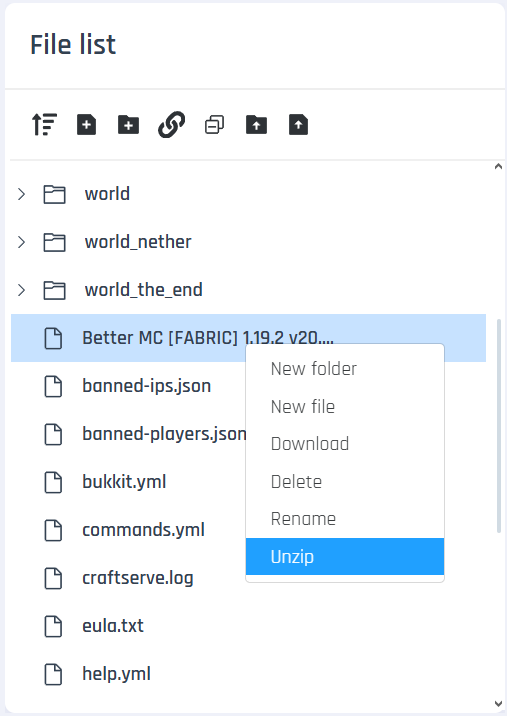

# Modpack Installation

### Requirements

* A Minecraft server supporting Fabric / Forge modifications (for Craftserve: the Amethyst package)

### Installation

1. Choose the recommended Forge or Fabric engine version for the modpack.
   - You can set the Forge engine in the **Settings** -> **Engine** -> **Forge** tab in the Craftserve panel.
   
     
   - Fabric engines are located in the **Settings** -> **Engine** -> **Fabric** tab in the Craftserve panel.
   
     
   - Confirm the server's formatting to avoid issues during the installation process. If you really need to save some files, 
   *Note: Server formatting will result in the loss of all files, including any map data.*
   
     
2. Download the modpack from a site such as [this one](https://www.curseforge.com/minecraft/modpacks). Be sure to download the server version of the pack, which is labeled "Server Pack".

    
3. Upload the downloaded zip file to the server using [FTP](ftp.md).
4. Go to the Craftserve panel and select the **Files** tab.
5. Find the uploaded zip file, right-click it, and select **Unzip** from the list.

    
6. After unzipping, you can delete the zip file.
7. Start the server and wait for it to launch.

### Notes
- Access to the server is only possible if the player has the same (but not the server version, only the regular, "client") modpack version installed in their game. 
- If you experience issues starting the server, check if the Fabric/Forge engine version matches the modpack version.
