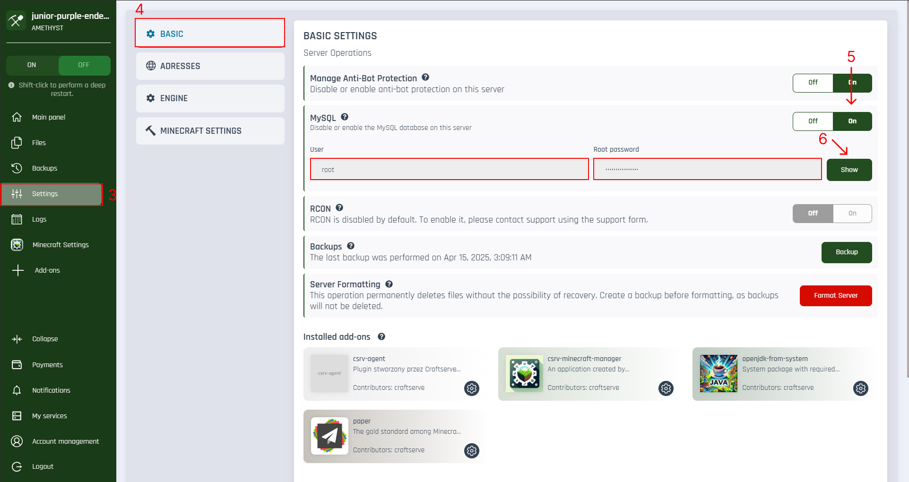

## 🧠 What is MySQL?

<p id="tooltip-data">
MySQL is a popular relational database management system. In the context of a Minecraft server, MySQL can be used for:

-   Storing player data (e.g., auth plugins, statistics, economy systems),
-   Storing plugin configurations,
-   Synchronizing data between multiple servers (e.g., BungeeCord, Velocity).
</p>

## 🔐 MySQL Availability

<div style="background-color:#ffe0e0; padding:10px; border-left:4px solid #ff4c4c; color: #000">
<strong>Note:</strong> MySQL access is available only for servers on the <strong>Amethyst</strong> plan.
</div>

## ✅ How to enable MySQL on your server?

To activate MySQL for your server, follow these steps:

1. Go to the <a target="_blank" href="https://craftserve.com/account"><strong>panel</strong></a>.
2. Select your target server.
3. From the sidebar, choose the <strong>Settings</strong> option.
4. Open the <strong>Basic</strong> tab.
5. Find the <strong>MySQL</strong> option and set it to <strong>Enabled</strong>.
6. After enabling it, a password will appear – click the <strong>"Show"</strong> button to view it.
   </br>
   </br>



## ⚙️ MySQL Access Details

| Parameter | Value                                      |
| --------- | ------------------------------------------ |
| Host      | `127.0.0.1` (not `localhost`)              |
| Port      | `3306`                                     |
| User      | `root`                                     |
| Password  | Visible after clicking "Show" in the panel |

## 🛠️ Plugin Connection Example

```yaml
# Example plugin configuration
mysql:
    host: 127.0.0.1
    port: 3306
    user: root
    password: your_password
    database: example_db
```
