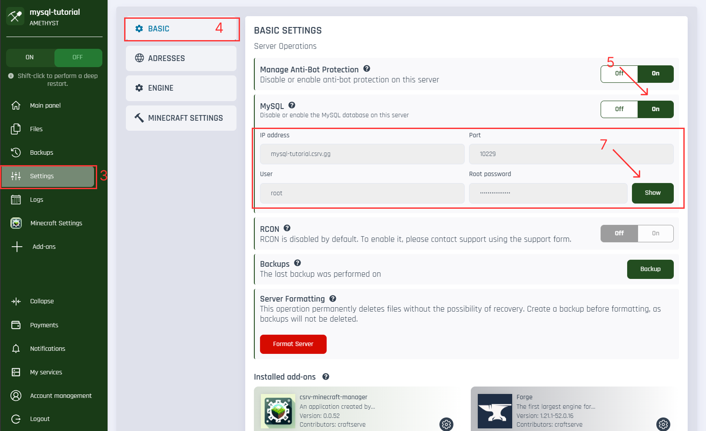
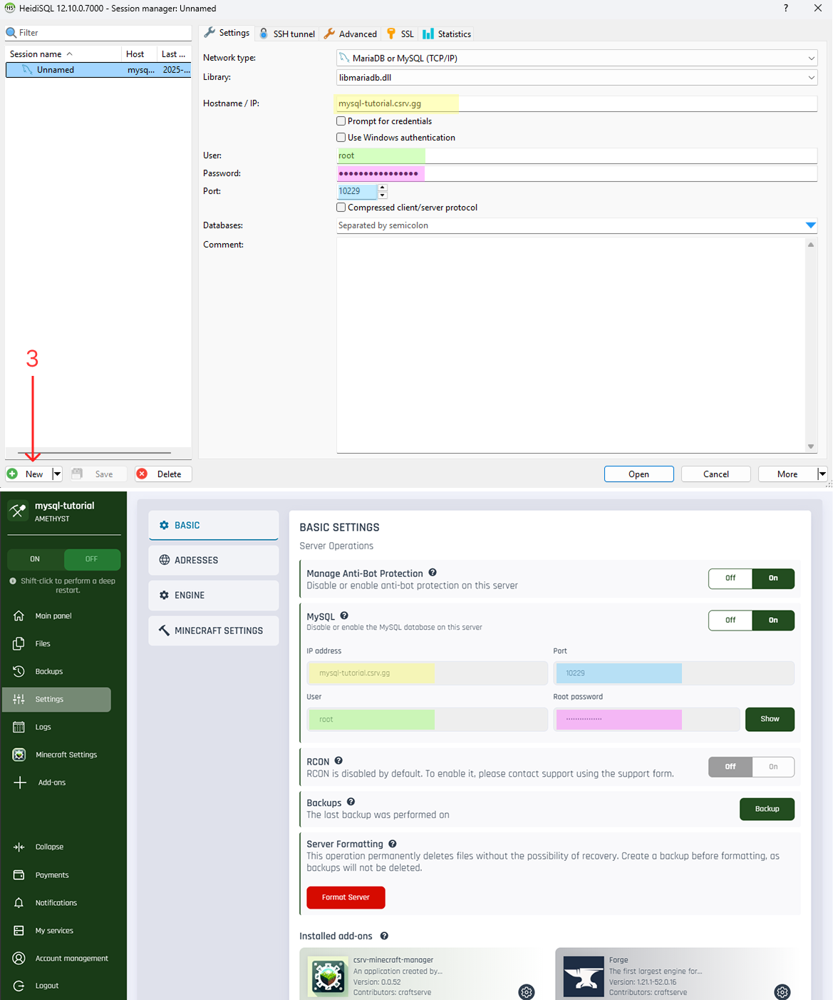

# 🧠 What is **MySQL**?

<p id="tooltip-data">
MySQL is a popular relational database management system. In the context of a Minecraft server, it can be used for:

-   Storing player data (e.g., login info, stats, economy systems),
-   Storing plugin configurations
-   Synchronizing data across multiple servers (e.g., using BungeeCord or Velocity).
</p>

---

# 🔐 MySQL Availability

<div style="background-color:#ffe0e0; padding:10px; border-left:4px solid #ff4c4c; color: #000">
<strong>Note:</strong> MySQL is only available on the <strong>Amethyst</strong> plan.
</div>

---

# ✅ How to Enable MySQL on Your Server

To enable MySQL for your server:

1. Go to the [dashboard](https://craftserve.com/account).
2. Select your server.
3. In the sidebar, click **Settings**.
4. Go to the **Basic** tab.
5. In the **MySQL** section, set the option to **Enabled**.
6. Confirm the warning about starting or stopping the server.

    > 🔴 **Note:** MySQL access will be available once the server has started or stopped.

7. After enabling MySQL, you will see your connection details: host, port, user, password – click the **Show** button to reveal.

---



---

# 🔗 How to Connect to MySQL

To connect to the MySQL database, you’ll need a client. We recommend the free program **HeidiSQL**:  
👉 [Download HeidiSQL](https://www.heidisql.com/download.php)

### Connection Setup:

1. Open HeidiSQL and click **New** in the bottom-left corner.
2. Fill in the fields as follows:

| Field               | Value from Craftserve Panel          |
| ------------------- | ------------------------------------ |
| **Connection Type** | `MariaDB or MySQL (TCP/IP)`          |
| **Library**         | (leave default)                      |
| **Hostname / IP**   | Value from the `Connection Address`  |
| **User**            | `root`                               |
| **Password**        | Password shown after clicking “Show” |
| **Port**            | Port shown after MySQL is enabled    |

3. Click **Open** to connect.



---

# ❗ Troubleshooting Connection Issues

### 🔄 Can't connect to the database

1. Go to the [dashboard](https://craftserve.com/account).
2. Select your server.
3. Navigate to **Settings** → **Basic**.
4. Check if **MySQL** is enabled.
5. If the issue persists:

    - Make sure all connection credentials are correct.
    - Restart the server by **holding SHIFT** while clicking the **Start** button – this triggers a _deep restart_.
    - Try connecting again after the restart.

---

# ⚙️ Plugin Configuration Details

Use the following credentials in your plugin configuration files:

| Parameter    | Value                           |
| ------------ | ------------------------------- |
| **Host**     | `127.0.0.1` _(not `localhost`)_ |
| **Port**     | `3306`                          |
| **User**     | `root`                          |
| **Password** | Available in the panel          |

### 📄 Plugin Configuration Example:

```yaml
mysql:
    host: 127.0.0.1
    port: 3306
    user: root
    password: your_password
    database: example_db
```
