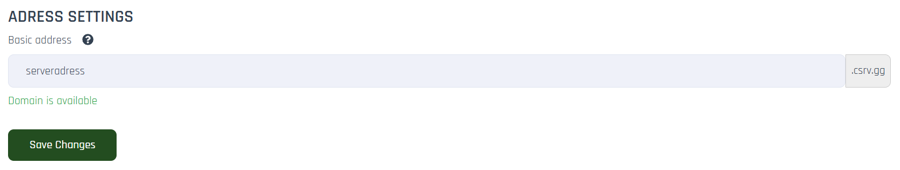
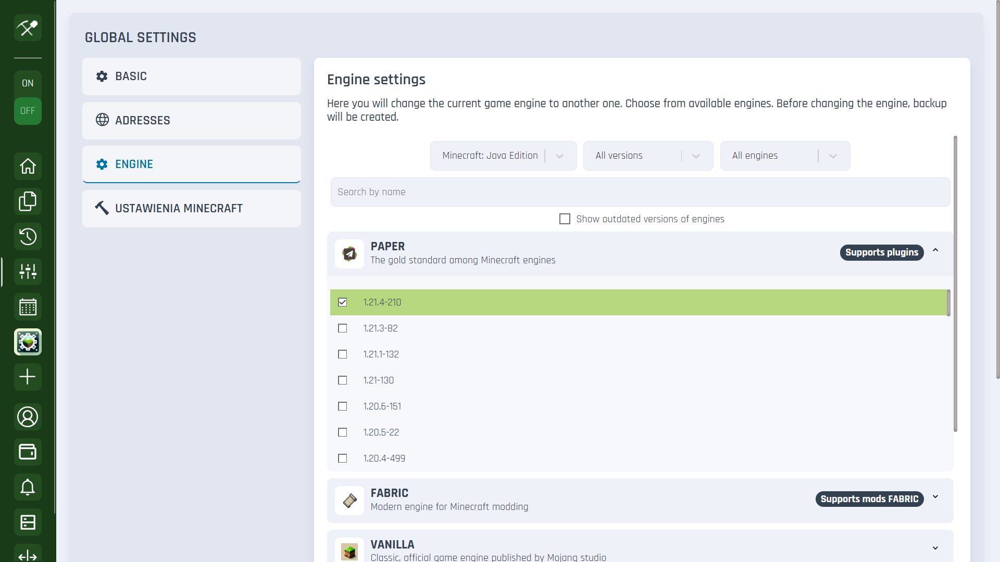

# Settings
You can manage the basic server options here. You can find the Settings tab at the left bar in your server panel.

___

## Basic Settings

**Manage Anti-Bot Protection**
Disable or enable anti-bot protection on this server

**MySQL**
Disable or enable the MySQL database on this server

**RCON**
RCON is disabled by default. To enable it, please contact support using the support form.

**Server Formatting**
This operation permanently deletes files without the possibility of recovery. Create a backup before formatting, as backups will not be deleted.

## Adress Settings

**Basic address**
The connection address for your server from within the game.

## Ustawienia silnika
Here you can change the current game engine to another one. Choose from available engines. Before changing the engine, backup will be created.

