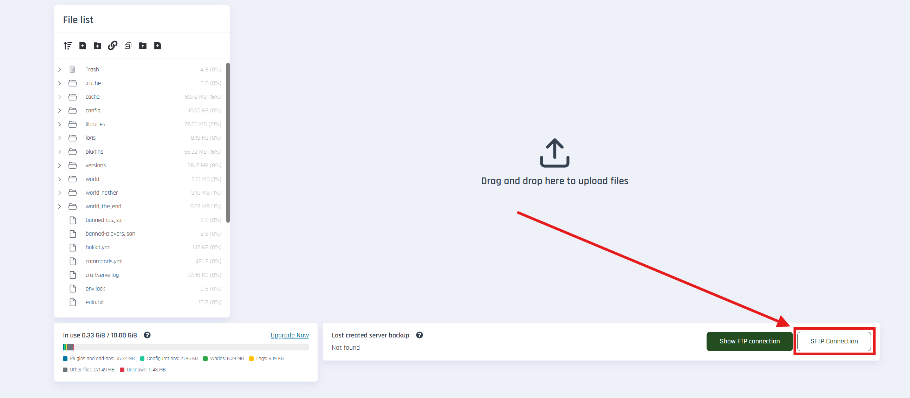
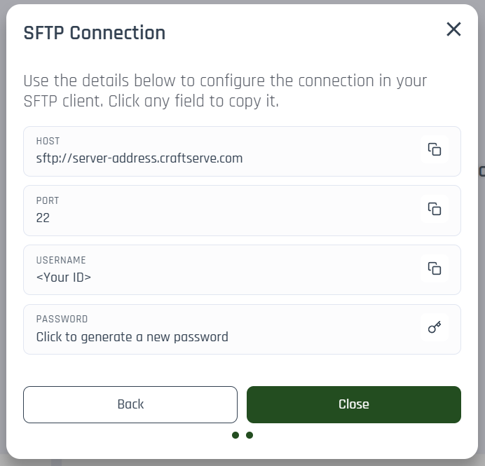
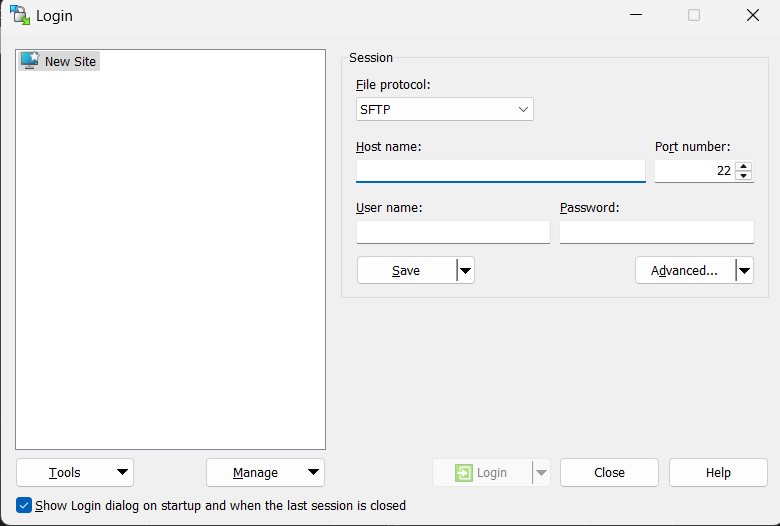
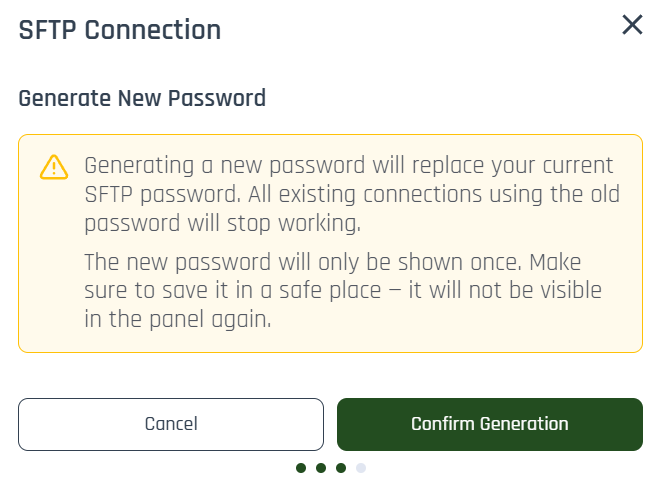

# SFTP - Connection and Password

SFTP (SSH File Transfer Protocol) is a secure way to transfer files between your computer and server. Craftserve provides SFTP details in the server panel, and you can generate or reset your password anytime.

## Where to find SFTP details in the panel

In the server panel, go to the **Files** section and click **SFTP connection**.

You should see:

1. **HOST** – e.g. `sftp://smart-gray-squid.csrv.gg`
2. **PORT** – usually `22`
3. **USER NAME**
4. **PASSWORD**

> The new SFTP password is shown only once. Save it in a safe place.

### Step-by-step:

1. Open the panel and go to **Files**.
2. Click **SFTP connection**.
3. Copy host and port (use copy icons).
4. Copy user name.
5. If password is missing or unknown, click generate new password.
6. Paste credentials into your SFTP client.

## Recommended clients and quick start

If you are unsure where to begin, use this documentaion and one of the recommended SFTP clients (or any other one!):

- FileZilla: https://filezilla-project.org/download.php
- WinSCP: https://winscp.net/eng/download.php
- Panel SFTP docs (this page)

## Connect with WinSCP

1. Open WinSCP and choose **New Session/New tab**.
2. Select **File protocol** = **SFTP**.
3. Enter credentials from panel:
   - Host name: value from panel (e.g., `smart-gray-squid.csrv.gg`)
   - Port number: `22`
   - User name: value from panel
   - Password: generated password
4. Click **Login**.

## Connect with FileZilla

1. Open FileZilla and go to **File → Site Manager**.
2. Click **New Site**.
3. Enter:
   - Protocol: **SFTP - SSH File Transfer Protocol**
   - Host: value from panel (domain only, without `sftp://`)
   - Port: `22`
   - Logon Type: **Normal**
   - User: value from panel
   - Password: generated password
4. Click **Connect**.

Then click **Login** / **Connect**.

## Generating a new SFTP password

If you don’t know the password or want to rotate it, click **Generate new password** in the panel.

- New password replaces the old one.
- Existing connections using the old password stop working.
- Password is shown once only – store it securely.

## Practical notes

- Do not share your password publicly.
- If login fails, verify host, port, and username.
- After uploading files, restart your server to apply changes.

## Common issues

- Login error: ensure no trailing spaces and correct password.
- Connection closed: verify SFTP protocol and port 22.
- Permission issue: account may only access your server folder.

