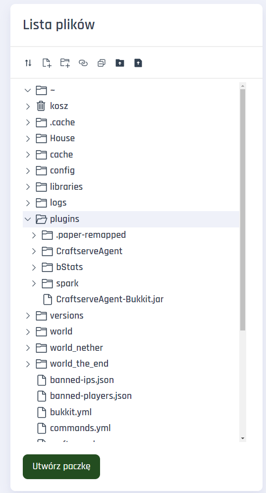

# Plugin Installation

Although the **Craftserve Panel** has a [Add-ons Gallery](https://craftserve.com/m), sometimes you may want to install plugins manually.

To install plugins, it is best to use the traditional method - by using **FTP** or the **Files** tab in the Craftserve panel. To run plugins, you will need one of the engines that supports them, e.g.:

## Bukkit, Spigot, Paper, Purpur, etc.

Plugins for these engines can be downloaded from [Bukkit.org](https://dev.bukkit.org/bukkit-plugins), [SpigotMC](https://www.spigotmc.org/resources/categories/spigot.4/), and many others. However, you should be careful about the sites you download files from, as many of them (e.g., "9minecraft", "BlackSpigot", and others like them) might send harmful or non-original software.

Before downloading a plugin, make sure it works with your version of Minecraft. Once downloaded, the **.jar** plugin files should be copied to the **/plugins/** folder on your server:

## Sponge

The Sponge engine has an API that is completely different from Bukkit, Spigot, or Paper, so plugins for these engines are not compatible with each other. Sponge plugins can be downloaded from the [SpongePowered](https://ore.spongepowered.org/) website. Like the previous engines, simply place the appropriate version of the plugin into the **/plugins/** folder on your server.

Unfortunately, the Sponge plugin library is significantly smaller than that of Bukkit and Spigot.

## Installation

To manage files, you can use the **Files** tab in the Craftserve panel or the **FTP** protocol with a compatible client, such as **[WinSCP](https://github.com/Craftserve/docs/blob/master/ftp.md)**.
