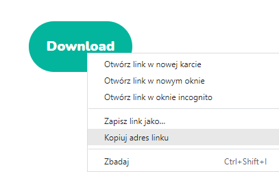
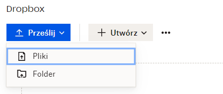

# Server Resource Pack
## Download Link
### Public Resource Pack

To upload a resource pack to the server, we need a direct download link for it. To get this, right-click on the button that triggers the download of the resource pack. Then, copy the link address.

### Resource Pack from Your Computer

If you want to upload your own resource pack to the server, you need to upload it to any service that provides a direct permalink for downloading. You can use, for example, [Dropbox](https://www.dropbox.com/). 
To do this:
* Drag your resource pack to the center of the page or click the **Upload** button.

* Select **Files**

* Find the resource pack you are looking for

* Then click **Open**

Now, copy the link to your pack by clicking the **Copy Link** button.

## Uploading the Resource Pack to the Server

Once you have the link, go to the server file **server.properties**. This file is located in the main directory of your server. Look for the line **resource-pack=** and paste the link there.

# IMPORTANT
If you are using Dropbox, you need to change the **0** at the end of the link to **1**.
