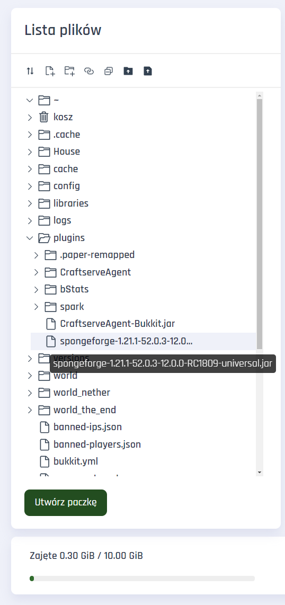

SpongeForge
===========
The standard **Forge** engine does not support any plugins. However, by making a few compromises, we can run plugins designed for the **Sponge** engine on it. To do this, simply download and install the **SpongeForge** mod. To get started, download the appropriate version of [**SpongeForge** from the SpongePowered website](https://www.spongepowered.org/downloads/spongeforge/stable/1.12.2), ensuring the mod version is compatible with your **Forge** — indicated by a red background symbol:

**Forge** loads mods alphabetically, so it’s best to rename the downloaded file to something like **0spongeforge.jar**, and then place it in the **/mods/** folder on your server.

**Sponge** plugins can be downloaded from the [SpongePowered website](https://ore.spongepowered.org/). Downloaded plugins with the **.jar** extension can be placed in either the **/mods/** or **/mods/plugins/** folder:

Note!
-----
If the plugin uses **MIXIN**, it must be placed in the **/mods/** folder.

Installation
------------
You can manage files through the **Files** tab in the Craftserve panel or using the **FTP** protocol with an FTP client, such as **FileZilla**.
