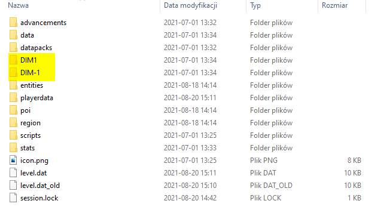

# Server World
## Table of Contents
- [Server World](#server-world)
  - [Table of Contents](#table-of-contents)
  - [Creating a New World](#creating-a-new-world)
  - [Uploading Your Own Map](#uploading-your-own-map)
  - [Setting Your Own Seed](#setting-your-own-seed)
  - [Moving a World from Server to Singleplayer](#moving-a-world-from-server-to-singleplayer)

## Creating a New World
To create a new map, follow these steps:
* Turn off the server
* Go to the server files
* Delete the current world on the server by removing the **world**, **world_nether**, and **world_the_end** folders. If the world name has been changed in the **server.properties** file, delete the **<world name>**, **<world name>_nether**, and **<world name>_the_end** folders. (If you want to keep the map, it is best to download it to your computer using **[FTP](https://github.com/Craftserve/docs/blob/master/ftp.md)**).

* If the **level-seed** line in the **server.properties** file has a world seed, delete it and save the file so a new one is generated. Otherwise, only your progress will be reset.
* Start the server

# Uploading Your Own Map
To upload your own world, follow these steps:
* Turn off the server
* Go to the server files
* Delete the old world (Information on how to do this is above)
* Upload your new world to the main server folder

* Rename the folder to **world**

* Start the server

## Setting Your Own Seed
To set your own seed, follow these steps:
* Turn off the server
* Go to the main server directory
* Open the **server.properties** file
* In the **level-seed=** line, enter your seed

* Save the file
* Delete the old world (Information on how to do this is at the top)
* Start the server

## Moving a World from Server to Singleplayer
To move a world from the server to your computer, follow these steps:
* Download your world
* Go to the Nether folder and download the **DIM-1** folder
* Go to the End folder and download the **DIM1** folder
* Press the **Windows + R** shortcut and type: **%appdata%**
* Open the **.minecraft** folder and then the **saves** folder
* Upload the world you downloaded there
* Add the **DIM-1** and **DIM1** folders to the world

