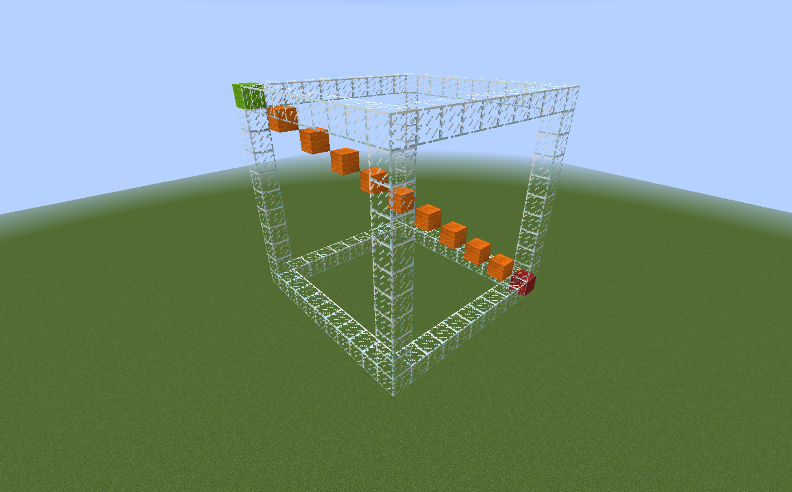
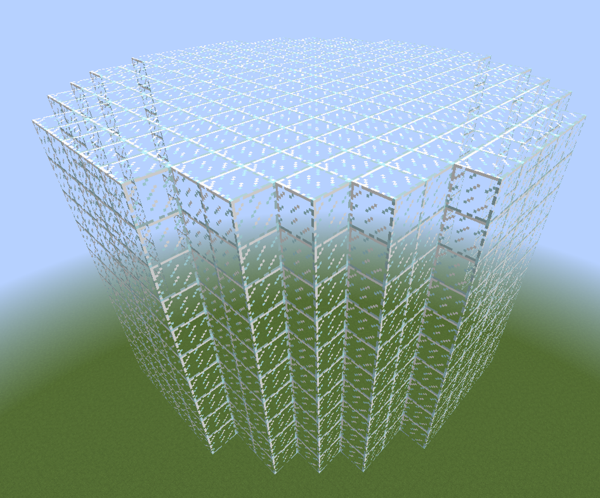

# WorldEdit - Complete Guide

WorldEdit is a plugin for world editing, allowing you to speed up basic tasks such as filling walls, copying and rotating, to generating advanced structures with a single command.

## Installation

1. Download the plugin from the [official page](https://dev.bukkit.org/projects/worldedit).
2. Copy the WorldEdit.jar file to the plugins folder.
3. Start the server.

## Basics - Start Here

Due to the vast number of features and their interconnections, I have divided the guide into two parts: basics and a complete overview. In this section, I describe the basic, most commonly used features. Later in the text, I expand on these with advanced functions.

### Selection
To edit blocks, you must first specify the area where you want to make changes. The basic selection type is a cuboid, connecting two points.

#### Creating a Selection
You can create it in three ways:

* Holding a wooden axe, select the first point by left-clicking and then select the second point by right-clicking. The wooden axe can be crafted or obtained using the `//wand` command.
* Type `//pos1` for the first point and `//pos2` for the second point. They are created at the locations where you stand while entering the commands.
* Type `//hpos1` for the first point and `//hpos2` for the second point. These are created at the locations where you are looking while entering the commands.

The cuboid will be created by connecting these two points.

#### Editing a Selection
If you want to edit the previously created cuboid, you can do so in several ways:

* Edit one of the points using the methods described in creating a selection.
* Expand the region by 5 blocks upwards by typing `//expand 5 U`.
* Expand the region by 5 blocks in the direction you're looking by typing `//expand 5`.
* Contract the region by 5 blocks from the top by typing `//contract 5 D`.
* Contract the region by 5 blocks in the direction you're looking by typing `//contract 5`.

The available directions are: N, S, W, E, U (up), D (down).

### Doing Something with the Selected Area
Once you've selected an area, you can modify it.

#### Filling the Selection
Using the `//set <blocks>` command, you will replace all blocks within the selection with specific blocks.  
Blocks can be written in the following ways:

* `stone` - will be replaced with stone
* `stone,dirt,bedrock` - will be randomly replaced with stone, dirt, and bedrock
* `25%stone,25%dirt,50%bedrock` - will be replaced with 25% stone, 25% dirt, and 50% bedrock

For example: `//set dirt`, `//set 10%glass,90%stone`, `//set air`

#### Replacing the Selection
Using the `//replace <blocks> <blocks>` command, you replace specific blocks with others.

For example, `//replace dirt,stone 20%dirt,20%sand,60%stone` will replace all dirt and stone blocks with 20% dirt, 20% sand, and 60% stone.

#### Creating Walls
Using the `//walls <blocks>` command, you create walls around the selection.

For example, `//walls stone,dirt` will create a wall made of random stone and dirt blocks.

#### Copying and Clipboard
After selecting the area, using the `//copy` command, you can copy it.

Using the `//paste` command, you can paste it.  
* **IMPORTANT** It’s important to note where you are standing when typing the `//copy` command — for example, if you were standing 5 blocks in front of a structure, after typing the `//paste` command, the structure will be pasted 5 blocks in front of you.

Using the `//rotate <degrees>` command, you can rotate the structure in the clipboard.  
For example: `//copy`, `//rotate 90`, `//paste`.

Using the `//flip [direction]` command, you can flip the structure in a given direction (e.g., mirror it).  
For example: `//copy`, `//flip`, `//paste`.

### Generating
There are also commands that allow you to generate certain structures at the location where you are standing without the need for selection.

#### Creating Spheres
Using the `//sphere <blocks> <radius>` command, you will create a sphere with its center at the location where you are standing.  
For example, `//sphere stone 5` will create a stone sphere with a radius of 5.

Using the `//hsphere <blocks> <radius>` command, you will create a hollow sphere (empty in the middle) with its center at the location where you are standing.  
For example, `//hsphere glass 7` will create a hollow glass sphere with a radius of 7.

#### Creating Cylinders
Using the `//cyl <blocks> <radius> [height]` command, you will create a cylinder with its center at the location where you are standing, and its height is measured upwards.  
For example, `//cyl glass 7 10` will create a glass cylinder with a radius of 7 and a height of 10.

Using the `//hcyl <blocks> <radius> [height]` command, you will create a hollow cylinder (empty in the middle) with its center at the location where you are standing, and its height is measured upwards.  
For example, `//hcyl stone,dirt 3 12` will create a hollow cylinder made of stone and dirt with a radius of 3 and a height of 12.

### Brushes
Brushes allow you to "draw" with specific items.

By holding an item like a stick and using the command `//br <brush type>`, you activate a specific brush on the stick. Upon right-clicking, a specific change will occur at the location you point to, depending on the brush.

Example brushes:
* `//br sphere <blocks> <radius>` creates a sphere at the location you point to.
* `//br cyl <blocks> <radius> [height]` creates a cylinder at the location you point to.
* `//br clipboard` pastes the clipboard object (copied with `//copy`) at the location you point to.
* `//br gravity <radius>` arranges blocks on the ground according to gravity in the area you point to. For example, if you use `//br gravity 10`, floating blocks within a 10-block radius from the pointed location will fall to the ground.

The command `//none` will stop the block you are holding from being used as a brush.

### History
By using the command `//undo`, you can revert the last change made.
Using the command `//redo` restores the previously undone change.

## Complete List of Features
Some of the features described above will be repeated here, but will be explained in more detail.

### History
All **changes** made via the WorldEdit plugin are saved in the history. Actions like copying or rotating the clipboard are not included, only actual changes to the map are recorded.

`//undo [amount]`
With the `//undo` command, you can undo previously made changes.
For example, `//undo 5` is the equivalent of typing `//undo` 5 times, meaning you undo the last 5 changes.

`//redo [amount]`
With the `//redo` command, you can redo a previously undone change.
For example, `//redo 5` is the equivalent of typing `//redo` 5 times, meaning you redo the last 5 undone changes.

For example, after typing `//undo 5`, and then `//redo 3`, you undo 5 changes and then redo the last 3 undone changes, which results in the same outcome as typing `//undo 2`.

You can clear your history using the `/clearhistory` command.

### Block Patterns
Patterns refer to the blocks *that something will be replaced with*. An example of a pattern is `<blocks>` in `//set <blocks>`.

#### Single Block
Simply provide one specific block, for example, `stone`.

#### Random Blocks
* You provide a list of blocks, and for each edited block, one will be randomly selected. For example, `stone,dirt,bedrock`.
* You provide a list of blocks with percentages, and for each edited block, one will be randomly selected based on the percentages. For example, `10%stone,10%dirt,80%bedrock`.

#### Random Block State
Preceding the block name with `*` will make the state of the block random for each occurrence.
For example, `*oak_log` will randomize the direction of the oak log for each block.

#### Random Block Type
Preceding the block name with `##` will randomize the type of block for each occurrence.
For example, `##wool` will randomize the color of wool for each block.

#### Previous Block State
Preceding the block name with `^` will retain the previous state for each block when using commands like `//replace`.
For example, `//replace oak_stairs ^acacia_stairs` will replace all oak stairs with acacia stairs while preserving their previous direction.

### Masks
Masks refer to the blocks *that will be replaced*. An example of a mask is `<blocks1>` in `//replace <blocks1> <blocks2>`.

**IMPORTANT**
In addition to command arguments, masks can also be used globally or with specific brushes.
`//mask <mask>` makes it so that when using a brush (`//br`), you will only edit specific blocks.
`//gmask <mask>` applies to all actions you perform using WorldEdit.
Typing just `//mask` or `//gmask` resets them.

#### Block Mask
The simplest mask, where you specify which blocks you want to edit.
`//replace stone air`, `stone` is the mask, meaning all stone blocks will be replaced with air.
`//replace stone,dirt air`, `stone,dirt` is the mask, meaning all stone and dirt blocks will be replaced with air.

#### Negation
Works exactly like the previous mask, but negates the blocks.
`//replace !stone air`, `!stone` is the mask, meaning all blocks **except** stone will be replaced with air.
`//replace !stone,dirt air`, `!stone,dirt` is the mask, meaning all blocks **except** stone and dirt will be replaced with air.

#### Existing (existing)
Refers to all blocks except air.
`//replace #existing dirt`, `#existing` is the mask, meaning all blocks **except air** will be replaced with dirt.

#### Solid (solid)
Refers to all solid blocks. These are blocks that prevent players from passing through them.
`//replace #solid dirt`, `#solid` is the mask, meaning all solid blocks will be replaced with dirt.

#### Region
The `#region` mask is useful when you want to edit everything except a specific object. To do this, first select the object, then use the region mask with negation: `//gmask !#region`. *WorldEdit will remember the region at the moment this command is typed.* From that point on, all changes made using WorldEdit will not affect the previously selected region.

#### Below/Above
`//gmask <air` will edit only the blocks directly below air blocks.
`//gmask >air` will edit only the blocks directly above air blocks.

#### Mask with Expression
This mask performs a mathematical expression on each block.
For example:
`//gmask =y<32` will edit only blocks below y=32.

#### Combined Masks
You can also use multiple masks simultaneously, provided they don't conflict. You specify them in quotation marks, separated by a space.
For example, if you want to change only the stone blocks that are floating in the air (above air blocks), use the mask `"stone <air"`.

### Movement

* **Compass** - When you want to quickly move, you can use the compass. Left-clicking will teleport you to the location where you're looking, while right-clicking will teleport you through the wall in the direction you're looking.
* `/jumpto` - This command will teleport you to the location you're looking at.
* `/thru` - This command will teleport you through the wall in the direction you're looking at.
* `/ceil` - This command will teleport you to the highest solid block above you.
* `/up <number of blocks>` - For example, using `/up 5` will teleport you 5 blocks upwards and place a single glass block beneath you. It is very useful when you want to start building a structure in the air.

### Selection

You can select points in three different ways:
* Hold a wooden axe, select the first point by left-clicking, then select the second point by right-clicking. You can either craft the wooden axe yourself or get it via the `//wand` command.
* Type `//pos1` for the first point and `//pos2` for the second point. These are created at the locations where you're standing when you enter the commands.
* Type `//hpos1` for the first point and `//hpos2` for the second point. These are created at the locations you're looking at when entering the commands.
For more advanced selection methods (described below), you can also use additional values (`//hpos3`, `//hpos4`, etc.).

There are 7 selection methods, which are chosen via the `//sel <mode>` command.

1. `cuboid` - A basic rectangular prism, it covers the entire area between block 1 and block 2.

   * You can create it by selecting the first and second points. The rectangular prism is formed by connecting these two points.

2. `extend` - An expandable rectangular prism achieved by selecting more points.

   * Start by selecting the first point, then each subsequent selection will expand the cuboid.

3. `poly` - A polygon.

   * Start by selecting the first point, then add additional points to expand the cuboid into a flat polygon. Its height will correspond to the highest and lowest points you added.

4. `ellipsoid`

   * Start by selecting the first point, which will be the center. Adding more points will expand its radius, allow it to flatten, etc.

5. `sphere`

   * Start by selecting the first point, which will be the center. The second point will define the radius of the sphere.

6. `cyl` - Cylinder.

   * Start by selecting the first point, which will be the center. Additional points will expand its radius and allow it to flatten. The height will correspond to the lowest and highest points you added.

7. `convex`

   * Start by selecting the first point, then add additional points to create a convex polyhedron.

#### Editing Selection
**NOTE** This works only for the `cuboid` selection type.

`//expand <amount> [direction]`
You can increase the size of the selection with the above command. Available directions are: N (north), S (south), W (west), E (east), U (up), D (down), F (forward), B (back), L (left), R (right). Directions F, B, L, R are relative to the direction you're looking.
You can also combine directions, for example, `//expand 10 n,w`.
If no direction is specified, the cuboid will be expanded in the direction you're looking.

`//contract <amount> [direction]`
You can decrease the size of the selection with this command. The available directions are the same as for `//expand`.
If no direction is specified, the cuboid will decrease **from** the direction you're looking.

`//outset <amount>`
The above command will increase the selection by a given number of blocks in every direction.
* `//outset <amount> -h` will increase the horizontal selection (north, south, east, west) without editing the top or bottom.
* `//outset <amount> -v` will increase the vertical selection (up and down).

`//inset <amount>`
The above command will decrease the selection by a given number of blocks in each direction.
* `//inset <amount> -h` will decrease the horizontal selection (from north, south, east, west) without editing the top or bottom.
* `//inset <amount> -v` will decrease the vertical selection (up and down).

#### Selection Information

`//size`
Displays the number of blocks within your selection.

`//count <mask>`
Counts the blocks within your selection that meet a specific mask.
For example, `//count "dirt >stone"` will show how many dirt blocks are directly above stone blocks.

`//distr`
Calculates the number of specific blocks in your selection.

### Region Operations

#### Setting Blocks
`//set <pattern>`
Allows you to replace all blocks within the selection with another, according to the pattern rules.
For example:
* `stone` - Replaces with stone.
* `stone,dirt,bedrock` - Randomly replaces with stone, dirt, or bedrock.
* `25%stone,25%dirt,50%bedrock` - Replaces with 25% stone, 25% dirt, and 50% bedrock.

#### Replacing Blocks
`//replace <mask> <pattern>`
Allows you to replace specific blocks (mask) with others (pattern) within the selection.
For example, `//replace dirt,stone 20%dirt,20%sand,60%stone` will replace all dirt and stone blocks with 20% dirt, 20% sand, and 60% stone blocks.

#### Creating Walls and Outlines
`//walls <pattern>`
Creates walls (fills the outer blocks of the cuboid, excluding top and bottom) with a specific block.

`//outside <pattern>`
Creates an outline (fills all outer blocks of the cuboid) with a specific block.

#### Overlaying
`//overlay <pattern>`
Covers all the highest blocks (those with only air above them) with a specific block (pattern). This is useful for covering a grass field with flowers.

#### Stacking
`//stack <amount> [direction]`
Copies the selected structure and pastes it a specific number of times (next to each other) in the given direction.
This is useful for creating bridges, tunnels, or repeating segments of a building.

#### Moving
`//move <distance> [direction]`
Copies, cuts, and pastes (moves) the entire structure a given number of blocks in the specified direction.
For example, `//move 5 u` moves the entire structure 5 blocks up.

#### Smoothing
`//smooth [number of repetitions]`
Smooths the selected area, useful for creating hills. The number of repetitions determines the smoothing strength (`//smooth 3` is equivalent to running the `//smooth` command 3 times).

#### Regenerating
`//regen`
Restores the terrain to its default state at the specified location based on the map's seed.

#### Naturalizing
`//naturalize`
Works only on stone, converting the top 3 layers of stone to dirt and one of those to grass.

#### Placing Flora
`//flora`
Covers the grass with naturally distributed plants, and the sand with naturally distributed dead trees.

#### Placing a Block in the Center of Selection
`//center <pattern>`
Places a specific block in the center of the selected cuboid. If the length is even, two blocks are placed.

#### Deforming
`//deform <mathematical expression>`
Deforms the selected area using a mathematical expression.

For example:
`//deform y+=0.2*sin(x*10)` waves the terrain, creating natural hills. By modifying variables, you can create very natural and unique effects. The size of the variables should be proportionally dependent on the size of the selected area.
`//deform swap(x,y)` flips the terrain.
`//deform rotate(x,z,45*pi/180)` rotates it at a given angle.
`//deform x/=2;y/=2;z/=2` scales the object by a factor of two.

### Clipboard

#### Copying and Cutting
Copying objects to the clipboard can be done by entering two commands (after selecting the region).
`//copy` - simply copies.
`//cut` - simply copies and then cuts (replaces with air).

**IMPORTANT** your position relative to the copied region is remembered, so if you are standing 5 blocks in front of a door and copy it, when you paste it elsewhere, the door will appear 5 blocks in front of you. This is an important aspect when performing clipboard operations.

Both commands allow the use of three additional flags:
* `-e` also includes entities (mobs, items on the ground, etc.) in the copy or cut. For example, `//copy -e`.
* `-b` also includes biomes (in the case of cutting, biomes will still be left at the location of the cut object). For example, `//copy -b`.
* `-m <mask>` also includes a specific mask when copying or cutting. All blocks that do not belong to the mask will be represented as air in your clipboard (they will not be copied). For example, `//copy -m !stone` will copy all blocks except stone.

#### Pasting
Pasting objects (after copying or cutting them).
`//paste` - allows pasting the object.
Since your position is remembered, if you copied a tower while standing at its top, after pasting, it will be directly beneath you.

Similar to copying, the command allows for the use of three flags:
* `-e` also includes pasted entities if any were copied.
* `-b` also includes pasted biomes if any were copied.
* `-m <mask>` allows the inclusion of specific blocks from the clipboard to be pasted.
Additionally, there are a few extra flags available:
* `-a` will not paste air from the clipboard.
* `-s` will set the selection to the area that was pasted.
* `-o` will paste the clipboard at the location it was copied from, ignoring the relative position.

#### Rotating
`//rotate <angle>`
Allows rotating the clipboard by a specific number of degrees; it is best to use multiples of 90 (for more irregular angles, it's recommended to use the `//deform` command described above).
It is important to note that the selection rotates relative to the location you were standing while copying the object. If you want to rotate it relative to the center, you must stand at the center while copying (you can define the center, for example, using the `//center <pattern>` command).

#### Flipping
`//flip [direction]`
Allows flipping the contents of the clipboard in a specific direction, such as a mirror flip of the content.

#### Creating Schematics
WorldEdit allows you to permanently save the clipboard content and share it elsewhere or upload schematics downloaded from the internet.
Schematics are stored in the `plugins/WorldEdit/schematics` folder.

`//schem save <file name>` saves the current clipboard content.
`//schem load <file name>` loads the given schematic into the clipboard.
`//schem list` displays a list of existing schematics.
`//schem delete <file name>` allows you to delete a specific schematic.

### Generation
WorldEdit also allows the generation of various objects, such as spheres or pyramids.
The center of the generated object will be at the location where you are standing.

#### Creating a Cylinder
By using the `//cyl <blocks> <radius> [height]` command, you will create a cylinder. Its center will be where you are standing, and its height is counted upwards.
For example, `//cyl glass 5 10` will create a glass cylinder with a radius of 5 and a height of 10.

Using the `//hcyl <blocks> <radius> [height]` command, you will create a hollow cylinder (a cylinder with a hollow center). Its center will be where you are standing, and its height is counted upwards.
For example, `//hcyl stone,dirt 3 12` will create a hollow cylinder of stone and dirt with a radius of 3 and a height of 12.

`//cyl <pattern> <radiusEW>,<radiusNS> [height]` allows for more control, where you can flatten the shape and create an elliptical cylinder by providing two values for the radius, the width of the radius on the EW and NS axes.
For example, `//cyl stone 5.5,10 5`.

#### Creating a Sphere
By using the `//sphere <blocks> <radius>` command, you will create a sphere. Its center will be where you are standing.
For example, `//sphere stone 5` will create a stone sphere with a radius of 5.

Using the `//hsphere <blocks> <radius>` command, you will create a hollow sphere (a sphere with a hollow center). Its center will be where you are standing.
For example, `//hsphere dirt 7` will create a dirt sphere with a radius of 7.

`//sphere <pattern> <radius>,<radius>,<radius>` allows you to use specific radii for all three axes, just like with cylinders.
For example, `//hsphere dirt 10,5,4.5`.

You can also add `yes` at the end of the command so that the highest point of the sphere will be directly beneath your feet (instead of its center being where you are standing).
For example, `//sphere stone 5 yes` will create a sphere with you standing on it.

#### Creating a Pyramid
`//pyramid <pattern> <size>`
`//hpyramid <pattern> <size>`
These commands allow you to create a pyramid (full or hollow). Its center will be where you are standing. Providing a size, e.g., 5, will create a pyramid consisting of 5 layers, each 1 block wider than the previous one.

#### Generating Advanced Shapes
WorldEdit also allows for generating advanced shapes using mathematical expressions that represent 3D functions.
A good understanding of mathematics is required here, or simply modifying existing examples and testing which variable does what.

Examples:

Flattened Torus:
`//g stone (0.75-sqrt(x^2+y^2))^2+z^2 < 0.25^2`
Tree Trunk:
`//g -h oak_log (0.5+sin(atan2(x,z)*8)*0.2)*(sqrt(x*x+z*z)/0.5)^(-2)-1.2 < y`
Rainbow Torus:
`//g white_wool data=(32+15/2/pi*atan2(x,y))%16; (0.75-sqrt(x^2+y^2))^2+z^2 < 0.25^2`
Rainbow Egg:
`//g white_wool data=(32+y*16+1)%16; y^2/9+x^2/6*(1/(1-0.4*y))+z^2/6*(1/(1-0.4*y))<0.08`
Heart:
`//g red_wool (z/2)^2+x^2+(5*y/4-sqrt(abs(x)))^2<0.6`
Wave:
`//g -h glass sin(x*5)/2<y`
Radial Wave:
`//g -h glass cos(sqrt(x^2+z^2)*5)/2<y`
Circular Hyperboloid:
`//g stone -(z^2/12)+(y^2/4)-(x^2/12)>-0.03`

### Tools

Tools can be bound to specific items and greatly speed up your work.
To bind a tool to a specific item, you must hold it in your hand and enter the given command.
To clear the assignment, simply type `//none`.

#### Tree Generating Tool
`/tree [type]`
This tool generates trees of specific types when you click on a block. It uses the Minecraft tree generator and has the same limits—it will not generate a tree on a block where it cannot plant it, or if there are solid blocks where the tree could spawn.

#### Tool for Removing Floating Trees
`/deltree`
By right-clicking on floating blocks of leaves or wood (for example, from players cutting only the lower parts of trees), this tool will remove all connected tree blocks.

#### Block Replacing Tool
`/repl <pattern>`
This tool will replace clicked blocks with blocks from your pattern. You can also left-click to replace your current pattern with the clicked block.

#### Long-Distance Building Tool
`/lrbuild <left pattern> <right pattern>`
This tool allows you to replace blocks you click on. Left-clicking will replace blocks with the first pattern, and right-clicking will replace blocks with the second pattern.

#### Long-Distance Wand
`/farwand`
This works like `//hpos1` and `//hpos2`, but with left and right mouse clicks.

#### Rotation Tool
`/cycler`
This tool is used to rotate (change the states of) blocks you are looking at. For example, you can look at stairs and rotate them.

#### Info Tool
`/info`
When you right-click, this tool displays information about the block you are looking at. It will show coordinates, state, block type, light level, and ID.

#### Floodfill Tool
`/floodfill <pattern> <radius>`
This tool will replace the right-clicked block and all other connected blocks of the same type within the specified range with the given pattern.

### Super Pickaxe
The Super Pickaxe works differently than other tools because it is activated and deactivated with a command and applies to all pickaxes. Unlike regular tools, it is deactivated using the `//` command.

#### Single Super Pickaxe
`/sp single`
Allows you to instantly destroy blocks.

#### Super Pickaxe by Range
`/sp area <radius>`
Allows you to instantly destroy blocks of the same type as the one you clicked on, within the specified radius.

#### Recursive Super Pickaxe
`/sp recur <radius>`
Allows you to instantly destroy blocks of the same type as the one you clicked on, within the specified radius, but only those **connected to the clicked block**.

### Brushes
Brushes are primarily tools created for modeling.
They are bound to items the same way as regular tools and can be unbound using the `//none` command.
When you right-click, a specific change is made at the location you're pointing at, depending on the brush.

#### List of Brushes:
* Sphere Brush: `/brush sphere <pattern> [radius]` - Works the same as the `//sphere` command.
* Cylinder Brush: `/brush cyl <pattern> [radius] [height]` - Works the same as the `//cyl` command.
* Clipboard Brush: `/brush clipboard [-aoeb] [-m <mask>]` - Works the same as `//paste` and allows the use of flags.
* Smooth Brush: `/brush smooth [radius] [execution] [mask]` - Works the same as `//smooth`.
* Gravity Brush: `/brush gravity [radius]` - Arranges blocks on the ground according to gravity within the area you're pointing at. For example, if you use `//br gravity 10`, flying blocks within a 10 block radius from the point you're pointing at will fall down.
* Extinguish Brush: `/brush extinguish [radius]` - Extinguishes fire within the given radius.
* Butcher Brush: `/brush butcher [radius] [-pngabtfr]` - Allows you to remove specific entities within the specified radius. Flags include: `-p` (kills tamed animals), `-n` (kills NPCs), `-g` (kills golems), `-a` (kills animals), `-b` (kills passive mobs), `-t` (kills mobs with tags), `-f` (combines all above flags), `-r` (removes armor stands).
* Deform Brush: `/brush deform <shape> [size] [expression]` - Works like the `//deform` command. Shape can be for example `sphere` or `cyl`.
* Raise Brush: `/brush raise <shape> [size]` - Raises all blocks by one.
* Lower Brush: `/brush lower <shape> [size]` - Lowers all blocks by one.

#### Brush Settings:
* Masks - described in the Masks section.
* `//size <size>` - Changes the brush size.
* `//material <pattern>` - Changes the brush material pattern.
* `//range <radius>` - Changes the brush's action radius.

### Additional Commands
* `/removeabove <radius> [height]`
Removes blocks above you to a specific height, within a given radius.
* `/removebelow <radius> [depth]`
Removes blocks below you to a specific depth, within a given radius.
* `/removenear <mask> <radius>`
Removes blocks around you that match the specified mask, within a specific radius.
* `/replacenear <size> <mask> <pattern>`
Replaces blocks around you that match the specified mask with blocks of the specified pattern, within a specific radius.
* `//fill <pattern> <radius> [depth]`
Fills (floods) blocks of the same type within the specified radius with a specific pattern. It only works downward and only on blocks that are at the same height as where the command was issued. This is useful for filling ponds or lakes.
* `//fillr <pattern> <radius>`
Works like the above command, but also fills blocks that are simply adjacent to the selected blocks. This is useful for filling caves.
* `//drain <radius>`
Removes water and lava blocks within a specified radius.
* `//snow <radius>`
Covers the area within the specified radius with snow.
* `//green <radius>`
Replaces dirt with grass within the specified radius.
* `//ex [radius]`
Extinguishes fire within the specified radius.
* `//butcher [-pngabtfl] [radius]`
Allows you to remove specific entities within a given radius. Flags include: `-p` (kills tamed animals), `-n` (kills NPCs), `-g` (kills golems), `-a` (kills animals), `-b` (kills passive mobs), `-t` (kills mobs with tags), `-f` (combines all above flags), `-r` (removes armor stands).
