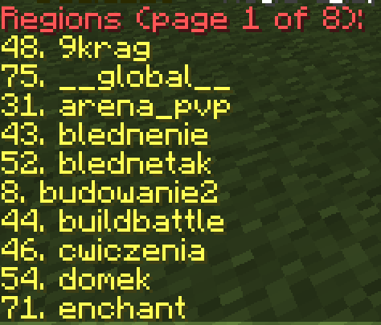

# WorldGuard - Guide

The main use of WorldGuard is to protect the world.

## Installation
*WorldGuard requires the WorldEdit plugin to function properly.*

1. Download the WorldEdit plugin from the [official website](https://dev.bukkit.org/projects/worldedit).
2. Copy the WorldEdit.jar file to the plugins folder.
3. Download the WorldGuard plugin from the [official website](https://dev.bukkit.org/projects/worldguard).
4. Copy the WorldGuard.jar file to the plugins folder.
5. Start the server.

## Creating and Editing Regions

### Creating Regions
To create a region, you must first select the area using the WorldEdit plugin. 
Hold the wooden axe and click the left mouse button (LMB) to select the first point, then click the right mouse button (RMB) to select the second point. You can create a wooden axe yourself or receive it via the `/wand` command. 
The selection will be made by connecting these two points.

WorldGuard supports polygonal regions; more information on using WorldEdit can be found in the dedicated [WorldEdit guide](https://github.com/Craftserve/docs/blob/master/worldedit.md).

After selecting the area, use the command `/rg define <region name> [owner]`.
The region name is a unique ID for the region, and two regions with the same name cannot exist in one world. The region name cannot contain spaces.
Providing the `owner` argument will assign the owner of the region (more information below).

After creating the region, players will automatically be unable to perform any unwanted actions, including editing blocks, opening chests, doors, riding animals, minecarts, etc., within the region. By default, only the administration with the appropriate permissions and players added as members or owners can modify the region.

### Editing the Region Area
If you want to edit the area that the region covers, create a new selection using the WorldEdit plugin, and then enter the command `/rg redefine <region name>`.

### Deleting a Region
To delete a region, use the command `/rg delete <region name>`.

## Checking Region Information

* `/rg info <region name>` - This command will display all information about a specific region.

* `/rg list [-p player] [page]` - This command will display a list of all regions. It supports the `-p player` flag (e.g., `/rg list -p jahumen`), which allows checking the list of regions a specific player is added to.

* While holding the *default* skin, right-click on any block — this will display information about the region in that location.

## Members

Members are individuals who have the permissions to edit blocks within a region, open chests, etc., but they cannot modify flags, add other members, etc.

### Adding Members
`/rg addmember <region name> <member>`
You can enter either a player's username or a group in the format `g:admin` for the `member`.

### Removing Members
`/rg removemember <region name> <member>`

## Owners

Region owners have permissions to edit other owners, members, flags, etc. (they manage the region). The first owner is automatically added in the `/rg define <region name> [owner]` command.

### Adding Owners
`/rg addowner <region name> <owner>`
You can enter either a player's username or a group in the format `g:admin` for the `owner`.

### Removing Owners
`/rg removeowner <region name> <owner>`

## Flags

By default, within a created region, building, block editing, etc., are not allowed, but you can modify these settings for a specific region using flags.
`/rg flag <region name> <flag> [state]`
If no flag state is provided, it will be set to the default, which means the flag will be removed.
This command also supports adding flags for specific groups in the format `g:admin`.

### Most Common Flags
* `passthrough` (allow/deny) - This flag makes the region use the flags from its parent region.
* `build` (allow/deny) - This flag allows building within the region.
* `interact` (allow/deny) - This flag allows interactions, such as opening doors, chests, pressing buttons, etc.
* `use` (allow/deny) - This flag allows opening doors, pressing buttons, etc., but **does not** allow opening chests.
* `pvp` (allow/deny) - This flag allows dealing damage to players.
* `tnt` (allow/deny) - This flag allows TNT explosions.
* `mob-spawning` (allow/deny) - This flag allows mobs to spawn.
* `deny-spawn` (list) - This flag specifies a list of mobs that cannot spawn in the region, e.g., `pig,cow`.
* `enderman-grief` (allow/deny) - This flag allows endermen to destroy blocks.
* `fire-spread` (allow/deny) - This flag allows fire spread.
* `creeper-explosion` (allow/deny) - This flag allows creeper explosions.
* `snow-fall` (allow/deny) - This flag allows snow to fall.
* `snow-melt` (allow/deny) - This flag allows snow to melt.
* `ice-melt` (allow/deny) - This flag allows ice to melt.
* `leaf-decay` (allow/deny) - This flag allows leaves to decay.
* `enderpearl` (allow/deny) - This flag allows teleportation using ender pearls.
* `chorus-fruit-teleport` (allow/deny) - This flag allows teleportation using chorus fruit.
* `item-pickup` (allow/deny) - This flag allows players to pick up items.
* `item-drop` (allow/deny) - This flag allows players to drop items.
* `invincible` (allow/deny) - This flag makes players in the region invincible.
* `fall-damage` (allow/deny) - This flag disables fall damage for players in the region.
* `blocked-cmds` (list) - Lists the commands that cannot be used in the region, e.g., `spawn,warp,home`.
* `greeting` (text) - A message that will be shown to the player when they enter the region.
* `farewell` (text) - A message that will be shown to the player when they leave the region.

You can check the full list of flags using the command `/rg flags [region name]`.
There are also [plugins](https://www.spigotmc.org/resources/worldguard-extra-flags.4823/) that add more flags.

## Region Priority

In certain areas, there may be more than one region at the same time. In such cases, the player must be added to each of them to, for example, destroy blocks. If the regions have different priorities, only the rules of the region with the highest priority will apply in that location.

`/rg setpriority <region name> <priority>`
The default priority is `0`. You can edit this for specific regions (both positive and negative values).

Example use:
* Creating a chest in the spawn that players can open while all other chests are blocked. To do this, create a `chest` region covering only the chest, then set the flag to allow interacting with chests: `/rg flag chest use allow` and set the priority of this region higher than the spawn region, e.g., `/rg setpriority chest 10`.

* Creating a PvP arena in the spawn where players can fight each other. To do this, create an `arena` region covering the arena, set the flag to allow PvP: `/rg flag arena pvp allow`, and set the priority of this region higher than the spawn region, e.g., `/rg setpriority arena 10`.

## Inheritance (Parent)

In the case of inheritance, the region structure is defined (parent <- child). Inheritance works similarly to priorities, but regions lower in the structure inherit the rules from the regions higher up (parent).
`/rg setparent <region name> [parent region name]`
`region name` is the name of the region that will be lower in the structure (inheriting flags and members).
`parent region name` is the name of the region that will be higher in the structure (providing flags and members).
To remove a parent (detach a region), simply do not specify the `parent region name`.

Example hierarchy creation:

1. Create all planned regions and set the appropriate flags for them.
2. Set the `city` parent for the regions `shop`, `shopping-center`, `plots`, and `showroom`, e.g., `/rg setparent plots city`.
3. Set the `shop` parent for the regions `shop-1`, `shop-2`, `shop-3`, e.g., `/setparent shop-1 shop`.
4. Set the `plots` parent for the regions `plot-1`, `plot-2`, `plot-3`, e.g., `/setparent plot-1 plots`.

Example use:
* Creating shops within a shopping center that only specific players can use, but the center's management should have access to all the shops. First, create the `shopping-center` region, set the appropriate flags, and add management members to it. Then create smaller regions covering specific shops, such as `shop-1`, `shop-2`, etc., and add the shop owners to each region, setting the appropriate flags. Assign the shop regions as children of the shopping center — `/rg setparent shop-1 shopping-center`, `/rg setparent shop-2 shopping-center`, etc.
* Creating plots for players within a city, where city administrators should have access — follow the same process as above.

## Teleporting to a Region

To teleport to a specific region, use the command `/rg teleport <region name>`.

## Global Region

There is a `__global__` region, which encompasses the entire world. By default, it has no flags. It has the lowest priority, so creating any other region will override it.  
You can use it when you want to prevent players from fighting or building in a specific world, for example, `/rg flag __global__ pvp deny`, `/rg flag __global__ build deny`.

Example usage:
* Preventing creeper explosions in the `world` world. To do this, teleport to the `world` world and use the command `/rg flag __global__ creeper-explosion deny`.

