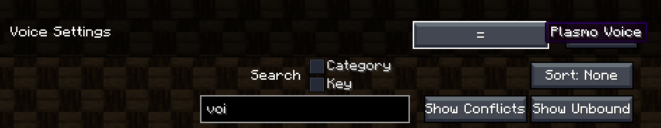

# YFLsmp Package Installation

### Requirements

- A Minecraft server on Craftserve running the Amethyst package

<a id="server"></a>

### Installation on the Server

1. Install the [YFLsmp package from the Add-ons Gallery](https://craftserve.com/m/yflsmp-s1).

   - You can do this in the **Add-ons** tab by searching for the term `yfl`.

     

   - Once you've selected the appropriate package, click the green **PLAY NOW** button.

     

2. Start the server.
3. If you want to use voice chat, notify support ([create a new ticket](https://craftserve.com/contact)).

<a id="client"></a>

### Installation on Player Computers

To join the server, players must have the YFLsmp package installed. Follow the steps below:

1. [Download TechnicLauncher](https://www.technicpack.net/download).
2. Install TechnicLauncher. Java version 8 is required to run it, ideally in the [Adoptium](https://adoptium.net/en-GB/temurin/releases/?version=8) environment.
   - It's important to note that **you need the Java version for x64 architecture**.
   - For Windows, select this version:

     
3. Run TechnicLauncher and log in.
4. In the **Modpacks** tab, paste the following link into the search bar:
   ```
   https://www.technicpack.net/modpack/yflsmp-csrv.1959773
   ```
   5. Install the package by clicking the **Install** button.


6. It’s recommended to ensure that the appropriate amount of RAM is allocated for the package.

- For YFLsmp, it is recommended to assign **8GB of RAM** (if you have at least 16GB in your computer, otherwise at least **5GB** is recommended).
- In TechnicLauncher, to change the amount of RAM, select **Launcher Options**, then **Java Settings**.
- In the **Memory** field, select the appropriate value.

  

- Also, make sure the correct version of Java is selected. Choose the one you downloaded in step 2.

7. Launch the YFLsmp package.

#### Most Common Issues

- Incorrect Java version (x32), you need to install the x64 version.
- Login issues with the launcher, make sure your credentials are correct and try logging in again.
- Crash during loading, remember to set the recommended RAM values.
- Voice chat not working (unable to hear others or yourself), configure PlasmoVoice as needed (see below).
- Low sound after entering the server, change the game volume settings by a few percentage points.


#### PlasmoVoice Configuration

By default, PlasmoVoice settings are activated with the `MouseButton4` (lower side mouse button). To change this, go to the game menu, `Options` -> `Controls` -> `Key Binds`, and search for `voice` to change the key binding that activates the voice chat settings.


Once the voice chat settings are open, you will see many options that you can adjust to your needs. Pay attention to the following:

- `Output Device` - the output device through which you will hear other players' voices.
- `Voice chat volume` - 100% - the volume of other players.
- `Priority volume` - 100%.
- `Microphone` - the microphone you want to use to communicate with other players.
- `Microphone volume` - 100% - the volume of your microphone.
- `Voice distance` - 16 - the distance (in blocks) at which players will be audible.
- `Activation type` - Push-to-talk - mode to capture your voice.

In the `Advanced` tab, set everything to `OFF` except for:

- `Visualise voice distance`: ON
- `Separate priority volume`: ON

`HRTF` - should be set to `OFF` as it can make other players hard to hear.  
If you experience issues with sound, toggle `HRTF` on and off.

### Notes

- If you have trouble joining the server, try reinstalling the server package.
- The **stalker mob from the DeeperDarker add-on crashes** players nearby (causing Minecraft to crash). It can be found in the 'pots' located in the Warden City. If it spawns, you need to kill it with the command:
 ```
  /kill @e[type=deeperdarker:stalker]
  ```
  - You cannot spawn a Poltergeist. If it spawns, some chunks may revert to their original state.
