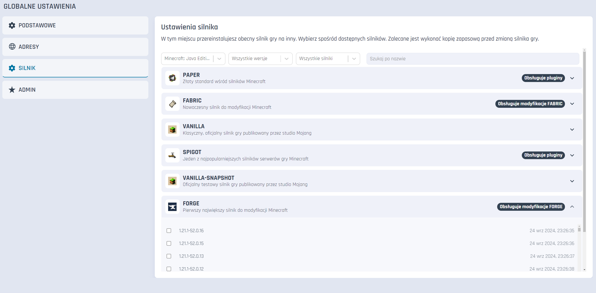
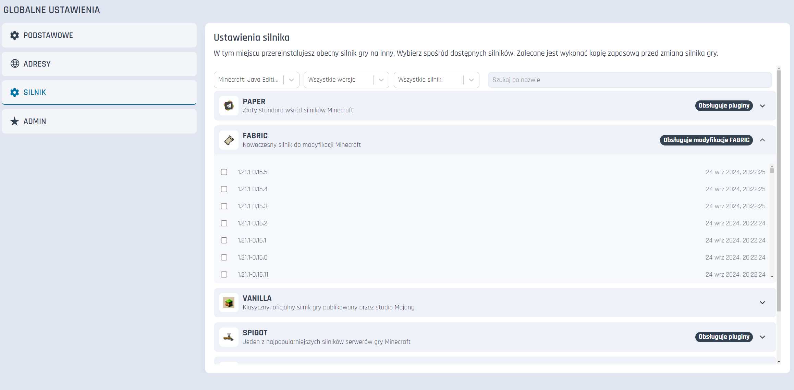
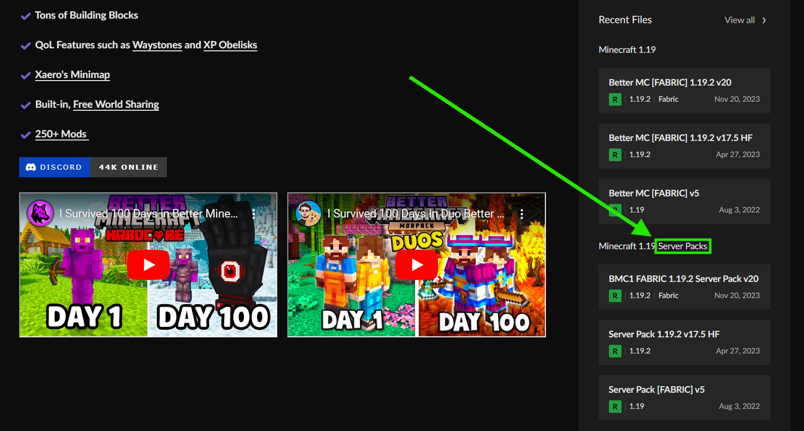
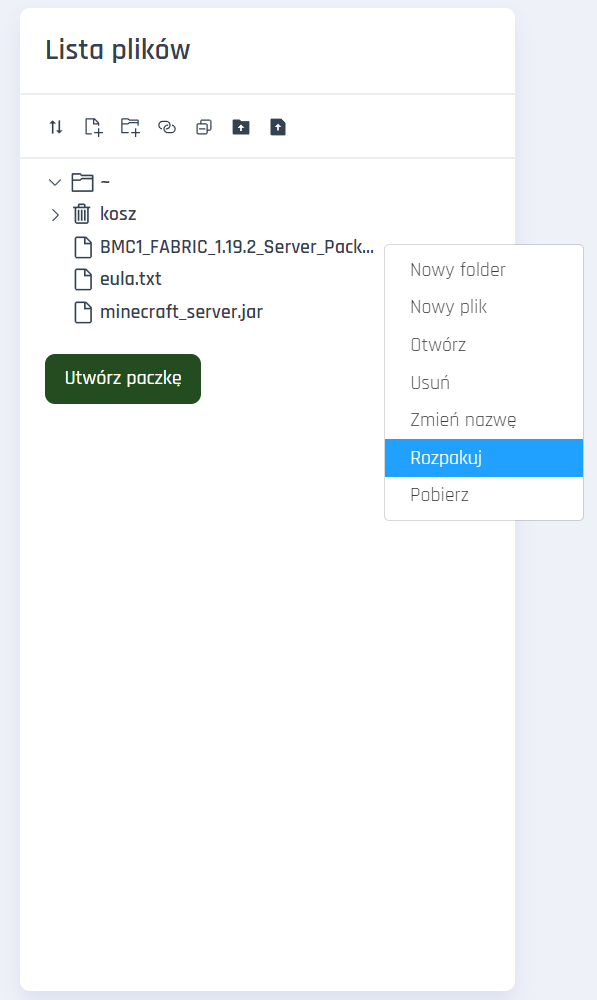

# Instalacja modpacka

### Wymagania

* Serwer Minecraft wspierający modyfikacje Fabric / Forge (w przypadku Craftserve: pakiet Amethyst)

### Instalacja

1. Wybierz zalecaną przez autora paczki wersję silnika Forge lub Fabric.
   - Silnik Forge możesz ustawić w zakładce **Ustawienia** -> **Silnik** -> **Forge** panelu Craftserve.
   
     
   - Silniki Fabric znajdują się w zakładce **Ustawienia** -> **Silnik** -> **Fabric** panelu Craftserve.
   
     
   - Potwierdź formatowanie serwera, aby zapewnić brak problemów w dalszym toku instalacji. Jeśli naprawdę potrzebujesz zapisać jakieś pliki, 
   *Uwaga: Formatowanie serwera spowoduje utratę wszystkich plików, w tym wszystkich elementów zapisanych na mapie.*
   
     
2. Pobierz modpack wersję modpacka przykładowo z [tej strony](https://www.curseforge.com/minecraft/modpacks). Pamiętaj, aby pobrać serwerową wersję paczki, czyli "Server Pack".

    
3. Pobranego zipa wgraj na serwer przy użyciu [FTP](ftp.md).
4. Przejdź do panelu Craftserve i wybierz zakładkę **Pliki**.
5. Odszukaj wgrany plik zip i kliknij na niego prawym przyciskiem myszy. Z listy wybierz opcję **Rozpakuj**.

    
6. Po rozpakowaniu możesz usunąć plik zip.
7.  Uruchom serwer i poczekaj na jego uruchomienie.

### Uwagi
- Wejście na serwer możliwe jest tylko jeśli gracz ma wgraną u siebie w grze tę samą (ale nie serwerową, tylko tradycjną, "clientową") wersję modpacka. 
- W przypadku problemów z uruchomieniem serwera, sprawdź czy wersja silnika Fabric/Forge jest zgodna z wersją modpacka.
