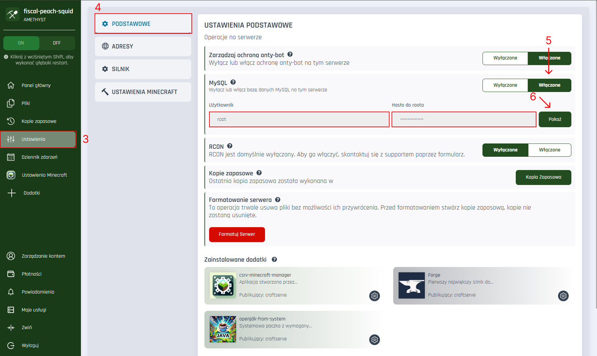

## 🧠 Czym jest MySQL?

<p id="tooltip-data">
MySQL to popularny system zarządzania relacyjnymi bazami danych. W kontekście serwera Minecraft, MySQL może być wykorzystywany do:

-   Przechowywania danych graczy (np. wtyczki typu auth, statystyki, systemy ekonomii),
-   Przechowywania konfiguracji pluginów,
-   Synchronizacji danych pomiędzy wieloma serwerami (np. BungeeCord, Velocity).
</p>

## 🔐 Dostępność MySQL

<div style="background-color:#ffe0e0; padding:10px; border-left:4px solid #ff4c4c; color: #000">
<strong>Uwaga:</strong> Dostęp do MySQL mają wyłącznie serwery w planie <strong>Amethyst</strong>.
</div>

## ✅ Jak włączyć MySQL na serwerze?

Aby aktywować MySQL dla swojego serwera, postępuj zgodnie z poniższymi krokami:

1. Przejdź do <a target="_blank" href="https://craftserve.com/account"><strong>Panelu</strong></a> zarządzania serwerami.
2. Wybierz swój docelowy serwer.
3. Z panelu bocznego wybierz opcję <strong>Ustawienia</strong>.
4. Otwórz zakładkę <strong>Podstawowe</strong>.
5. Znajdź opcję <strong>MySQL</strong> ustaw ją na <strong>Włączone</strong>.
6. Po włączeniu, pojawi się hasło – kliknij przycisk <strong>"Pokaż"</strong>, aby je zobaczyć.
   </br>
   </br>



## ⚙️ Dane dostępowe do MySQL

| Parametr   | Wartość                                 |
| ---------- | --------------------------------------- |
| Host       | `127.0.0.1` (nie `localhost`)           |
| Port       | `3306`                                  |
| Użytkownik | `root`                                  |
| Hasło      | Widoczne po kliknięciu "Pokaż" w panelu |

## 🛠️ Przykład połączenia z pluginem

```yaml
# Przykład konfiguracji pluginu
mysql:
    host: 127.0.0.1
    port: 3306
    user: root
    password: twoje_haslo
    database: example_db
```

---
