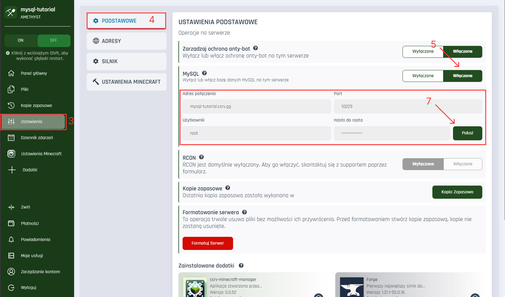
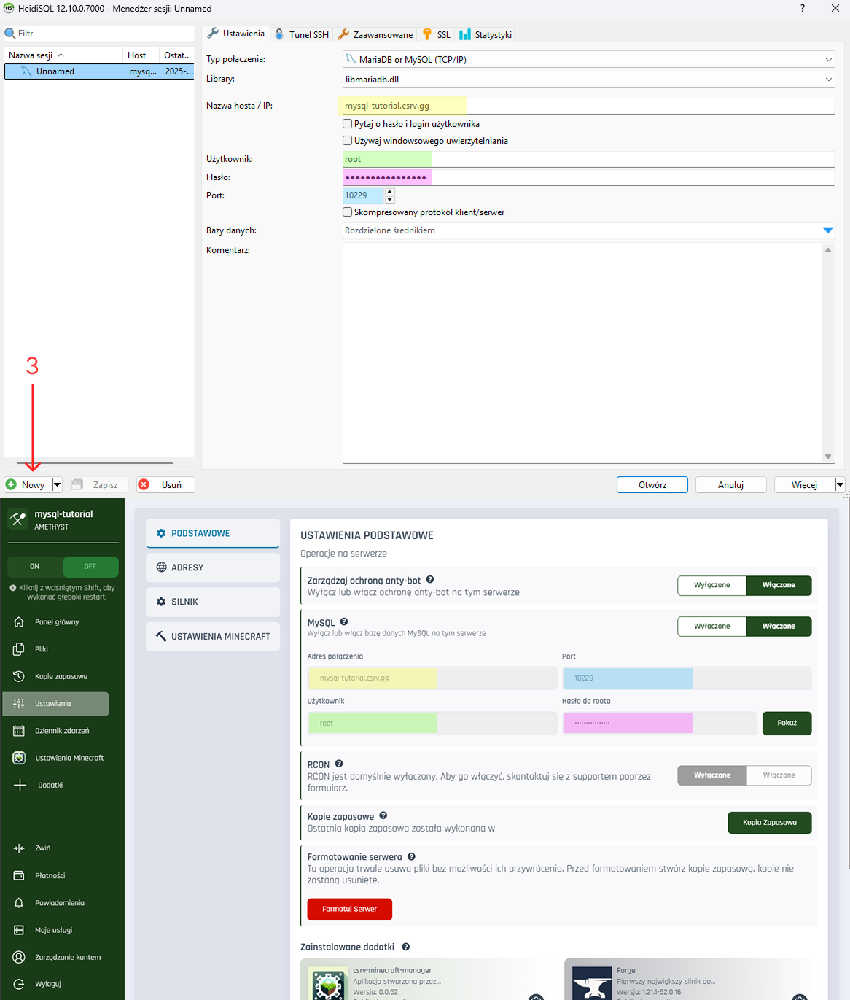

# 🧠 Czym jest **MySQL**?

<p id="tooltip-data">
MySQL to popularny system zarządzania relacyjnymi bazami danych. W kontekście serwera Minecraft, może być wykorzystywany m.in. do:

-   przechowywania danych graczy (np. dane logowania, statystyki, systemy ekonomii),
-   przechowywania konfiguracji pluginów,
-   synchronizacji danych między wieloma serwerami (np. przy użyciu BungeeCord lub Velocity).
</p>

# 🔐 Dostępność MySQL

<div style="background-color:#ffe0e0; padding:10px; border-left:4px solid #ff4c4c; color: #000">
<strong>Uwaga:</strong> Funkcja MySQL dostępna jest wyłącznie w planie <strong>Amethyst</strong>.
</div>

---

# ✅ Jak włączyć MySQL na serwerze?

Aby aktywować MySQL dla swojego serwera:

1. Przejdź do [panelu](https://craftserve.com/account).
2. Wybierz odpowiedni serwer.
3. W menu bocznym kliknij **Ustawienia**.
4. Przejdź do zakładki **Podstawowe**.
5. W sekcji **MySQL** ustaw opcję na **Włączone**.
6. Zaakceptuj ostrzeżenie o konieczności uruchomienia lub zatrzymania serwera.

    > 🔴 **Uwaga:** Połączenie z MySQL będzie możliwe po zakończeniu procesu od uruchamiania/zatrzymywania serwera.

7. Po włączeniu MySQL zobaczysz dane dostępowe: adres, port, użytkownik, hasło - kliknij przycisk **Pokaż**.

---



---

# 🔗 Jak połączyć się z MySQL?

Do połączenia się z bazą danych MySQL potrzebny będzie klient. Polecamy darmowy program **HeidiSQL**:
👉 [Pobierz HeidiSQL](https://www.heidisql.com/download.php)

### Konfiguracja połączenia:

1. Otwórz HeidiSQL i kliknij **Nowy** w lewym dolnym rogu.
2. Wypełnij pola zgodnie z poniższą tabelą:

| Pole               | Wartość z panelu Craftserve          |
| ------------------ | ------------------------------------ |
| **Typ połączenia** | `MariaDB or MySQL (TCP/IP)`          |
| **Library**        | (pozostaw domyślne)                  |
| **Nazwa hosta/IP** | Adres z pola `Adres połączenia`      |
| **Użytkownik**     | `root`                               |
| **Hasło**          | Hasło widoczne po kliknięciu „Pokaż” |
| **Port**           | Port wyświetlany po aktywacji MySQL  |

3. Kliknij **Otwórz**, aby nawiązać połączenie.



---

# ❗ Problemy z połączeniem – co robić?

### 🔄 Nie mogę się połączyć z bazą danych

1. Przejdź do [panelu zarządzania serwerami](https://craftserve.com/account).
2. Wybierz swój serwer.
3. Przejdź do **Ustawień** → **Podstawowe**.
4. Sprawdź, czy **MySQL** jest włączony.
5. Jeśli problem nadal występuje:

    - Upewnij się, że dane do połączenia są poprawne.
    - Zrestartuj serwer, **przytrzymując klawisz SHIFT** podczas klikania przycisku **Uruchom** – wykona się tzw. _głęboki restart_.
    - Po restarcie ponów próbę połączenia.

---

# ⚙️ Dane do konfiguracji pluginów

Użyj poniższych danych w plikach konfiguracyjnych pluginów:

| Parametr       | Wartość                         |
| -------------- | ------------------------------- |
| **Host**       | `127.0.0.1` _(nie `localhost`)_ |
| **Port**       | `3306`                          |
| **Użytkownik** | `root`                          |
| **Hasło**      | Dostępne w panelu               |

### 📄 Przykład konfiguracji pluginu:

```yaml
mysql:
    host: 127.0.0.1
    port: 3306
    user: root
    password: twoje_haslo
    database: example_db
```

---
