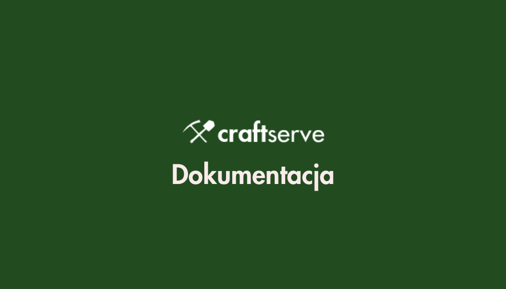

# Oficjalny zestaw dokumentacji, poradników i zasobów Craftserve

Tutaj znajdziesz przydatne przewodniki i zasoby do instalacji i konfiguracji serwerów Minecraft i Hytale.

## 🎮 Dostępne Sekcje

- **Panel Craftserve** - Przydatne informacje o FTP, MySQL, backupach i migracji
- **Minecraft** - Kompletna dokumentacja do zarządzania serwerem Minecraft
- **Hytale** - Komendy i poradniki dla serwerów Hytale

Wybierz sekcję z menu po lewej aby zacząć!
