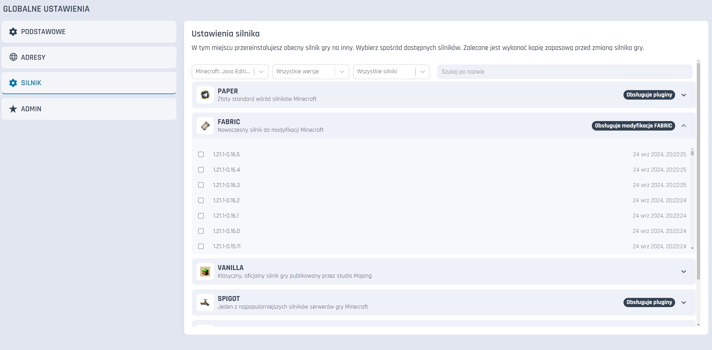
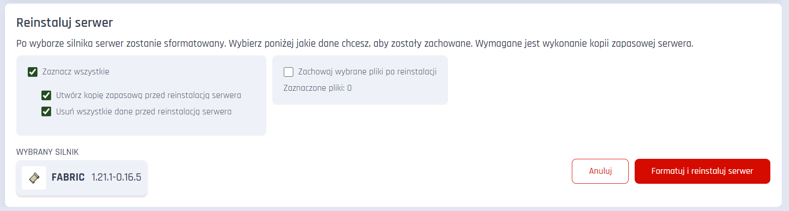
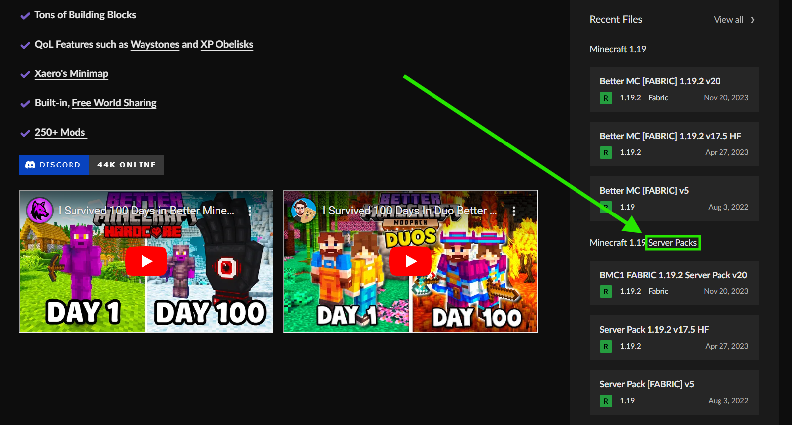
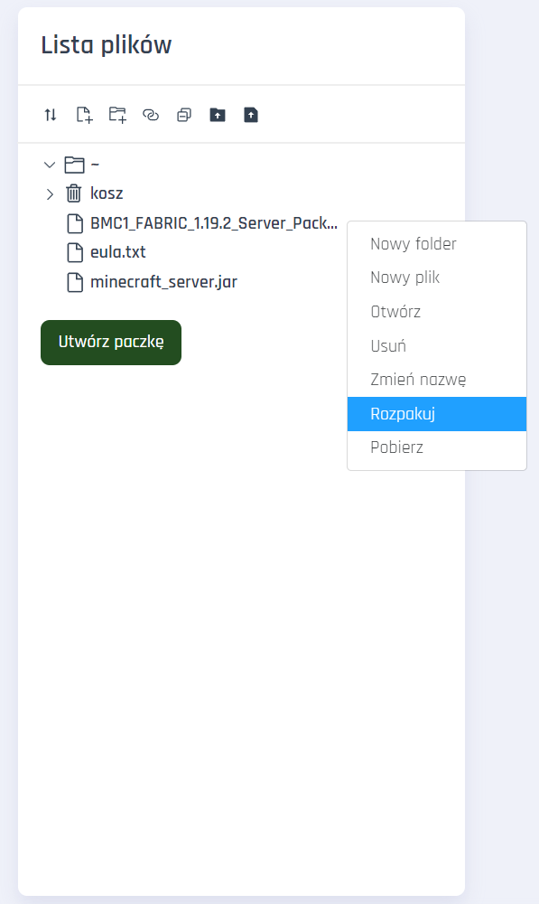

# Instalacja modpacka BetterMC (Fabric)

### Wymagania

* Serwer Minecraft wspierający modyfikacje Fabric (w przypadku Craftserve: pakiet Amethyst).

### Instalacja

1. Wybierz odpowiedni silnik Fabric dla wersji modpacka BetterMC (w tym przypadku: 1.19.2).
   - Silnik Fabric możesz ustawić w zakładce **Ustawienia** -> **Silnik** -> **Fabric** panelu Craftserve.
   
     
   - Potwierdź formatowanie serwera, aby zapewnić brak problemów w dalszym toku instalacji. Jeśli naprawdę potrzebujesz zapisać jakieś pliki, 
   *Uwaga: Formatowanie serwera spowoduje utratę wszystkich plików, w tym wszystkich elementów zapisanych na mapie.*
   
     
2. Pobierz BetterMC z [**TEJ STRONY**](https://www.curseforge.com/minecraft/modpacks/better-mc-fabric/files). Pamiętaj, aby pobrać serwerową wersję paczki, czyli "Server Pack".

    
3. Pobranego zipa wgraj na serwer przy użyciu [FTP](ftp.md).
4. Przejdź do panelu Craftserve i wybierz zakładkę **Pliki**.
5. Odszukaj wgrany plik zip i kliknij na niego prawym przyciskiem myszy. Z listy wybierz opcję **Rozpakuj**.
    

6. Po rozpakowaniu możesz usunąć plik zip.
7.  Uruchom serwer i poczekaj na jego uruchomienie.

### Uwagi
- Wejście na serwer możliwe jest tylko jeśli gracz ma wgraną u siebie tę samą (ale nie serwerową, tylko tradycyjną, "clientową") wersję modpacka BetterMC. 
- W przypadku problemów z uruchomieniem serwera, sprawdź czy wersja silnika Fabric jest zgodna z wersją modpacka BetterMC.
