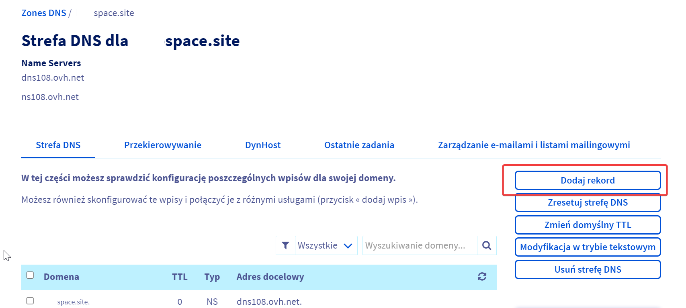
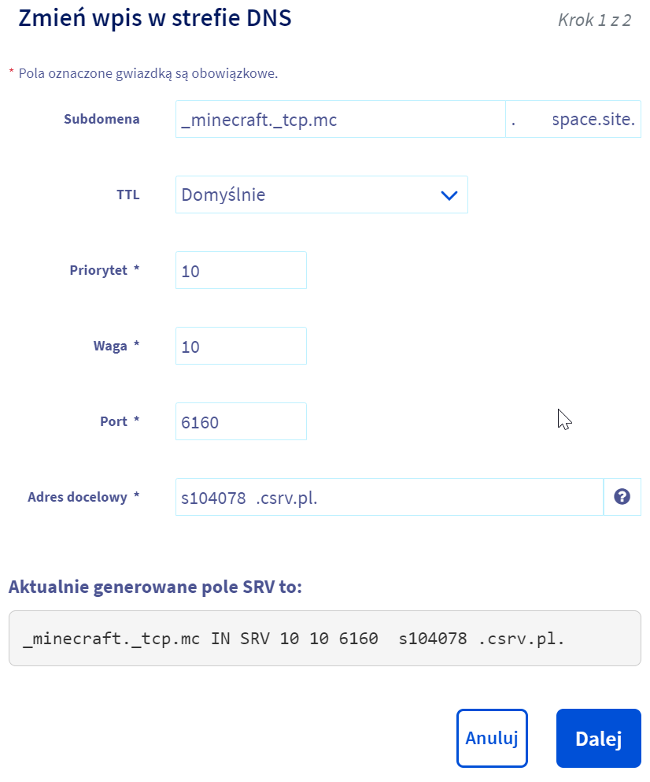

# Ustawianie własnej domeny do serwera minecraft

### Wymagania

  * Własna zakupiona domena na jednym z dostępnych serwisów (np. [OVH](https://www.ovhcloud.com/pl/domains/))
  * Serwer minecraft

### Kroki

1. Otwórz panel zarządzania rekordami DNS swojej domeny.
    - Zazwyczaj panel ten wygląda tak:
    - 
2. Dodaj nowy rekord typu SRV.
    - Dane do uzupełnienia skopiuj z panelu Craftserve, konkretnie z zakładki **Ustawienia** -> **Domena** -> **Zewnętrzna domena**. Wygląda ona następująco:
    - 
    - Przykładowy rekord SRV wygląda następująco:
    - 
    - W polu subdomena/nazwa należy wpisać nazwę subdomeny na której ma być dostępny serwer. Jeśli chcemy aby serwer działał na domenie głównej, należy pozostawić to pole z wartością `_minecraft._tcp.domena.pl` (czasem końcówka jest dopisywana automatycznie).
3. Zapisz zmiany, **aktualizacja rekordu może potrwać od kilku minut do kilku godzin**.

### Uwagi
- Należy zauważyć, że konfiguracja domeny może być różna w zależności od serwisu, w którym została zakupiona. W przypadku innych serwisów należy poszukać odpowiedniego panelu zarządzania DNS.
- By połączyć się z serwerem należy wpisać swoją domenę w polu adresu serwera w Minecraft. W przypadku domeny głównej należy wpisać `domena.pl`, w przypadku subdomeny `subdomena.domena.pl`.
