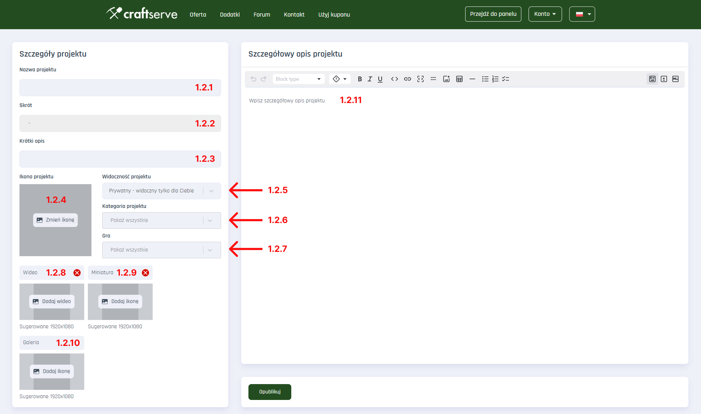
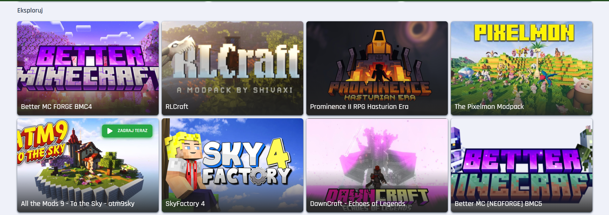
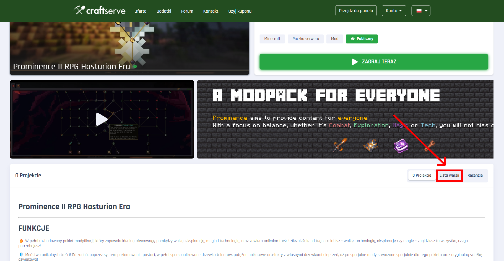

### Jak stworzyć paczkę na Craftserve Dodatki?

###### Uwaga: Tworzenie projektów i wersji wymaga zakupionej usługi. Zakup usługę już na teraz na [craftserve.com](https://craftserve.com/#offers)

- [Tworzenie nowego projektu galerii dodatków](#1-tworzenie-projektu)
  - [Pola formularza, wstawianie filmów i zdjęć](#form_fields)
- [Dodawanie wersji do utworzonego projektu](#2-tworzenie-wersji)
  - [Opcje zaawansowane](#advanced)

#### 1. Tworzenie projektu

##### Aby Twój projekt był możliwy do pobrania, oraz aby użytkownicy mogli ją zobaczyć w galerii dodatków należy najpierw utworzyć nowy projekt.

&nbsp;&nbsp;1.1 Wejdź do panelu zarządzania serwerem, następnie w Galerie Dodatków, oraz kliknij odnośnik “Utwórz projekt”
&nbsp;&nbsp;

&nbsp;&nbsp;1.2 W kreatorze projektu wypełnij poszczególne pola
&nbsp;&nbsp;

&nbsp;&nbsp;&nbsp;&nbsp;1.2.1 **Nazwa projektu** – Wyświetla się w marketplace, oraz dzięki temu polu użytkownicy będą mogli wyszukiwać Twój projekt po nazwie.

&nbsp;&nbsp;&nbsp;&nbsp;1.2.2 **Skrót** &bull; te pole wypełnia się automatycznie względem nazwy którą wypełnisz,odpowiada ono za identyfikacje projektu w linku.

&nbsp;&nbsp;&nbsp;&nbsp;1.2.3 **Krótki opis** – Pojawia się po kliknięciu w projekt nad przyciskiem "Zagraj teraz" lub "Zainstaluj najnowszą wersję" (w zależności od typu projektu). Wyświetla się również w kafelku w liście zainstalowanych paczek w widoku ustawień serwera.

&nbsp;&nbsp;&nbsp;&nbsp;1.2.4 **Ikona projektu** &bull; przyciąga uwagę i jest niejako wizytówką Twojej paczki! Pojawia się w kafelku w liście zainstalowanych paczek w widoku ustawień, oraz na podstronie "Dodatki", gdy paczka ma inną kategorię projektu niż "Paczka serwera"

&nbsp;&nbsp;&nbsp;&nbsp;1.2.5 **Widoczność projektu**

&nbsp;&nbsp;&nbsp;&nbsp;&nbsp;&nbsp;&bull; **Publiczny** : Dostępny dla każdego, wyświetla się w liście paczek
w galerii dodatków

&nbsp;&nbsp;&nbsp;&nbsp;&nbsp;&nbsp;&bull; **Niepubliczny** : Nie wyświetla się w liście paczek w galerii dodatków, ale jest możliwy
do udostępnienia przez link.

&nbsp;&nbsp;&nbsp;&nbsp;&nbsp;&nbsp;&bull; **Prywatny** : Dostępny tylko dla Ciebie.

> Jako autor projektu, zawsze będziesz widział swój projekt w liście
> projektów w galerii dodatków. Bez względu jaką widoczność wybierzesz

&nbsp;&nbsp;&nbsp;&nbsp;&nbsp;&nbsp;1.2.6 **Kategoria projektu** – powinna jak najbliżej precyzować czym jest Twoja paczka. Służy do wyszukiwania paczek w galerii dodatków, oraz uzależnia w jakim wariancie wyświetli się Twój projekt. Wyróżniamy dwa warianty.

&nbsp;&nbsp;&nbsp;&nbsp;&nbsp;&nbsp;&nbsp;&nbsp;&bull; Wariant dla projektów **_NIEOZNACZONYCH_** jako "Paczka serwera"
&nbsp;&nbsp;&nbsp;&nbsp;

&nbsp;&nbsp;&nbsp;&nbsp;&nbsp;&nbsp;&bull; Wariant dla projektów **_OZNACZONYCH_** jako "Paczka serwera"
&nbsp;&nbsp;&nbsp;&nbsp;

&nbsp;&nbsp;&nbsp;&nbsp;**Uwaga:** Gdy projekt ma ustawioną kategorię jako "Paczka serwera" to w przypadku, gdy użytkownik będzie chciał zainstalować dany projekt wymuszona zostanie reinstalacja i formatowanie serwera przed instalacją docelowej paczki.
<a id="form_fields"></a>
&nbsp;&nbsp;&nbsp;&nbsp;1.2.7 **Gra** - Określa do jakiej gry jest przeznaczona Twoja paczka.

&nbsp;&nbsp;&nbsp;&nbsp;1.2.8 **Wideo** - Odtwarza się po najechaniu na kafelek projektu, oraz na podstronie Twojego projektu (opcjonalne). Powinno być w formacie WebM, być w maksymalnej rozdzielczości 720p, maks. 30fps, oraz rozmiar pliku nie powinien przekraczać 50 MiB.

&nbsp;&nbsp;&nbsp;&nbsp;1.2.9 **Miniatura** - Wyświetla się na kafelku projektu w galerii dodatków, oraz w widoku wybranego projektu, gdy nie zostało dodane wideo.

&nbsp;&nbsp;&nbsp;&nbsp;1.2.10 **Galeria** - Wyświetla się na podstronie Twojego projektu (opcjonalne).

&nbsp;&nbsp;&nbsp;&nbsp;1.2.11 **Szczegółowy opis projektu** – skorzystaj z przyjaznego edytora markdown, aby w pełni opisać swój projekt. Uwzględnij czego wymaga Twoja paczka, oraz na czym się skupia, lub jaki problem rozwiązuje.

&nbsp;&nbsp;&nbsp;&nbsp;
&nbsp;&nbsp;&nbsp;&nbsp;

&nbsp;&nbsp;1.3 Gdy uzupełnisz swój projekt, kliknij przycisk “Opublikuj”, aby zatwierdzić zmiany.

&nbsp;&nbsp;1.4 Gotowe! Aby zobaczyć swój projekt wejdź na "Dodatki" i wyszukaj go w
wyszukiwarce.

#### 2. Tworzenie wersji

###### Masz już swój projekt, ale brakuje w nim wersji, czyli brakuje dodanych plików do projektu, które zostaną pobrane w momencie gdy użytkownik będzie chciał ją zainstalować na swoim serwerze. Aby dodać wersję wejdź w swój projekt, następnie kliknij “Lista wersji”

&nbsp;&nbsp;

&nbsp;&nbsp;2.1 Kliknij “Dodaj wersję”

&nbsp;&nbsp;

&nbsp;&nbsp;2.2 Kreator wersji projektu składa się z następujących pól:

&nbsp;&nbsp;&nbsp;&nbsp;2.2.1 **Typ wersji**

&nbsp;&nbsp;&nbsp;&nbsp;&nbsp;&nbsp;&bull; **Stable** oznacza wersję stabilną, która przeszła pełne testy. Jest ona skierowana do użytkowników którzy oczekują w pełni działającej paczki.

&nbsp;&nbsp;&nbsp;&nbsp;&nbsp;&nbsp;&bull; **Private** oznacza, że wersja jest prywatna, skierowana dla danej grupy odbiorców np. Programistów, lub Twoich testerów. Nie musi być stabilna, może wymagać np. Dodatkowych testów.

&nbsp;&nbsp;&nbsp;&nbsp;&nbsp;&nbsp;&bull; **Latest** to najnowsza wersja, może być stabilna lub nie. Kierowana dla użytkowników, którzy chcą najnowszych funkcji.

&nbsp;&nbsp;&nbsp;&nbsp;2.2.2 **Wersja projektu** np. Numer. To twoja decyzja jak oznaczasz swoje wersje. Te pole ma swoje ograniczenia i nie pozwala na użycie białych znaków (np. spacji) i znaków specjalnych (np. $, @, !).

&nbsp;&nbsp;&nbsp;&nbsp;2.2.3 **Serwer** – wybierz serwer z którego chcesz udostępnić pliki do paczki. Wybrane
pliki zostaną zainstalowane na serwerze użytkownika, który zainstaluje Twoją paczkę. 1.7.4 **Wybierz paczki**, które mają zostać zainstalowane przed zainstalowaniem Twojej paczki. Wykrywamy automatycznie jakie paczki posiadasz zainstalowane na swoim serwerze z którego wgrywasz pliki. Zaznacz jeśli Twoja paczka wymaga do działania jakiejś innej paczki, lub konkretnej wersji silnika.

> **Przykład** : Moja paczka to mapa serwera z kilkoma dodatkowymi pluginami. Wiem, że moje pluginy wymagają silnika Paper na wersji 1.12.1. Dodatkowo chciałbym, aby wymagane od użytkownika była powyższa wersja, ponieważ jeśli będzie posiadał starszą to mapa może zostać źle wczytana. Wybieram więc:


&nbsp;&nbsp;&nbsp;&nbsp;Jeśli wiesz, że Twoje pliki wymagają przykładowo silnika spigot w wersji 1.21.1 to zaznacz spigot-api w wersji 1.21.1. Jeśli natomiast chcesz, aby zależność była weryfikowana razem z wersją builda wybierz opcję która kończy się "-" przykład: paper:1.12.1-97 Wymagane wtedy będzie, aby użytkownik posiadał paczkę spigot w wersji 1.21.1 o buildzie 97. Gdy użytkownik będzie chciał zainstalować Twoją paczkę zostanie sprawdzona kompatybilność z jego serwerem względem tego jakie wymagania zaznaczysz.

&nbsp;&nbsp;&nbsp;&nbsp;&nbsp;&nbsp; <a id="advanced"></a> 2.2.4 **Opcje zaawansowane (opcjonalne)** - Po kliknięciu w **"Pokaż opcje zaawansowane"** pojawi się przycisk "Dodaj zależność". Po kliknięciu masz możliwość **dodania własnej zależności**. Formularz składa się z 4 pól:

&nbsp;&nbsp;&nbsp;&nbsp;&nbsp;&nbsp;&nbsp;&nbsp;&bull; **Nazwa** - Powinna określać nazwę paczki do której będziesz konfigurował niestandardowe wymagania np. "paper-api".
&nbsp;&nbsp;&nbsp;&nbsp;&nbsp;&nbsp;&nbsp;&nbsp;&bull; **Wyrażenie** odpowiada za logikę odnośnie weryfikowania zależności. Pole korzysta z składni języka wyrażeń [Expr](https://expr-lang.org/#documentation). W tym polu masz dostęp do wszystkich wartości paczki, którą wybrałeś w polu **nazwa**. Wyrażenie ZAWSZE powinno zwracać wartość logiczną (true/false). Przykładowy obiekt paczki paper:

> **Przykład paczki**

```json
{
  "manifestVersion": "v2",
  "ManifestHash": "sha256-725770a3ffad4d6335fb6828c65b8bd4c558a1c21b817d3155668267f2d04a52",
  "name": "paper",
  "subdir": "/marketplace/paper/sha256-725770a3ffad4d6335fb6828c65b8bd4c558a1c21b817d3155668267f2d04a52",
  "version": "1.21.3-29",
  "versionFormat": "semver",
  "depends": ["java:21"],
  "provides": [
    "game-engine",
    "minecraft-java-server:1.21.3",
    "minecraft-java-server:1.21.x",
    "paper-api:1.21.3",
    "spigot-api:1.21.3",
    "bukkit-api:1.21.3",
    "paper:1.21.3",
    "paper:1.21.x"
  ],
  "set-env": [
    {
      "key": "MINECRAFT_VERSION",
      "value": "1.21.3"
    },
    {
      "key": "21",
      "value": "21"
    }
  ],
  "labels": {
    "craftserve.com/game": "minecraft-java",
    "craftserve.com/java/version": "21",
    "craftserve.com/minecraft-java/version": "1.21.3",
    "craftserve.com/mod-loader": "paper",
    "craftserve.com/package/time": "2024-11-15 15:30:09.385604",
    "craftserve.com/release/time": "2024-11-15 09:09:36.732000",
    "craftserve.com/type": "mod_loader"
  },
  "fileshash": "k1:ff0ad7f85bab891c2d9174d87602f478dd031e206a7cc029ab132ca089da3e0e",
  "downloadfiles": [
    {
      "name": "minecraft_server.jar",
      "url": "https://api.papermc.io/v2/projects/paper/versions/1.21.3/builds/29/downloads/paper-1.21.3-29.jar",
      "hash": "sha256-eb58806b3535646272a2e2ca3b46aae50b7a4ab8f173a493650092f0c1859b89"
    }
  ]
}
```

> Korzystając z wiedzy jak wygląda struktura paczki możemy **zadeklarować zależności** przykładowo:

&nbsp;&nbsp;&bull; Sprawdź czy paczka zawiera któreś z api ładujących pluginy.

> - **||** - Operator OR - oznacza on, że wyrażenie zwróci `true`, jeśli **przynajmniej jeden z warunków** połączonych tym operatorem jest prawdziwy.
> - **`wartość`**: Element, który chcesz sprawdzić (np. `"spigot-api"`).
> - **`in`**: Operator sprawdzający, czy element występuje w tablicy, lub czy istnieje klucz w obiekcie z daną wartością.
> - **`klucz`**: Nazwa klucza tablicy, której chcesz sprawdzić wartość (np. `provides`).

```js
"spigot-api" in provides || "bukkit-api" in provides || "paper-api" in provides; // Zwraca wartość logiczną
```

&nbsp;&nbsp;-&bull; Sprawdź czy paczka ma wersje nowszą niż (włącznie z numerem builda).

> - **&&** - Operator AND - oznacza on, że wyrażenie zwróci `true` tylko w tedy gdy A i B są prawdziwe **A && B**. np. dla wyrażenia A: 10 > 5 i dla wyrażenia B: 3 < 4 `10 > 5 && 3 < 4` zwróci **true**.
> - **`split(version, "-")`**: Dzieli ciąg `version` na części. Wynik to tablica: `"1.21.3-29"` → `["1.21.3", "29"]`.
> - **`split(version, "-")[0]`**: Wybiera część przed `"-"` (wersję) - czyli pierwszy element tablicy.
> - **`split(version, "-")[1]`**: Wybiera część po `"-"` (numer builda) - drugą część tablicy.
> - Warunek sprawdza najpierw wersję, a jeśli są równe, porównuje numer builda, aby określić czy mimo, że wersja jest równa to czy build jest nowszy.

```js
split(version, "-")[0] > "1.19.2" ||
  (split(version, "-")[0] == "1.19.2" && int(split(version, "-")[1]) > 29);
```

&nbsp;&nbsp;&bull; **semverInRange** (gotowa funkcja):

> - `semverInRange(tag, {WARTOŚĆ})` to funkcja pomocnicza, która pozwala sprawdzać wersje semantyczne (bez numeru builda np. 1.12.1, 1.23.2).
> - **`WARTOŚĆ`**: Wprowadzony warunek, który musi zostać spełniony względem wersji semantycznej paczki. np. gdy wersja semantyczna musi być większa, bądź równa 1.12.1 wtedy wartość powinna posiadać wartość `">=1.12.1"``.

```js
semverInRange(tag, ">=1.12.1");
```

&nbsp;&nbsp;&nbsp;&nbsp;&nbsp;&nbsp;&bull; Więcej o możliwościach [Expr](https://expr-lang.org/#documentation). dowiesz się [klikając tutaj](https://expr-lang.org/docs/language-definition), lub skorzystaj z pomocy na naszym [discordzie](https://discord.gg/craftserve-387222965131149313)

&nbsp;&nbsp;&nbsp;&nbsp;&nbsp;&nbsp;&bull; **tag** jeśli wymagasz konkretnej wersji powinieneś użyć tego pola. Dla wartości pola **tag** np. 1.12.1 i wartości pola **nazwa** np. paper-api wymagasz paper-api w wersji 1.21.1 - `paper-api:1.12.1`,
**UWAGA! Pole tag powinno być puste, jeśli pole "Wyrażenie" zawiera wartość.**

&nbsp;&nbsp;&nbsp;&nbsp;&nbsp;&nbsp;&bull; **Etykiety** Możesz uwzględnić dodatkowo jakie etykiety (labels patrz: **przykład paczki**) muszą się znajdować, w paczce z pola **name**. Przykładowo dla klucza `craftserve.com/mod-loader` musi być to wartość `minecraft-java`,

&nbsp;&nbsp;2.2.5 **Szczegółowy opis** : Tutaj możesz opisać dokładnie czego wymaga Twoja wersja, oraz opisać co zmieniło się np. Względem starszej wersji. Pamiętaj, aby dokładnie uzupełniać swoje opisy.

&nbsp;&nbsp;2.2.6 Gdy wszystkie pola zostały uzupełnione, kliknij przycisk “ **Dodaj wersję** ”.

2.3 Wersja została utworzona i jest teraz dostępna do pobrania. **Gratulacje**!
