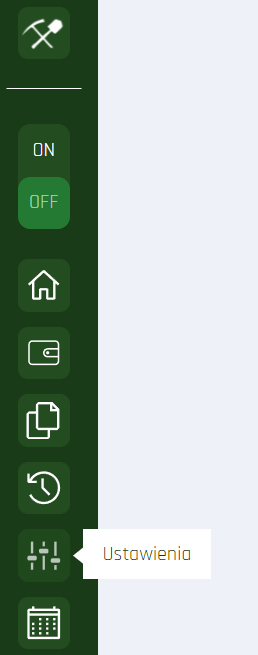
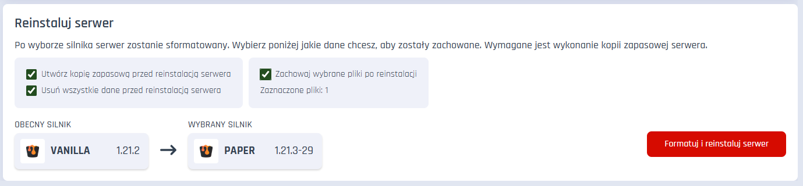

# Silniki

## Jak zmienić silnik na serwerze?

1. Przejdź do zakładki **Ustawienia** na prawym pasku w panelu swojego serwera.
   
2. Wybierz menu **Silnik**.
   
3. Przejdź przez pomocnik wyboru i instalacji silnika lub wybierz opcję "Daj spokój, jestem profesjonalistą", jeśli chcesz przejść bezpośrednio do pełnej listy silników i wersji.  
4. Wybierz wersję silnika, który potrzebujesz z  dostępnej listy.
   
5. Po wybraniu silnika, przejdź do opcji.
6. Potwierdź usunięcie wszystkich plików ze swojego serwera oraz wykonanie kopii zapasowej. Jeśli potrzebujesz, możesz pominąć wybrane pliki i foldery podczas formatowania, by nie zostały one usunięte. **Zalecamy używanie tej opcji wyłącznie gdy posiadasz ważne dane na serwerze, np. postępy w folderze `world`.**
   
7. Kliknij przycisk **Formatuj serwer i zmień silnik**.
8. Poczekaj do końca procesu.
9. Gotowe!

