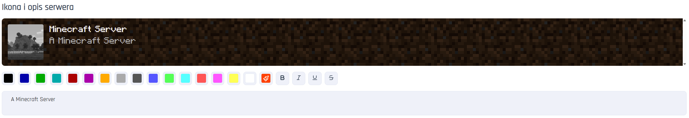

# Ustawienia Minecraft
Znajdziesz je w zakładce "Ustawienia Minecraft" w panelu serwera.
___

## Ikona i opis serwera

## Podstawowe ustawienia serwera
Ustawienia związane z działaniem serwera. Poniżej znajdziesz ich listę:

Pokaż info o komendach operatorom:
`broadcast-console-to-ops`

Informuj adminów o RCON:
`broadcast-rcon-to-ops`

Tryb diagnostyczny serwera:
`debug`

Włącz/wyłącz bloki komend:
`enable-command-block`

Włącz monitor JMX:
`enable-jmx-monitoring`

Włącz/wyłącz info o serwerze:
`enable-query`

Włącz zdalny RCON:
`enable-rcon`

Włącz/wyłącz status serwera:
`enable-status`

Wymuś bezpieczne profile:
`enforce-secure-profile`

Wymuś whitelistę:
`enforce-whitelist`

Procent zasięgu broadcastu:
`entity-broadcast-range-percentage`

Wymuś ustalony tryb gry:
`force-gamemode`

Min. poziom funkcji:
`function-permission-level`

Ukryj listę graczy:
`hide-online-players`

Wyłączone paczki (start)
`initial-disabled-packs`:

Włączone paczki (start):
`initial-enabled-packs`

Max. aktual. cyklicznych:
`max-chained-neighbor-updates`

Max. liczba graczy:
`max-players`

Wiadomość serwera:
`motd`

Próg kompresji pakietów:
`network-compression-threshold`

Wymuś logowanie premium:
`online-mode`

Poziom uprawnień operatora:
`op-permission-level`

Limit nieaktywności gracza:
`player-idle-timeout`

Blokuj proxy/VPN:
`prevent-proxy-connections`

Port zapytania serwera:
`query.port`

Limit pakietów:
`rate-limit`

Hasło RCON:
`rcon.password`

Port RCON:
`rcon.port`

Adres IP serwera:
`server-ip`

Port serwera:
`server-port`

Synchronizuj zapisy chunków:
`sync-chunk-writes`

Konfig. filtra tekstu:
`text-filtering-config`

Włącz nat. optymalizacje sieciowe:
`use-native-transport`

Włącz whitelistę:
`white-list`

## Ustawienia świata
Dostosuj ustawienia świata do swoich potrzeb.

Pozwól latać:
`allow-flight`

Dostęp do Nether:
`allow-nether`

Poziom trudności:
`difficulty`

Domyślny tryb gry:
`gamemode`

Generuj struktury:
`generate-structures`

Ustaw. generatora:
`generator-settings`

Tryb hardcore:
`hardcore`

Nazwa świata:
`level-name`

Ziarno świata:
`level-seed`

Typ świata:
`level-type`

Limit ticka:
`max-tick-time`

Maks. rozmiar świata:
`max-world-size`

Włącz PvP:
`pvp`

Odległość symulacji:
`simulation-distance`

Generuj zwierzęta:
`spawn-animals`

Generuj potwory:
`spawn-monsters`

Generuj NPC:
`spawn-npcs`

Ochrona spawnu:
`spawn-protection`

Odległość renderowania:
`view-distance`

## Ustawienia paczki zasobów
Dodaj swoją własną paczkę zasobów na serwer:

Wymuś na graczach korzystanie z określonej paczki zasobów:
`require-resource-pack`

Adres, pod którym znajduje się paczka zasobów:
`resource-pack`

Tekst wyświetlany graczom przy prośbie o pobranie paczki zasobów:
`resource-pack-prompt`

Skrót SHA1 paczki zasobów:
`resource-pack-sha1`

Unikalny identyfikator paczki zasobów:
`resource-pack-id`

## Inne ustawienia

Brak opisu:
`previews-chat`