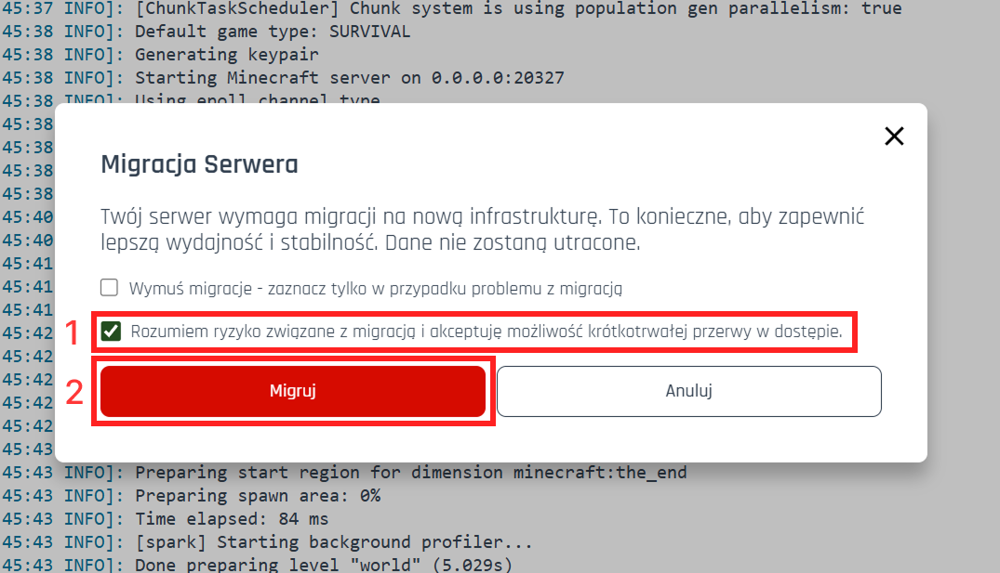
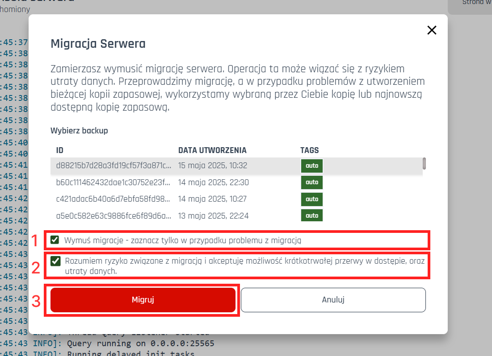

# 🔍 Migracje serwerów

Migracja to proces obejmujący przeniesienie danych na nowy węzeł (ang. node) na przykład w wyniku problemów z infrastrukturą czy zbyt dużym obciążeniem. Ich celem jest:

-   zwiększenie wydajności serwera,
-   poprawa stabilności,
-   zapewnienie zgodności z najnowszymi rozwiązaniami technicznymi.

---

## ⚠️ Dostałem komunikat o wymaganej migracji — co robić?

1. **Zaznacz zgodę na migrację** (będzie widoczna w komunikacie).
2. **Kliknij przycisk „Migruj”**, tak jak pokazano na poniższej ilustracji.

🕒 Migracja potrwa około **15 minut**, w tym czasie serwer może być tymczasowo niedostępny.

<strong>✅ Migracja w tej konfiguracji jest całkowicie bezpieczna.</strong> Nie grozi Ci utrata danych.

---

## 🚧 Migracja nie działa — co teraz?

Jeśli standardowa migracja się nie powiedzie:

1. Wybierz opcję **„Wymuś migrację”**.
 

 ⚠️ Uwaga: Ta opcja <strong> może wiązać się z utratą najnowszych danych</strong> na serwerze w przypadku wczytania ostatniej najnowszej, lub wybranej przez Ciebie (patrz pkt. 4) kopii zapasowej.
 

2. **Zaznacz zgodę na migrację**.
3. **Kliknij przycisk „Migruj”**, tak jak pokazano na poniższej ilustracji.

4. Opcjonalnie: Zaznacz kopię zapasową, która ma zostać użyta w razie niepowodzenia przywrócenia najnowszych danych z serwera.

    - Jeśli nic nie wybierzesz — system użyje najnowszej utworzonej do tej pory kopii.
    - Jeśli wybierzesz - w przypadku niepowodzenia, system użyje wybranej przez Ciebie kopii.'

---

## 🆘 Potrzebujesz pomocy?

Jeśli żaden z powyższych kroków nie działa, skontaktuj się z naszym zespołem wsparcia technicznego:

📧 **[support@craftserve.pl](mailto:support@craftserve.pl)**

## ✅ Najważniejsze informacje w skrócie:

| 🔧 Czynność          | 🕒 Czas trwania | 💾 Dane               |
| -------------------- | --------------- | --------------------- |
| Standardowa migracja | około 15 minut  | Bezpieczne            |
| Wymuszona migracja   | około 15 minut  | Możliwa utrata danych |

---
