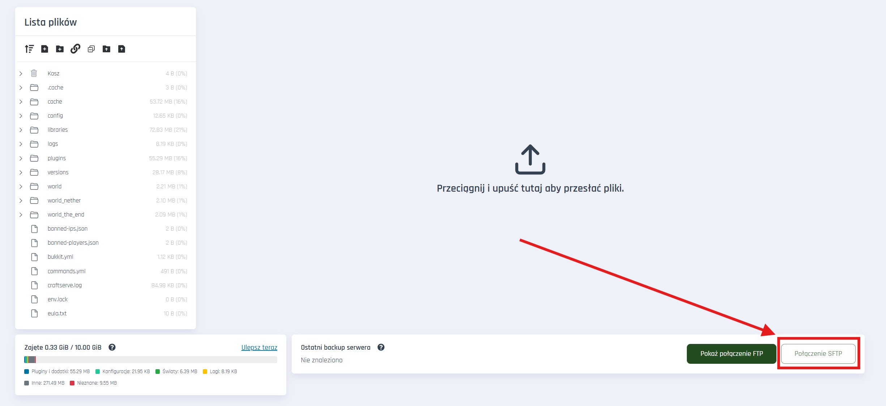
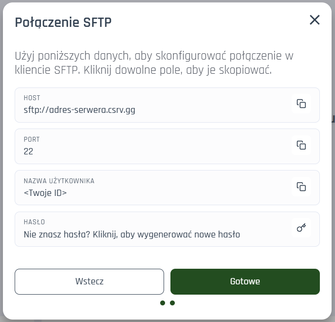
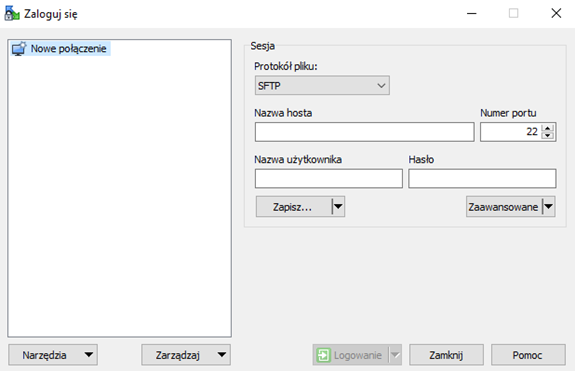
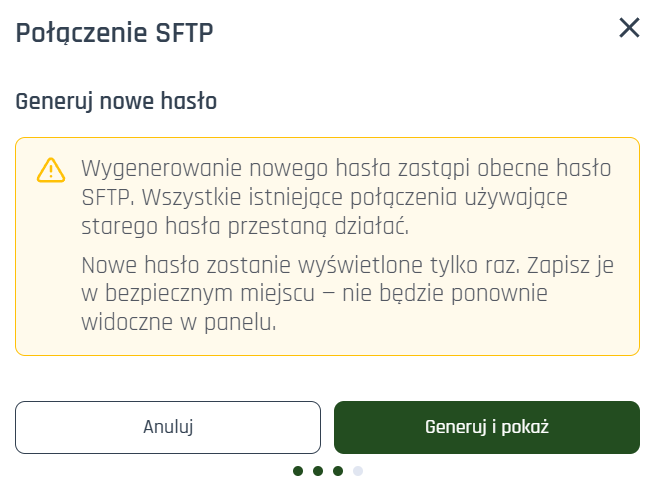

# SFTP - Połączenie i hasło

SFTP (SSH File Transfer Protocol) jest bezpieczniejszą alternatywą dla FTP i umożliwia przesyłanie plików w zaszyfrowanym połączeniu. Craftserve udostępnia dane SFTP w panelu serwera, a hasło można wygenerować lub zresetować w dowolnej chwili.

## Jak znaleźć dane SFTP w panelu

W panelu serwera przejdź do zakładki **Pliki** i kliknij przycisk **Połączenie SFTP**.

Powinno się otworzyć okno, w którym znajdziesz dane:

1. **HOST** – np. `sftp://smart-gray-squid.csrv.gg`
2. **PORT** – zazwyczaj `22`
3. **NAZWA UŻYTKOWNIKA** – unikalny login do SFTP
4. **HASŁO** – aktualne hasło (jeśli nie znasz, wygeneruj nowe)

> Nowe hasło SFTP jest wyświetlane tylko raz. Zapisz je w bezpiecznym miejscu.

### Krok po kroku:

1. Otwórz panel i przejdź do **Pliki**.
2. Kliknij **Połączenie SFTP**.
3. Skopiuj host i port (najlepiej kliknij ikonę kopiowania obok pola).
4. Skopiuj nazwę użytkownika.
5. Jeśli hasło jest ukryte lub nie znasz, kliknij w przycisk do generowania nowego hasła.
6. Skopiuj nowe hasło i wklej do klienta SFTP.

## Polecane klienty i szybki start

Jeżeli nie wiesz od czego zacząć, wykorzystaj tę dokumentację oraz jeden z polecanych klientów SFTP (może być dowolny inny!):

- FileZilla: https://filezilla-project.org/download.php
- WinSCP: https://winscp.net/eng/download.php
- Dokumentacja SFTP w panelu (ten poradnik)

## Połączenie w WinSCP

1. Otwórz WinSCP i wybierz **Nowa sesja/Nowa karta**.
2. W polu **Protokół pliku** wybierz **SFTP**.
3. Wypełnij pola:
   - Nazwa hosta: wartości z panelu (np. `smart-gray-squid.csrv.gg`)
   - Numer portu: `22`
   - Nazwa użytkownika: wartość z panelu
   - Hasło: wygenerowane hasło
4. Kliknij **Zapisz** (opcjonalnie) i **Logowanie**.

## Połączenie w FileZilla

1. Otwórz FileZilla i przejdź do **Plik → Menedżer stron**.
2. Kliknij **Nowy adres**.
3. Wypełnij dane:
   - Protokół: **SFTP - SSH File Transfer Protocol**
   - Serwer: wartość z panelu (tylko domena, bez `sftp://`)
   - Port: `22`
   - Typ logowania: Normalne
   - Użytkownik: nazwa użytkownika z panelu
   - Hasło: wygenerowane hasło
4. Kliknij **Połącz**.

Następnie kliknij **Login** / **Połącz**.

## Generowanie nowego hasła SFTP

Jeżeli nie znasz hasła lub chcesz je zmienić, kliknij przycisk **Wygeneruj nowe hasło** w panelu.

- Nowe hasło zastąpi stare.
- Istniejące połączenia używające starego hasła przestaną działać.
- Hasło jest widoczne tylko raz – zapisz je bezpiecznie.

## Praktyczne uwagi

- Nie udostępniaj hasła publicznie.
- Jeśli połączenie się nie udaje, sprawdź najpierw host, port i nazwę użytkownika.
- Po zmianie plików zazwyczaj wystarczy zrestartować serwer, aby zmiany weszły w życie.

## Częste problemy

- Błąd logowania: sprawdź czy hasło jest bez spacji i kopiowane poprawnie.
- Połączenie zerwane: sprawdź czy używasz SFTP (nie FTP) i port 22.
- Brak uprawnień: konto może mieć dostęp tylko do katalogu przypisanego do serwera.

