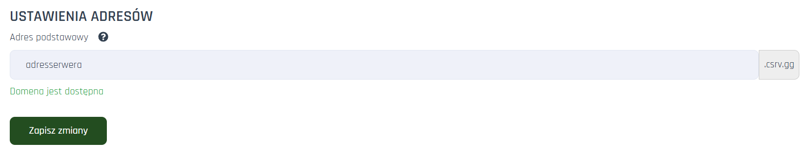
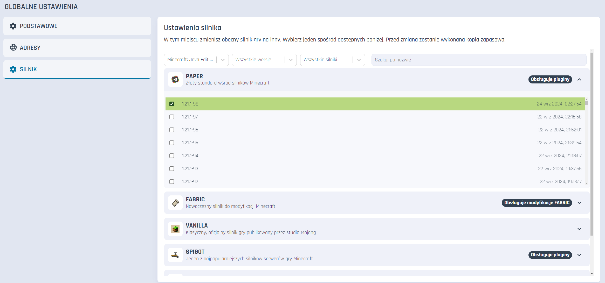

# Ustawienia
Pozwalają na zarządzanie podstawowymi opcjami na Twoim serwerze. Znajdziesz je w jednej z zakładek na pasku po lewej w panelu serwera.

___

## Podstawowe

**Zarządzaj ocrhoną anty-bot**
Wyłącz lub włącz ochronę anty-bot na tym serwerze.

**MySQL**
Wyłącz lub włącz bazę danych MySQL na tym serwerze.

**RCON**
RCON jest domyślnie wyłączony. Aby go włączyć, skontaktuj się z supportem poprzez formularz.

**Ignoruj ostrzeżenie o zatrzymaniu serwera**
Pozwala na automatyczne wymuszanie zamknięcia serwera przy wykonywaniu w panelu operacji tego wymagających.

**Formatowanie serwera**
Ta operacja trwale usuwa pliki bez możliwości ich przywrócenia. Przed formatowaniem stwórz kopie zapasową, kopie nie zostaną usunięte.

## Adresy

**Adres podstawowy**
Ustaw adres łączenia z Twoim serwerem z poziomu gry

## Ustawienia silnika
W tym miejscu zmienisz obecny silnik gry na inny. Wybierz jeden spośród dostępnych. Przed zmianą zostanie wykonana kopia zapasowa.

