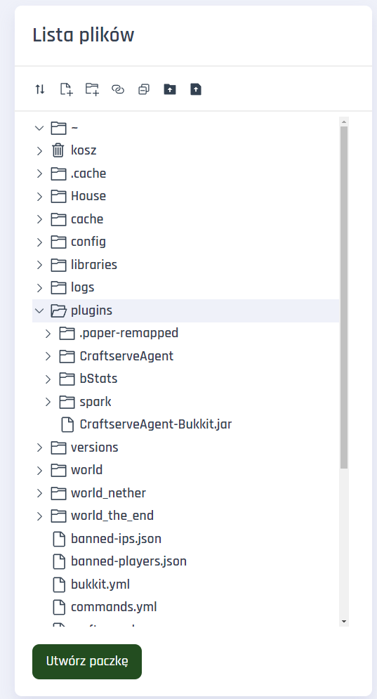

# Instalacja pluginów

**Panel Craftserve** co prawda posiada [Galerie Dodatków](https://craftserve.com/m), jednak czasami możesz chcieć wgrać pluginy ręcznie.

By zainstalować pluginy, najlepiej to zrobić tradycyjną metodą - wykorzystując **FTP** lub zakładkę **Pliki** w panelu Craftserve. Do uruchomienia pluginów potrzebujemy jeden z silników obsługujących je, np.:

## Bukkit, Spigot, Paper, Purpur, itp.

Pluginy na te silniki można pobrać ze stron [Bukkit.org](https://dev.bukkit.org/bukkit-plugins), [SpigotMC](https://www.spigotmc.org/resources/categories/spigot.4/) i wielu innych. Należy jednak bacznie uważać, z jakich stron pobieramy pliki, ponieważ wiele z nich (np. "9minecraft", "BlackSpigot" i inne podobne) może wysłać nam szkodliwe oraz nieoryginalne oprogramowanie.

Przed pobraniem pluginu należy się upewnić, że działa on na naszej wersji Minecrafta, a już pobrane pluginy z rozszerzeniem **.jar** należy przekopiować do folderu **/plugins/** na naszym serwerze:

## Sponge

Silnik sponge ma API zupełnie różne od Bukkit, Spigot czy Paper, dlatego pluginy z tych silników nie są między sobą kompatybilne. Wtyczki Sponge można ściągnąć ze strony [SpongePowered](https://ore.spongepowered.org/). Tak jak w przypadku tych poprzednich, wystarczy odpowiednią wersję pluginu wrzucić do folderu **/plugins/** na naszym serwerze.

Niestety, biblioteka pluginów Sponge'a jest zdecydowanie uboższa, niż ta Bukkita i Spigota.

## Instalacja

Do zarządzania plikami można wykorzystać zakładkę **Pliki** w panelu Craftserve lub protokół **FTP** i obsługującego go klienta, np. **[WinSCP](https://github.com/Craftserve/docs/blob/master/ftp.md)**.
