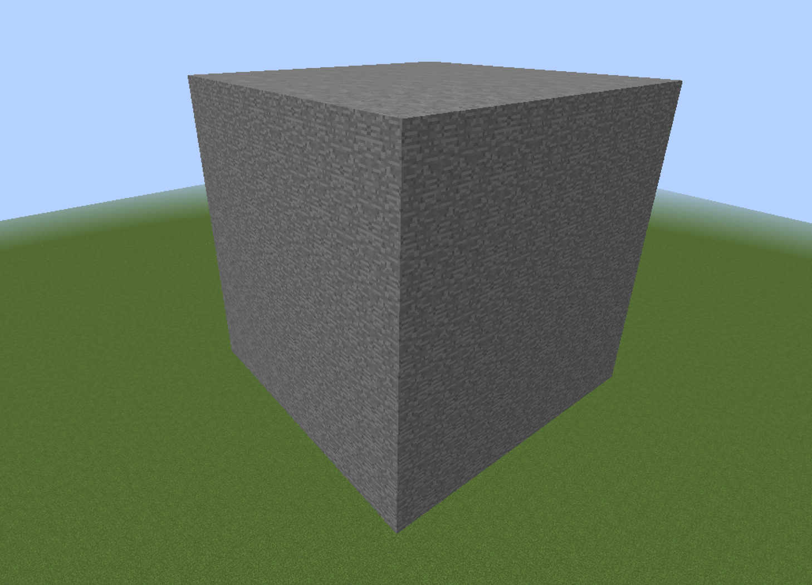
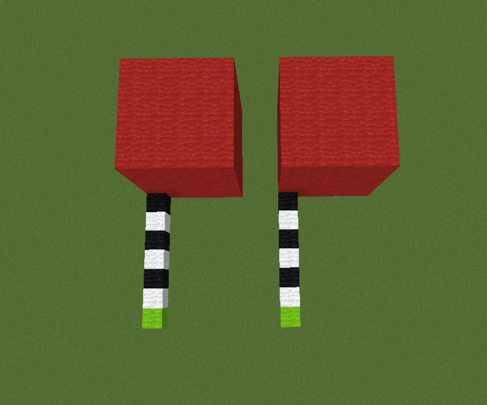
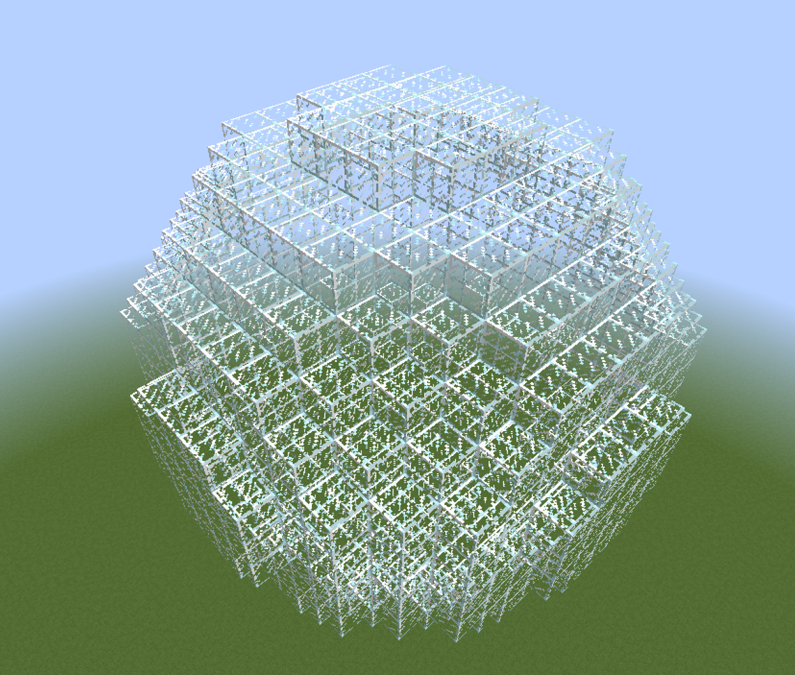
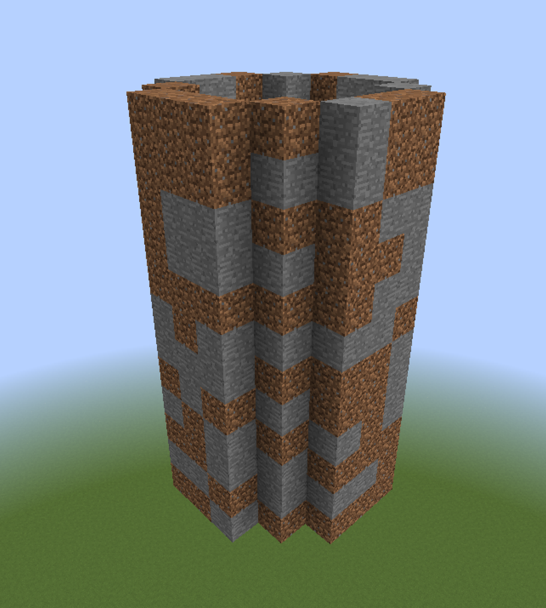

# WorldEdit - kompletny poradnik

WorldEdit jest pluginem do edycji świata, pozwala na znaczne przyspieszenie najprostszych czynności, takich jak wypełnianie ścian, przez kopiowanie i obracanie, aż po generowanie zaawansowanych struktur jedną komendą.

## Instalacja

1. Pobierz plugin z [oficjalnej strony](https://dev.bukkit.org/projects/worldedit).
2. Skopiuj plik WorldEdit.jar do folderu plugins.
3. Włącz serwer.

## Podstawy - tu zacznij

Ze względu na ogromną ilość funkcji i ich wzajemne powiązanie, podzieliłem poradnik na dwie części: podstawy i kompletny przegląd. W tym miejscu opisałem podstawowe, najczęściej wykorzystywane funkcje. W dalszej części tekstu rozszerzam je o zaawansowane funkcje.

### Zaznaczanie
W celu edycji bloków, musisz najpierw wskazać obszar, w którym zamierzasz jej dokonać. Podstawowym typem zaznaczania jest prostopadłościan, łączący dwa punkty.

#### Tworzenie zaznaczenia
Możesz je stworzyć na trzy sposoby:

* Trzymając drewnianą siekierę zaznaczyć pierwszy punkt klikając LPM i następnie zaznaczyć drugi punkt klikając PPM. Drewnianą siekierę można stworzyć samemu lub otrzymać ją za pomocą komendy `//wand`.
* Wpisać `//pos1` dla punktu pierwszego i `//pos2` dla punktu drugiego. Są one tworzone w miejscach gdzie stoisz w czasie wpisywania komend.
* Wpisać `//hpos1` dla punktu pierwszego i `//hpos2` dla punktu drugiego. Są one tworzone w miejscach gdzie patrzysz w czasie wpisywania komend.

Prostopadłościan powstanie w wyniku połączenia tych dwóch punktów.

#### Edycja zaznaczenia
Jeśli chcesz zedytować stworzony wcześniej prostopadłościan możesz zrobić to na kilka różnych sposobów:

* Zedytować jeden z punktów wykorzystując metody opisane w tworzeniu zaznaczenia.
* Powiększyć region o np. 5 kratek w górę wpisując `//expand 5 U`
* Powiększyć region o np. 5 kratek w kierunku w którym patrzysz wpisując `//expand 5`
* Zmniejszyć region o np. 5 kratek od góry wpisując `//contract 5 D`
* Zmniejszyć region o np. 5 kratek w kierunku w którym patrzysz wpisując `//contract 5`

Dostępne kierunki to: N, S, W, E, U (w górę), D (w dół).

### Robienie czegoś z zaznaczonym terenem
Jeśli już zaznaczyłeś teren, możesz go teraz zmodyfikować.

#### Wypełnianie zaznaczenia
Używając komendy `//set <bloki>` zamienisz wszystkie bloki w obrębie zaznaczenia, na konkretne bloki.
Bloki możesz wpisać w następujące sposoby:

* `stone` - zamieni się na kamień
* `stone,dirt,bedrock` - zamieni się losowo na kamień, ziemię i bedrock
* `25%stone,25%dirt,50%bedrock` - zamieni się na 25% kamienia, 25% ziemii i 50% bedrocka

Dla przykładu: `//set dirt`, `//set 10%glass,90%stone`, `//set air`

#### Zamienianie zaznaczenia
Używając komendy `//replace <bloki> <bloki>` zamieniasz określone bloki, na inne.

Dla przykładu `//replace dirt,stone 20%dirt,20%sand,60%stone` zamieni wszystkie bloki ziemii i kamienia na 20% bloków ziemii, 20% bloków piasku, 60% bloków kamienia.

#### Tworzenie ścian
Używając komendy `//walls <bloki>` tworzysz ściany wokół zaznaczenia.

Dla przykładu `//walls stone,dirt` stworzy ścianę z losowo występującego kamienia i ziemii.

#### Kopiowanie i schowek
Po zaznaczeniu terenu, używając komendy `//copy` możesz go skopiować.

Używając komendy `//paste` wklejasz go.
* **UWAGA** Ważne jest to w którym miejscu stoisz wpisując komendę `//copy` - gdy stałeś np. 5 bloków przez strukturą, po wpisaniu komendy `//paste` struktura wklei się 5 bloków przed tobą.

Używając komendy `//rotate <ilość-stopni>` obracasz strukturę w schowku.
Dla przykładu `//copy`, `//rotate 90`, `//paste`.

Używając komendy `//flip [kierunek]` przewracasz strukturę w danym kierunku (np. lustrzanie).
Dla przykładu `//copy`, `//flip`, `//paste`.

### Generowanie
Istnieją także komendy umożliwiające generowanie danych struktur w miejscu gdzie stoisz, nie wymagają one zaznaczania.

#### Tworzenie kulii/sfery
Używając komendy `//sphere <bloki> <promień>` stworzysz kulę, jej środek będzie w miejscu gdzie stoisz.
Dla przykładu `//sphere stone 5` stworzy kulę z kamienia o promieniu równym 5.

Używając komendy `//hsphere <bloki> <promień>` stworzysz sferę (kulę pustą w środku), jej środek będzie w miejscu gdzie stoisz.
Dla przykładu `//hsphere glass 7` stworzy sferę ze szkła o promieniu równym 7.

#### Tworzenie walca/cylindra
Używając komendy `//cyl <bloki> <promień> [wysokość]` stworzysz walec, jego środek będzie w miejscu gdzie stoisz, jego wysokość jest liczona w górę.
Dla przykładu `//cyl glass 7 10` stworzy walec ze szkła o promieniu równym 5 i wysokości 10.

Używając komendy `//hcyl <bloki> <promień> [wysokość]` stworzysz cylinder (walec pusty w środku), jego środek będzie w miejscu gdzie stoisz, jego wysokość jest liczona w górę.
Dla przykładu `//hcyl stone,dirt 3 12` stworzy cylinder z kamienia i ziemii o promieniu równym 3 i wysokości 12.

### Pędzle
Pędzle umożliwiają "rysowanie" konkretnymi przedmiotami.

Trzymając w ręce np. patyk i używając komendy `//br <typ pędzla>` aktywujesz konkretny pędzel na patyku. Po kliknięciu PPM, w miejscu na które wskazujesz, wykona się konkretna zmiana, w zależności od pędzla.

Przykładowe pędzle:
* `//br sphere <bloki> <promień>` tworzy kulę w miejscu na które wskazujesz.
* `//br cyl <bloki> <promień> [wysokość]` tworzy cylinder w miejscu na które wskazujesz.
* `//br clipboard` wkleja obiekt ze schowka (skopiowany za pomocą `//copy`) w miejscu na które wskazujesz.
* `//br gravity <promień>` układa bloki na ziemii zgodnie z grawitacją w obszarze na który wskazujesz. Dla przykładu, jeśli użyjesz `//br gravity 10`, latające bloki w promieniu 10 od miejsca na które wskazałeś opadną na dół.

Komenda `//none` sprawi, że blok który trzymasz w ręce przestanie być pędzlem.

### Historia
Używając komendy `//undo` cofasz ostatnio dokonaną zmianę.
Używając komendy `//redo` przywracasz cofniętą wcześniej zmianę.

## Kompletny spis możliwości
Część opisanych wyżej funkcji powtórzy się tutaj, jednak zostaną dokładniej wyjaśnione.

### Historia
Wszystkie **zmiany** których dokonujesz za pomocą pluginu WorldEdit, są zapisywane w historii. Kopiowanie czy obracanie schowka jest pomijane, uwzględnione są tylko faktyczne zmiany mapy.

`//undo [ilość]`
Z pomocą komendy `//undo` możesz cofnąć wykonane wcześniej zmiany.
Używając np. `//undo 5` jest to odpowiednik wpisania 5 razy `//undo`, czyli cofasz 5 ostatnich zmian.

`//redo [ilość]`
Z pomocą komendy `//redo` możesz ponowić cofniętą wcześniej zmianę.
Używając np. `//redo 5` jest to odpowiednik wpisania 5 razy `//redo`, czyli ponawiasz 5 ostatnio cofniętych zmian.

Dla przykładu po wpisaniu `//undo 5`, a następnie `//redo 3`, cofasz 5 zmian, a następnie ponawiasz 3 ostatnio cofnięte zmiany, czyli efekt jest taki sam jak po wpisaniu `//undo 2`

Możesz wyczyścić swoją historię przy użyciu komendy `/clearhistory`.

### Wzory bloków (patterns)
Patterny odnoszą się do bloków *na które coś zostanie zamienione*. Patternem jest np. `<bloki>` w `//set <bloki>`.

#### Pojedynczy blok
Podajesz po prostu jeden konkretny blok, dla przykładu `stone`.

#### Losowe bloki
* Podajesz kilka bloków w formie listy, dla każdego zedytowanego bloku zostanie wylosowany jeden z nich. Dla przykładu `stone,dirt,bedrock`.
* Podajesz kilka bloków w formie listy uwzględniając procenty, dla każdego zedytowanego bloku zostanie wylosowany jeden z nich uwzględniając procenty. Dla przykładu `10%stone,10%dirt,80%bedrock`.

#### Losowy stan bloku
Poprzedzenie nazwy bloku `*` spowoduje wylosowanie jego stanu dla każdego z nich.
Dla przykładu `*oak_log` wylosuje kierunek ułożenia pnia dla każdego bloku.

#### Losowy typ bloku
Poprzedzenie nazwy bloku `##` spowoduje wylosowanie jego typu dla każdego z nich.
Dla przykładu `##wool` wylosuje kolor wełny dla każdego bloku.

#### Wcześniejszy stan bloku
Poprzedzenie nazwy bloku `^` spowoduje zapamiętanie jego stanu przy np. komendzie `//replace`.
Dla przykładu `//replace oak_stairs ^acacia_stairs` spowoduje zamienienie wszystkich dębowych schodów na akacjowe z uwzględnieniem ich wcześniejszego kierunku.

### Maski
Maski odnoszą się do bloków *które mają zostać zamienione*. Maską jest np. `<bloki1>` w `//replace <bloki1> <bloki2>`.

**UWAGA**
Poza argumentami w komendach, mask można używać również globalnie lub do konkretnych pędzli.
`//mask <maska>` sprawia, że używając pędzla (`//br`) będziesz edytował tylko konkretne bloki.
`//gmask <maska>` odnosi się do wszystkich akcji jakie wykonujesz przy użyciu world edita.
Wpisanie samego `//mask` lub `//gmask` resetuje je.

#### Maska blokowa
Najprostsza maska, przy jej użyciu wskazujesz po prostu, które bloki chcesz zedytować.
`//replace stone air`, `stone` jest maską, oznacza to, że wszystkie bloki kamienia zostaną zamienione na powietrze.
`//replace stone,dirt air` `stone,dirt` jest maską, oznacza to, że wszystkie bloki kamienia i ziemii zostaną zamienione na powietrze.

#### Negacja
Działa dokładnie tak jak poprzednia, jednak neguje bloki.
`//replace !stone air`, `!stone` jest maską, oznacza to, że wszystkie bloki **oprócz kamienia** zostaną zamienione na powietrze.
`//replace !stone,dirt air` `!stone,dirt` jest maską, oznacza to, że wszystkie bloki **oprócz kamienia i ziemii** zostaną zamienione na powietrze.

#### Istniejące (existing)
Oznacza wszystkie bloki oprócz powietrza.
`//replace #existing dirt`, `#existing` jest maską, oznacza to, że wszystkie bloki **oprócz powietrza** zostaną zamienione na ziemię.

#### Solidne (solid)
Oznacza wszystkie solidne bloki. Są to bloki, które nie pozwalają na przechodzenie np. graczy przez nie.
`//replace #solid dirt`, `#solid` jest maską, oznacza to, że wszystkie solidne bloki zostaną zamienione na ziemię.

#### Region
Maska `#region` jest przydatna np. gdy chcesz zedytować wszystko oprócz konkretnego obiektu. W tym celu zaznaczasz dany obiekt, a następnie używasz maski region z negacją - `//gmask !#region`. *World edit zapamięta region w momencie wpisania tej komendy.* Od tego momentu wszystkie zmiany dokonywane world editem nie będą miały wpływu na zaznaczony wcześniej region.

#### Poniżej/powyżej
`//gmask <air` zedytuje tylko bloki bezpośrednio pod blokiem powietrza.
`//gmask >air` zedytuje tylko bloki bezpośrednio nad blokiem powietrza.

#### Maska z wyrażeniem
Ta maska wykonuje wyrażenie matematyczne odnośnie każdego bloku.
Dla przykładu:
`//gmask =y<32` zedytuje tylko bloki poniżej y=32.

#### Łączone maski
Możesz użyć także kilku mask równocześnie, pod warunkiem, że się nie wykluczają. Podajesz je w cudzysłowie oddzielając spacją.
Dla przykładu jeśli chcesz zmienić tylko bloki stone znajdujące się nad powietrzem (więc unoszące się w powietrzu) użyj maski `"stone <air"`.

### Przemieszczanie się

* Kompas - gdy chcesz szybko przemieścić się, możesz użyć kompasu. Kliknięcie LPM spowoduje teleportację w miejsce gdzie patrzysz, kliknięcie PPM spowoduje teleportację przez ścianę w kierunku w który patrzysz.
* `/jumpto` ta komenda przeniesie cię w miejscu na które patrzysz.
* `/thru` ta komenda przeteleportuje cię w przez ścianę w kierunku której patrzysz.
* `/ceil` ta komenda przenosi cię na najwyższy stały blok nad tobą.
* `/up <liczba blokow>` dla przykładu dla komendy `/up 5` zostaniesz przeteleportowany o 5 bloków w górę i pod tobą utworzony zostanie pojedynczy blok szkła. Jest ona bardzo przydatna gdy chcesz zacząć budować jakąś strukturę w powietrzu.

### Zaznaczanie

Zaznaczanie punktów może odbywać się na trzy różne sposoby:
* Trzymając drewnianą siekierę zaznacz pierwszy punkt klikając LPM i następnie zaznacz drugi punkt klikając PPM. Drewnianą siekierę można stworzyć samemu lub otrzymać ją za pomocą komendy `//wand`.
* Wpisując `//pos1` dla punktu pierwszego, `//pos2` dla punktu drugiego. Są one tworzone w miejscach gdzie stoisz w czasie wpisywania komend.
* Wpisując `//hpos1` dla punktu pierwszego, `//hpos2` dla punktu drugiego. Są one tworzone w miejscach gdzie patrzysz w czasie wpisywania komend.
W przypadku bardziej zaawansowanych metod zaznaczania (opisane niżej) możesz używać także kolejnych wartości (`//hpos3`, `//hpos4` itd.).

Istnieje 7 metod zaznaczania, są one wybierane za pomocą komendy `//sel <tryb>`.

1. `cuboid` podstawowy prostopadłościan, obejmuje cały teren pomiędzy blokiem 1, a blokiem 2.

  * Możesz go stworzyć zaznaczając pierwszy i drugi punkt. Prostopadłościan powstanie w wyniku połączenia tych dwóch punktów.

2. `extend` prostopadłościan rozszerzany przez ponowne wybieranie punktów.

  * Zacznij od zaznaczenia pierwszego punktu, następnie zaznaczane punkty będą rozszerzać cuboid.

3. `poly` wielokąt.

  * Zacznij od zaznaczenia pierwszego punktu, następnie dodawaj kolejne, będą one rozszerzały cuboid tworząc płaski wielokąt. Jego wysokość będzie odpowiadała wysokości najniższego i najwyższego punktu jakie dodałeś.

4. `ellipsoid`

  * Zacznij od zaznaczenia pierwszego punktu, który będzie jego środkiem. Dodawane później punkty rozszerzają jego promień, pozwalają na jego spłaszczenie itp.

5. `sphere`

  * Zacznij od zaznaczenia pierwszego punktu, który będzie jego środkiem. Drugi punkt będzie stanowił promień kuli.

6. `cyl`

  * Zacznij od zaznaczenia pierwszego punktu, który będzie jego środkiem. Dodawane później punkty rozszerzają jego promień, pozwalają na jego spłaszczanie itp. Jego wysokość będzie odpowiadała wysokości najniższego i najwyższego punktu jakie dodałeś.

7. `convex`

  * Zacznij od zaznaczenia pierwszego punktu, a następnie dodawaj kolejne. Utworzysz w ten sposób wielościan.

#### Edycja zaznaczenia
**UWAGA** Działa tylko dla typu zaznaczenia `cuboid`.

`//expand <ilość> [kierunek]`
Możesz zwiększyć rozmiar zaznaczenia za pomocą powyższej komendy, dostępne kierunki to: N (north), S (south), W (west), E (east), U (w górę), D (w dół); F (forward, do przodu), B (back, do tyłu), L (left, w lewo), R (right, w prawo). Kierunki F,B,L,R odnoszą się kierunków względem kierunku w którym patrzysz.
Możesz także mieszać kierunki, dla przykładu `//expand 10 n,w`
Jeśli nie wpiszesz kierunku rozmiar cuboida zostanie zwiększony w kierunku w którym patrzysz.

`//contract <ilość> [kierunek]`
Możesz zmniejszyć rozmiar zaznaczenia za pomocą powyższej komendy, obowiązują te same kierunki co dla komendy `//expand`.
Jeśli nie wpiszesz kierunku rozmiar cuboida zostanie zmniejszony **z** kierunku w którym patrzysz.

`//outset <ilość>`
Komenda powyżej zwiększy zaznaczenie o daną ilość kratek w każdym kierunku.
* `//outset <ilość> -h` zwiększy ilość kratek horyzontalnie, czyli na północ, na południe, na wschód i na zachód, nie edytując góry i dołu.
* `//outset <ilość> -v` zwiększy ilość kratek wertykalnie, czyli w dół i na górę

`//inset <ilość>`
Komenda powyżej zmniejszy zaznaczenie o daną ilość kratek z każdego kierunku.
* `//inset <ilość> -h` zmniejszy ilość kratek horyzontalnie, czyli z północy, z południa, ze wschodu i z zachodu, nie edytując góry i dołu.
* `//inset <ilość> -v` zmniejszy ilość kratek wertykalnie, czyli z dołu i z góry.

#### Informacje odnośnie zaznaczenia

`//size`
Wyświetla ilość bloków należących do twojego zaznaczenia.

`//count <maska>`
Pozwala policzyć bloki w twoim zaznaczeniu spełniające konkretną maskę.
Dla przykładu `//count "dirt >stone"` wyświetli ilość bloków ziemii znajdujących się bezpośrednio nad kamieniem.

`//distr`
Oblicza ilość konkretnych bloków w Twoim zaznaczeniu.

### Operacje na regionach

#### Ustawianie bloków
`//set <pattern>`
Umożliwia zamianę wszystkich bloków w obrębie zaznaczenia na inne, zgodnie z zasadą patternów.
Dla przykładu:
* `stone` - zamieni się na kamień
* `stone,dirt,bedrock` - zamieni się losowo na kamień, ziemię i bedrock
* `25%stone,25%dirt,50%bedrock` - zamieni się na 25% kamienia, 25% ziemii i 50% bedrocka

#### Zamiana bloków
`//replace <maska> <pattern>`
Umożliwia zamianę konkretnych bloków (maska) na inne (pattern) w obrębie zaznaczenia.
Dla przykładu `//replace dirt,stone 20%dirt,20%sand,60%stone` zamieni wszystkie bloki ziemii i kamienia na 20% bloków ziemii, 20% bloków piasku, 60% bloków kamienia.

#### Tworzenie ścian i obwódki
`//walls <pattern>`
Umożliwia utworzenie ścian (wypełnia skrajne bloki cuboida pomijając górę i dół) z konkretnego bloku.

`//outside <pattern>`
Umożliwia utworzenie obwódki (wypełnia wszystkie skrajne bloki cuboida) z konkretnego bloku.

#### Pokrywanie
`//overlay <pattern>`
Przykrywa wszystkie najwyżej znajdujące się bloki (czyli te, nad którymi jest tylko powietrze) konkretnym blokiem (pattern). Umożliwia np. pokrycie łąki różnymi kwiatami.

#### Stakowanie
`//stack <ilość> [kierunek]`
Kopiuje zaznaczoną strukturę, a następnie wkleja ją konkretną ilość razy (obok siebie) w danym kierunku.
Umożliwia tworzenie mostów, tuneli i powtarzających się segmentów budowli.

#### Przesuwanie
`//move <dystans> [kierunek]`
Kopiuje, wycina i wkleja (przesuwa) całą strukturę daną ilość kratek, w danym kierunku, dalej.
Dla przykładu `//move 5 u` przesunie całą strukturę o 5 kratek w górę.

#### Wygładzanie
`//smooth [ilość powtórzeń]`
Wygładza zaznaczony teren, przydatne przy tworzeniu np. pagórków. Ilość powtórzeń oznacza siłę wygładzenia (`//smooth 3` jest równoznaczne wpisaniu komendy `//smooth` 3-krotnie).

#### Naprawianie
`//regen`
Przywraca domyślny stan terenu w danym miejscu, opiera się o konkretny seed mapy.

#### Naturalizowanie
`//naturalize`
Działa tylko na kamień, zamienia 3 górne warstwy kamienia ziemię i jedną ziemią z trawą.

#### Umieszczanie flory
`//flora`
Pokrywa trawę naturalnie rozmieszczoną roślinnością, natomiast piasek naturalnie rozmieszczonymi martwymi drzewami.

#### Umieszczanie bloku w centrum zaznaczenia
`//center <pattern>`
Umieszcza dany blok w środku zaznaczonego cuboida, jeśli dana długość jest parzysta, umieszcza dwa bloki.

#### Deformowanie
`//deform <wyrażenie matematyczne>`
Deformuje zaznaczony teren za pomocą wyrażenia matematycznego.

Dla przykładu:
`//deform y+=0.2*sin(x*10)` faluje teren tworząc naturalne pagórki. Modyfikując różne zmienne można stworzyć bardzo naturalne i niepowtarzalne efekty. Wielkość zmiennych powinna być proporcjonalnie uzależniona od rozmiaru zaznaczonego terenu.
`//deform swap(x,y)` przewraca zaznaczony teren.
`//deform rotate(x,z,45*pi/180)` obraca pod danym kątem.
`//deform x/=2;y/=2;z/=2` powiększa (skaluje) obiekt dwukrotnie.

### Schowek

#### Kopiowanie i wycinanie
Kopiowanie obiektów do schowka umozliwia wpisaniu dwóch komend (po zaznaczeniu regionu).
`//copy` - po prostu kopiuje.
`//cut` - po prostu kopiuje, a następnie wycina (zamienia na powietrze).

**WAŻNE** zapamiętywana jest twoja pozycja względem kopiowanego regionu, więc jeśli stoisz 5 kratek przed wejściem do domu i go skopiujesz, po wklejeniu w innym miejscu drzwi pojawią się 5 kratek przed tobą. Jest to bardzo istotny aspekt przy wykonywaniu operacji na schowku.

Obie komendy pozwalają na użycie trzech dodatkowych flag:
* `-e` pozwala także uwzględnić w kopiowaniu lub wycinaniu entity (moby, leżące przedmioty itp.). Dla przykładu `//copy -e`.
* `-b` pozwala także uwzględnić biomy (w przypadku wycinania biomy w dalszym ciągu zostaną pozostawione w miejscu wyciętego obiektu). Dla przykładu `//copy -b`.
* `-m <mask>` pozwala także uwzględnić konkretną maskę w przypadku kopiowania lub wycinania. Wszystkie bloki, które nie należą do maski będą reprezentowane jako powietrze w twoim schowku (nie skopiują się). Dla przykładu `//copy -m !stone` skopiuje wszystkie bloki oprócz kamienia.

#### Wklejanie
Wklejanie obiektów (po wcześniejszym skopiowaniu lub wycięciu).
`//paste` - umozliwia wklejenie obiektu.
Ponieważ zapamiętywana jest twoja pozycja, jeśli skopiowałeś wieże stojąc na jej szczycie, po wklejeniu będzie znajdowała się bezpośrednio pod tobą.

Podobnie jak przy kopiowaniu komenda pozwala na użycie trzech flag:
* `-e` pozwala uwzględnić także skopiowane entity przy wklejaniu (jeśli jakieś są).
* `-b` pozwala uwzględnić także skopiowane biomy przy wklejaniu (jeśli jakieś są).
* `-m <mask>` pozwala uwzględnić konkretne bloki ze schowka, które mają zostać wklejone.
Oprócz tego dostępne jest kilka dodatkowych flag:
* `-a` nie wklei powietrza ze schowka.
* `-s` ustawi zaznaczenie na obszar, który wkleiłeś.
* `-o` wklei schowek w miejsce z którego został skopiowany, ignorując względną pozycję.

#### Obracanie
`//rotate <kąt>`
Pozwala na obrócenie schowka o konkretną ilość stopni, najlepiej używać wielokrotności 90 (dla bardziej nieregularnych kątów polecane jest użycie komendy `//deform`, opisanej wyżej).
Istotne jest to, że obraca zaznaczenie względem miejsca w którym stałeś kopiując obiekt. Jeśli chcesz obrócić go względem środka, musisz stać na środku w trakcie kopiowania (możesz wyznaczyć środek np. przy użyciu komendy //center <pattern>).

#### Przewracanie
`//flip [kierunek]`
Pozwala na przewrócenie zawartości schowka w konkretnym kierunku, np. odbijając lustrzanie jego zawartość.

#### Tworzenie schematów
World edit pozwala zapisać zawartość schowka na stałe i udostępniać ją w innych miejscach, lub wgrać schematy pobrane z internetu.
Schematy przechowywane są w folderze `plugins/WorldEdit/schematics`.

`//schem save <nazwa pliku>` zapisuje obecną zawartość schowka.
`//schem load <nazwa pliku>` wczytuje dany schemat do zawartości schowka.
`//schem list` wyświetla listę istniejących schematów.
`//schem delete <nazwa pliku>` pozwala na skasowanie konkretnego schematu.

### Generowanie
World edit pozwala także na generowanie różnych obiektów, takich jak kule czy piramidy.
Środek generowanego obiektu znajduje się w miejscu, w którym stoisz.

#### Tworzenie walca/cylindra
Używając komendy `//cyl <bloki> <promień> [wysokość]` stworzysz walec, jego środek będzie w miejscu gdzie stoisz, jego wysokość jest liczona w górę.
Dla przykładu `//cyl glass 5 10` stworzy walec ze szkła o promieniu równym 5 i wysokości 10.

Używając komendy `//hcyl <bloki> <promień> [wysokość]` stworzysz cylinder (walec pusty w środku), jego środek będzie w miejscu gdzie stoisz, jego wysokość jest liczona w górę.
Dla przykładu `//hcyl stone,dirt 3 12` stworzy cylinder z kamienia i ziemii o promieniu równym 3 i wysokości 12.

`//cyl <pattern> <promieńEW>,<promieńNS> [wysokość]` dla lepszej kontroli możesz spłaszczyć figurę i stworzyć eliptyczny cylinder, podając dwie wartości w miejscu promienia, szerokość promienia w osii EW i osii NS.
Dla przykładu `//cyl stone 5.5,10 5`.

#### Tworzenie kulii/sfery
Używając komendy `//sphere <bloki> <promień>` stworzysz kulę, jej środek będzie w miejscu gdzie stoisz.
Dla przykładu `//sphere stone 5` stworzy kulę z kamienia o promieniu równym 5.

Używając komendy `//hsphere <bloki> <promień>` stworzysz sferę (kulę pustą w środku), jej środek będzie w miejscu gdzie stoisz.
Dla przykładu `//hsphere dirt 7` stworzy sferę z ziemii o promieniu równym 7.

`//sphere <pattern> <promień>,<promień>,<promień>` podobnie jak w przypadku cylindrów, tutaj także możesz użyć konkretnych promienii, jednak dla wszystkich trzech osii.
Dla przykładu `//hsphere dirt 10,5,4.5`.

Możesz także dodać `yes` na końcu komendy, by najwyższy punkt kuli znajdował się bezpośrednio pod twoimi nogami (zamiast jej środka w miejscu w którym stoisz).
Dla przykładu `//sphere stone 5 yes` stworzy kulę, na której będziesz stał.

#### Tworzenie piramidy
`//pyramid <pattern> <rozmiar>`
`//hpyramid <pattern> <rozmiar>`
Komendy pozwalają na stworzenie piramidy (pełnej lub pustej w środku), jej środek będzie w miejscu w którym stoisz. Podaniu rozmiaru np. 5, spowoduje powstanie piramidy składającej się z 5 warstw leżących na sobie, każdej kolejnej o 1 szerszej od poprzedniej.

#### Generowanie zaawansownych kształtów
World edit pozwala na generowanie zaawansowanych kształtów za pomocą wyrażeń matematycznych, reprezentujących funkcje 3D.
Wymagana jest tutaj spora wiedza matematyczna lub po prostu modyfikowanie gotowych przykładów i testowanie, która zmienna co robi.

Przykłady:

Spłaszczony torus:
`//g stone (0.75-sqrt(x^2+y^2))^2+z^2 < 0.25^2`
Pień drzewa:
`//g -h oak_log (0.5+sin(atan2(x,z)*8)*0.2)*(sqrt(x*x+z*z)/0.5)^(-2)-1.2 < y`
Tęczowy torus:
`//g white_wool data=(32+15/2/pi*atan2(x,y))%16; (0.75-sqrt(x^2+y^2))^2+z^2 < 0.25^2`
Tęczowe jajko:
`//g white_wool data=(32+y*16+1)%16; y^2/9+x^2/6*(1/(1-0.4*y))+z^2/6*(1/(1-0.4*y))<0.08`
Serce:
`//g red_wool (z/2)^2+x^2+(5*y/4-sqrt(abs(x)))^2<0.6`
Fala:
`//g -h glass sin(x*5)/2<y`
Radialna fala:
`//g -h glass cos(sqrt(x^2+z^2)*5)/2<y`
Circular hyperboloid:
`//g stone -(z^2/12)+(y^2/4)-(x^2/12)>-0.03`

### Narzędzia

Narzędzia można zbindować do konkretnych przedmiotów, pozwalają na znaczne przyspieszenie pracy.
W celu zbindowania danego narzędzia do konkretnego przedmiotu, musisz go trzymać w ręce i wpisać daną komendę.
Jeśli chcesz wyczyścić przypisanie, wystarczy wpisać `//none`.

#### Narzędzie generujące drzewa
`/tree [typ]`
To narzędzie tworzy drzewa danych typów podczas gdy klika się nim na blok. Używa minecraftowego generatora drzew i ma te same limity - nie wygeneruje drzewa na bloku, na którym nie może go posadzić lub gdy w miejscu gdzie mogłoby powstać, znajdują się solidne bloki.

#### Narzędzie usuwające latające drzewa
`/deltree`
Po kliknięciu prawym przyciskiem na latające w powietrzu bloki liści lub drewna (powstałe na przykład przez graczy ścinających tylko dolne części drzew) usunie wszystkie połączone bloki drzew.

#### Narzędzie zamieniające bloki
`/repl <pattern>`
To narzędzie zamieni kliknięte bloki na bloki z twojego patternu. Możesz także kliknąć lewym przyciskiem myszy by zamienić swój obecny pattern na kliknięty blok.

#### Narzędzie do budowania na daleki dystans
`/lrbuild <lewy pattern> <prawy pattern>`
To narzędzie pozwala na zamienianie bloków na które klikasz. Jeśli klikniesz lewym przyciskiem myszy, bloki będą zamieniane na pierwszy pattern, jeśli klikniesz prawym, bloki będą zamieniane na drugi pattern.

#### Różdżka na daleki dystans
`/farwand`
Działa tak jak `//hpos1` i `//hpos2`, jednak za pomocą lewego i prawego kliknięcia myszy.

#### Narzędzie do obracania
`/cycler`
Narzędzie służące do obracania (zmieniania stanów) bloków na które patrzysz. Dla przykładu możesz spojrzeć na schody i je obracać.

#### Narzędzie wyświetlające informacje
`/info`
Po naciśnięciu prawego klawisza myszy, wyświetli informacje na temat bloku na który patrzysz. Wyświetli koordynaty, stan, typ bloku, poziom oświetlenia i ID.

#### Narzędzie do zalewania
`/floodfill <pattern> <promień>`
Narzędzie zamieni kliknięty prawym przyciskiem myszy i wszystkie pozostałe połączone bloki tego samego typu, w danym zasięgu, na wskazany pattern.

### Super kilof
Super kilof działa inaczej niż pozostałe narzędzia, ponieważ jest włączany i wyłączany komendą, odnosząc się do wszystkich kilofów. W przeciwieństwie do normalnych narzędzi jest wyłączany za pomocą komendy `//`.

#### Pojedynczy super kilof
`/sp single`
Pozwala natychmiast niszczyć bloki.

#### Super kilof na zasięg
`/sp area <promień>`
Pozwala natychmiast niszczyć bloki tego samego typu co kliknięty, w danym zasięgu.

#### Rekursywny super kilof
`/sp recur <promień>`
Pozwala natychmiast niszczyć bloki tego samego typu co kliknięty, w danym zasięgu, jednak tylko te, które są **polączone ze sobą i klikniętym blokiem**.

### Pędzle
Pędzle są głównie narzędziami stworzonymi w celu modelowania.
Binduje się je do przedmiotów w ten sam sposób co zwykłe narzędzia i odbindowuje przy pomocy komendy `//none`.
Po kliknięciu PPM, w miejscu na które wskazujesz, wykona się konkretna zmiana, w zależności od pędzla.

#### Lista pędzli:
* Pędzel tworzący kule `/brush sphere <pattern> [promień]`, kule działają w ten sam sposób jak te generowane za pomocą komendy `//sphere`.
* Pędzel tworzący cylindry `/brush cyl <pattern> [promień] [wysokość]`, cylindry działają w ten sam sposób jak te generowane za pomocą komendy `//cyl`.
* Pędzel wklejający `/brush clipboard [-aoeb] [-m <maska>]`, działa w ten sam sposób jak `//paste`, pozwala na używanie flag.
* Pędzel wygładzający `/brush smooth [promień] [wykonania] [maska]`, działa w ten sam sposób jak `//smooth`.
* Pędzel grawitacyjny `/brush gravity [promień]`, układa bloki na ziemii zgodnie z grawitacją w obszarze na który wskazujesz. Dla przykładu, jeśli użyjesz `//br gravity 10`, latające bloki w promieniu 10 od miejsca na które wskazałeś opadną na dół.
* Pędzel gaszący `/brush extinguish [promień]`, gasi ogień w danym promieniu.
* Pędzel zabijający entity `/brush butcher [radius] [-pngabtfr]`, pozwala na usunięcie konkretnych entity w danym promieniu, `-p`	zabija oswojone zwierzęta, `-n`	zabija NPC, `-g`	zabija golemy, `-a`	zabija zwierzęta, `-b`	zabija moby pasywne, `-t`	zabija moby z tagami, `-f`	łączy wszystkie powyższe flagi, `-r`	usuwa stojaki na zbroje.
* Pędzel deformujący `/brush deform <kształt> [rozmiar] [wyrażenie]`, działa tak jak komenda `//deform`. Kszałt to dla przykładu `shphere` lub `cyl`.
* Promień podwyższający `/brush raise <kształt> [rozmiar]`, podwyższa wszystkie bloki o jeden.
* Promień obniżający `/brush lower <kształt> [rozmiar]`, obniża wszystkie bloki o jeden.

#### Ustawienia pędzli:
* Maski - opisane w dziale maski.
* `//size <rozmiar>` zmienia rozmiar pędzla.
* `//material <pattern>` zmienia pattern pędzla.
* `//range <promień>` zmienia promień działania pędzla.

### Dodatkowe komendy
* `/removeabove <promień> [wysokość]`
Usuwa bloki nad tobą na konkretną wysokość, o konkretnym promieniu.
* `/removebelow <promień> [głębokość]`
Usuwa bloki pod tobą na konkretną głebokość, o konkretnym promieniu.
* `/removenear <maska> <promień>`
Usuwa bloki wokół ciebie dopasowane do konkretnej maski, w konkretnym promieniu.
* `/replacenear <rozmiar> <maska> <pattern>`
Zamienia bloki wokół ciebie dopasowane do konkretnej maski, na bloki o konkretnym patternie, w konkretnym promieniu.
* `//fill <pattern> <promień> [głębokość]`
Wypełnia (zalewa) bloki tego samego typu w konkretnym promieniu konkretnym patternem. Działa tylko w dół i jedynie na bloki znajdujące się pod blokami tego samego typu na wysokości wpisania komendy. Pozwala na wypełnianie np. sadzawek, jezior.
* `//fillr <pattern> <promień>`
Działa tak samo jako komenda wyżej, jednak wypełnia również bloki po prostu stykające się z zaznaczonymi. Pozwala na wypełnianie np. jaskinii.
* `//drain <radius>`
Usuwa bloki wody i lawy w konkretnym promieniu.
* `//snow <promień>`
Pokrywa teren w danym promieniu śniegiem.
* `//green <promień>`
Zamienia ziemię na trawę w danym promieniu.
* `//ex [promień]`
Gasi ogień w danym promieniu.
* `//butcher [-pngabtfl] [promień]`
Pozwala na usunięcie konkretnych entity w danym promieniu, `-p`	zabija oswojone zwierzęta, `-n`	zabija NPC, `-g`	zabija golemy, `-a`	zabija zwierzęta, `-b`	zabija moby pasywne, `-t`	zabija moby z tagami, `-f`	łączy wszystkie powyższe flagi, `-r`	usuwa stojaki na zbroje.
