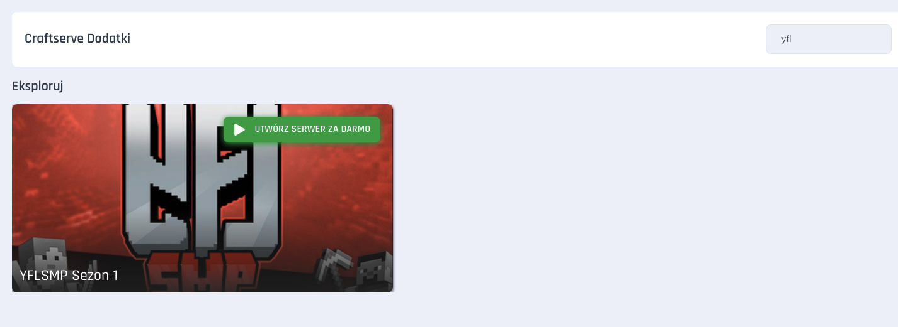
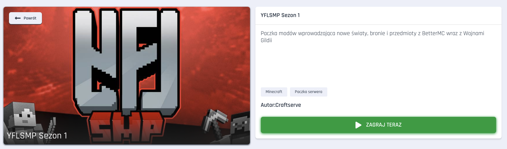
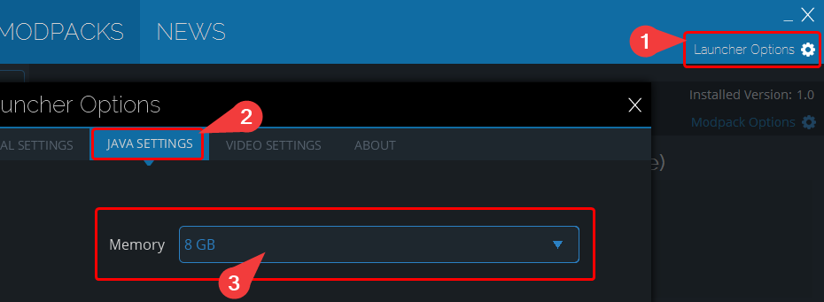

# Instalacja paczki YFLsmp

### Wymagania

- Serwer Minecraft na Craftserve działający na pakiecie Amethyst

<a id="server"></a>

### Instalacja na serwerze

1. Zainstaluj paczkę [YFLsmp z Galerią Dodatków](https://craftserve.com/m/yflsmp-s1).

   - Możesz to zrobić w zakładce **Dodatki** wyszukując frazę `yfl`.

     

   - Po wejściu w odpowiednią paczkę należy kliknąć zielony przycisk **ZAGRAJ TERAZ**.

     

2. Uruchom serwer.
3. Jeśli chciałbyś skorzystać z voicechatu, powiadom o tym support([utwórz nowe zgłoszenie](https://craftserve.com/contact)).

<a id="client"></a>

### Instalacja na komputerach graczy

By można było dołączyć do serwera, gracz musi mieć zainstalowaną paczkę YFLsmp. Podążaj za poniższymi krokami:

1. [Pobierz TechnicLauncher](https://www.technicpack.net/download).
2. Zainstaluj TechnicLauncher. Do uruchomienia wymagana jest Java wersji 8, najlepiej w środowisku [Adoptium](https://adoptium.net/en-GB/temurin/releases/?version=8).
   - Warto wspomnieć, że **wymagana jest wersja Javy dla architektury x64**.
   - W przypadku systemu Windows, należy wybrać tę wersję:

     
3. Uruchom TechnicLauncher i zaloguj się do niego.
4. W zakładce **Modpacks** w wyszukiwarce wklej poniższy link:
   ```
   https://www.technicpack.net/modpack/yflsmp-csrv.1959773
   ```
5. Zainstaluj paczkę za pomocą przycisku **Install**.

   

6. Warto upewnić się, że przypisana została odpowiednia ilość pamięci RAM dla paczki.

   - W przypadku YFLsmp zalecane jest przypisanie **8GB pamięci RAM**(jeśli posiadasz co najmniej 16GB w komputerze, w przeciwnym razie rekomendowane jest co najmniej **5GB**).
   - W TechnicLauncher, aby zmienić ilość pamięci RAM, należy wybrać **Launcher Options**, a następnie **Java Settings**.
   - W polu **Memory** wybierz odpowiednią wartość.

     

   - Przy okazji warto sprawdzić, czy została wybrana odpowiednia wersja Javy. Wybierz tą pobraną w kroku 2.

7. Uruchom paczkę YFLsmp.

#### Najczęściej występujące problemy

- Zła wersja Java (x32), należy zainstalować wersję x64.
- Zalogowanie się do launchera, należy upewnić się, czy dane są poprawne i próbować zalogować się ponownie.
- Crash na etapie ładowania, trzeba pamiętać o ustawieniu zalecanych wartości RAM.
- Nie działający voice chat (nie słychać innych lub Ciebie), należy skonfigurować PlasmoVoice pod siebie (zobacz niżej).
- Po wejściu na serwer dźwięk jest cichy, należy w ustawieniach gry zmienić poziom głośności o parę procent.
  

#### Konfiguracja PlasmoVoice

Domyślnie ustawienia PlasmoVoice są pod przyciskiem `MouseButton4`(dolny boczny przycisk myszy), aby to zmienić należy wejść w menu gry, `Options` -> `Controls` -> `Key Binds` i wyszukać `voice` i zmienić przycisk, na którym mają uruchamiać się ustawienia voice chatu.


Po otwarciu ustawień voice chatu widoczne jest wiele opcji, które można dostosować do swoich potrzeb. Warto zwrócić uwagę na:

- `Output Device` - urządzenie wyjściowe, na którym będzie słychać głos graczy.
- `Voice chat volume` - 100% - poziom głośności innych graczy.
- `Priority volume` - 100%.
- `Microphone` - mikrofon, którego chcesz używać do porozumiewania się z innymi graczami.
- `Microphone volume` - 100% - poziom głośności mikrofonu.
- `Voice distance` - 16 - odległość w blokach, w której gracze będą słyszalni.
- `Activation type` - Push-to-talk - tryb przechwytywania twojego głosu.

W zakładce `Advanced` ustaw wszystko na `OFF` oprócz:

- `Visualise voice distance`: ON
- `Separate priority volume`: ON

`HRTF` - powinno być ustawione na `OFF`, przez to często inni gracze są ledwo słyszalni.
Jeśli występują problemy z dźwiękiem, należy włączyć i wyłączyć `HRTF`.

### Uwagi

- W przypadku problemów z dołączeniem do serwera spróbuj powtórzyć instalację na serwerze.
- Mob **stalker z dodatku deeperdarker crashuje** graczy w pobliżu (wyrzuca im minecrafta) można go znaleźć w 'dzbankach', które są w warden city - jeśli się zrespi, trzeba go zabić komendą
  ```
  /kill @e[type=deeperdarker:stalker]
  ```
- Nie można respić Poltergaista, jeśli go zrespimy niektóre chunki mogą przywrócić się do stanu pierwotnego
