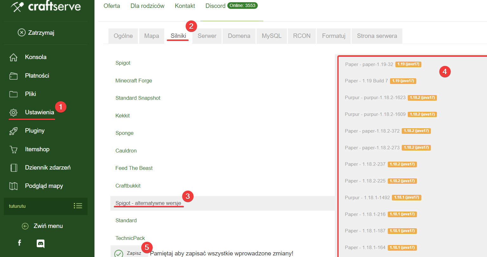

## Choosing the Right Engine
To use anti-xray without the need to install additional plugins, you need to upload the `Paper` engine or its forks (**Purpur, Yatopia**) to your server and select the appropriate server version. To do this on the [**Craftserve**](https://craftserve.pl/) hosting platform, go to the **Settings** tab and then select `Engines`. In the next step, go to the `Spigot - alternative versions` category, select the desired engine, and save the change at the bottom of the page.



## Mode Descriptions
Anti-xray can operate in two different modes:
* `engine-mode: 1`: Ores are replaced with stone, but only those that do not neighbor air or liquid blocks (water or lava). When x-ray is enabled, only those ores that could not be hidden by adjacent blocks will be visible.

* `engine-mode: 2`: Ores are not hidden, but stone, andesite, diorite are replaced with random ore veins that the player cannot distinguish from real ores. Fake ores turn into real blocks when an air or liquid block is adjacent to them. If there are server lags, random ores may occasionally appear while digging, but the player won't be able to mine them.

### Selected Modes for the Overworld


### Selected Modes for the Nether


## Configuration Files for `1.19`
There are four files where you configure anti-xray:
* `paper-world-defaults` - This file is located in the **config** folder in the main server directory. It contains settings for all worlds, meaning that if we add a block here, it will be hidden in the Overworld, Nether, etc. By default, when opening this file, we should see the following text at line 16:
```yml
anticheat:
  anti-xray:
    enabled: false
    engine-mode: 1
    hidden-blocks:
    - copper_ore
    - deepslate_copper_ore
    - gold_ore
    - deepslate_gold_ore
    - iron_ore
    - deepslate_iron_ore
    - coal_ore
    - deepslate_coal_ore
    - lapis_ore
    - deepslate_lapis_ore
    - mossy_cobblestone
    - obsidian
    - chest
    - diamond_ore
    - deepslate_diamond_ore
    - redstone_ore
    - deepslate_redstone_ore
    - clay
    - emerald_ore
    - deepslate_emerald_ore
    - ender_chest
```
* `paper-world`  
  * From the **world** folder
  * From the **world_nether** folder
  * From the **world_the_end** folder  

In each of the above files, there are settings for separate worlds. One does not affect the operation of the other. Compared to the previous file, after opening one of these files, you will only see a few lines, for example, for `paper-world` from **world**:
```yml
# This is a world configuration file for Paper.
# This file may start empty but can be filled with settings to override ones in the config/paper-world-defaults.yml
# 
# World: world (minecraft:overworld)

_version: 28
```
To enable anti-xray, simply copy and paste the settings below into the files.

## Recommended Settings for Engine-mode: 1
### For `paper-world-defaults`
```yml
anticheat:
  anti-xray:
    enabled: true
    engine-mode: 1
    hidden-blocks:
    - chest
    - coal_ore
    - deepslate_coal_ore
    - copper_ore
    - deepslate_copper_ore
    - raw_copper_block
    - diamond_ore
    - deepslate_diamond_ore
    - emerald_ore
    - deepslate_emerald_ore
    - gold_ore
    - deepslate_gold_ore
    - iron_ore
    - deepslate_iron_ore
    - raw_iron_block
    - lapis_ore
    - deepslate_lapis_ore
    - redstone_ore
    - deepslate_redstone_ore
    - ancient_debris
    - nether_gold_ore
    - nether_quartz_ore
    lava-obscures: false
    max-block-height: 90
    update-radius: 2
    use-permission: false
```
### For `paper-world`
- From **world**
```yml
anticheat:
  anti-xray:
    enabled: true
    engine-mode: 1
    hidden-blocks:
    - chest
    - coal_ore
    - deepslate_coal_ore
    - copper_ore
    - deepslate_copper_ore
    - raw_copper_block
    - diamond_ore
    - deepslate_diamond_ore
    - emerald_ore
    - deepslate_emerald_ore
    - gold_ore
    - deepslate_gold_ore
    - iron_ore
    - deepslate_iron_ore
    - raw_iron_block
    - lapis_ore
    - deepslate_lapis_ore
    - redstone_ore
    - deepslate_redstone_ore
    lava-obscures: false
    max-block-height: 64
    update-radius: 2
    use-permission: false
```
- From **world_nether**
```yml
anticheat:
  anti-xray:
    enabled: true
    engine-mode: 1
    hidden-blocks:
    - ancient_debris
    - nether_gold_ore
    - nether_quartz_ore
    max-block-height: 128
```
- From **world_the_end**
```yml
anticheat:
  anti-xray:
    enabled: false
```

## Recommended Settings for Engine-mode: 2
### For `paper-world-defaults`
```yml
anticheat:
  anti-xray:
    enabled: true
    engine-mode: 2
    hidden-blocks:
    - air
    - copper_ore
    - deepslate_copper_ore
    - raw_copper_block
    - diamond_ore
    - deepslate_diamond_ore
    - gold_ore
    - deepslate_gold_ore
    - iron_ore
    - deepslate_iron_ore
    - raw_iron_block
    - lapis_ore
    - deepslate_lapis_ore
    - redstone_ore
    - deepslate_redstone_ore
    - ancient_debris
    - bone_block
    - glowstone
    - magma_block
    - nether_bricks
    - nether_gold_ore
    - nether_quartz_ore
    - polished_blackstone_bricks
    lava-obscures: false
    max-block-height: 64
    replacement-blocks:
    - chest
    - amethyst_block
    - andesite
    - budding_amethyst
    - calcite
    - coal_ore
    - deepslate_coal_ore
    - deepslate
    - diorite
    - dirt
    - emerald_ore
    - deepslate_emerald_ore
    - granite
    - gravel
    - oak_planks
    - smooth_basalt
    - stone
    - tuff
    - netherrack
    - soul_sand
    - soul_soil
    - basalt
    - blackstone
    update-radius: 2
    use-permission: false
```
### For `paper-world`

- From **world**
```yml
anticheat:
  anti-xray:
    enabled: true
    engine-mode: 2
    hidden-blocks:
    - air
    - copper_ore
    - deepslate_copper_ore
    - raw_copper_block
    - diamond_ore
    - deepslate_diamond_ore
    - gold_ore
    - deepslate_gold_ore
    - iron_ore
    - deepslate_iron_ore
    - raw_iron_block
    - lapis_ore
    - deepslate_lapis_ore
    - redstone_ore
    - deepslate_redstone_ore
    lava-obscures: false
    max-block-height: 64
    replacement-blocks:
    - chest
    - amethyst_block
    - andesite
    - budding_amethyst
    - calcite
    - coal_ore
    - deepslate_coal_ore
    - deepslate
    - diorite
    - dirt
    - emerald_ore
    - deepslate_emerald_ore
    - granite
    - gravel
    - oak_planks
    - smooth_basalt
    - stone
    - tuff
    update-radius: 2
    use-permission: false
```
- From **world_nether**
```yml
anticheat:
  anti-xray:
    enabled: true
    engine-mode: 2
    hidden-blocks:
    - air
    - ancient_debris
    - bone_block
    - glowstone
    - magma_block
    - nether_bricks
    - nether_gold_ore
    - nether_quartz_ore
    - polished_blackstone_bricks
    max-block-height: 128
    replacement-blocks:
    - basalt
    - blackstone
    - gravel
    - netherrack
    - soul_sand
    - soul_soil
```
- From **world_the_end**
```yml
anticheat:
  anti-xray:
    enabled: false
```

## Example Configured Files
- `paper-world-defaults` <br>


- `paper-world` (here the Nether) <br> 


## Source
https://docs.papermc.io/paper/anti-xray
