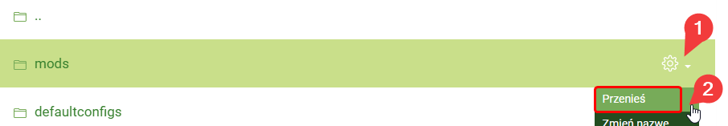

# Installing BetterMC Modpack (Fabric)

### Requirements

* A Minecraft server supporting Fabric mods (for Craftserve: Diamond or KM package)

### Installation

1. Remove the current map files from the server. You can use the **Format** -> **All files** function found in the settings.
*Note: Formatting the server will result in the loss of all files, including all items saved on the map.*

    
2. Select the appropriate Fabric engine for the BetterMC modpack version (in this case: 1.19.2).
   - You can set the Fabric engine in the **Settings** -> **Engines** -> **Cauldron** tab in the Craftserve panel.
   
     
   - Remember to save the engine after selecting it. To do this, go to the bottom of the page and click the **Save** button.
   
     
3. Download the BetterMC server pack from [**THIS PAGE**](https://www.curseforge.com/minecraft/modpacks/better-mc-fabric/files).

    
4. Upload the downloaded zip to the server using [FTP](ftp.md).
5. Go to the Craftserve panel and select the **Files** tab.
6. Find the uploaded zip file and select the **Unzip** option next to it.

    
    - Choose **/** as the destination folder.

      
7. After unpacking, you can delete the zip file.
8. In the main server folder, a folder containing the BetterMC pack should appear. Open it.
9. Move the files from this folder to the main server folder. Mainly, focus on the **mods**, **config**, **defaultconfigs** folders, and the **server.properties** file.
    - You can use the **Move** function for each of these items, selecting **/** as the destination folder.

      
10. Delete the folder with the unpacked BetterMC pack as it no longer contains important files.
11. Start the server and wait for it to launch.

### Notes
- Access to the server is only possible if the player has the same version of the BetterMC modpack installed.
- If there are issues starting the server, check if the Fabric engine version is compatible with the BetterMC modpack version.
- [BetterMC modpack page](https://www.curseforge.com/minecraft/modpacks/better-mc-fabric)
