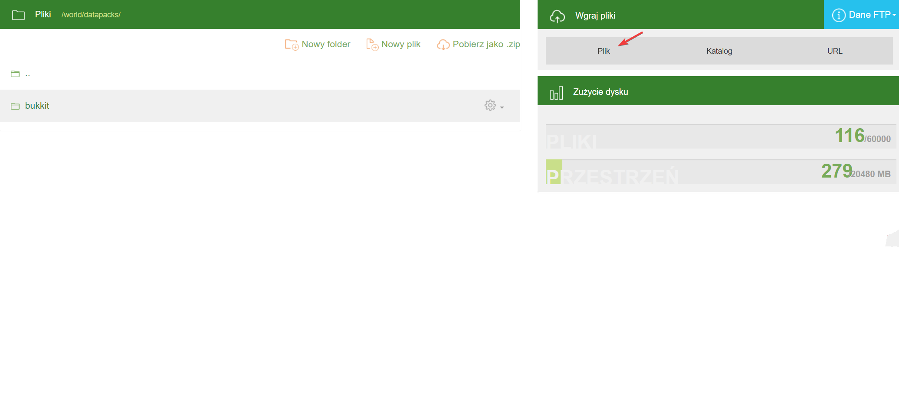
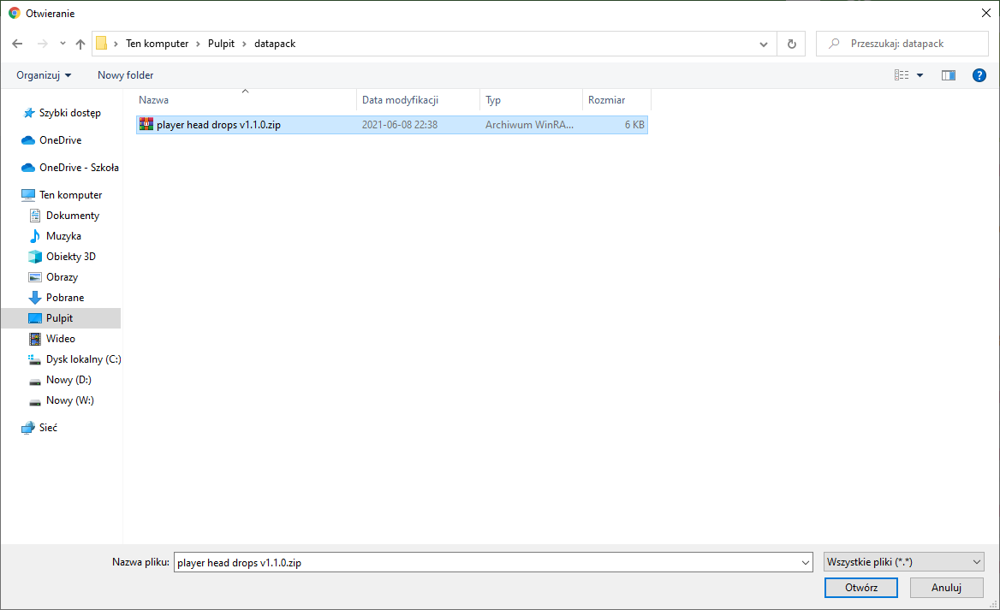
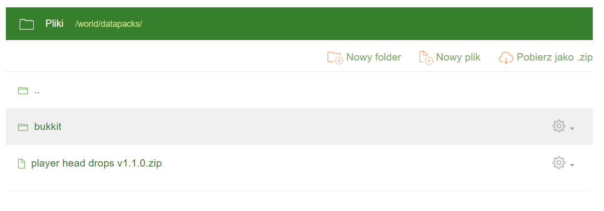

# Installing Datapacks
To upload a datapack to the server, we first need to download it from a source. You can find datapacks on websites such as [Planet Minecraft](https://www.planetminecraft.com/data-packs/), [Vanilla Tweaks](https://vanillatweaks.net/picker/datapacks/), and [VoodooBeard](http://mc.voodoobeard.com/).

Next, in the server files, open the **world** folder, and within it, the **datapacks** folder. There, you will upload your datapacks **in .zip format**. To do this, click the **File** button under the **Upload Files** tab.

Then, select your datapack and click **Open**.

After this, your datapack should appear in the server panel.

Next, start the server and enter the command **/minecraft:reload** or, if that doesn't exist, **/reload**.

## Datapacks can also be uploaded via [FTP](https://github.com/Craftserve/docs/blob/master/ftp.md). Most people find this method of uploading files more convenient.
