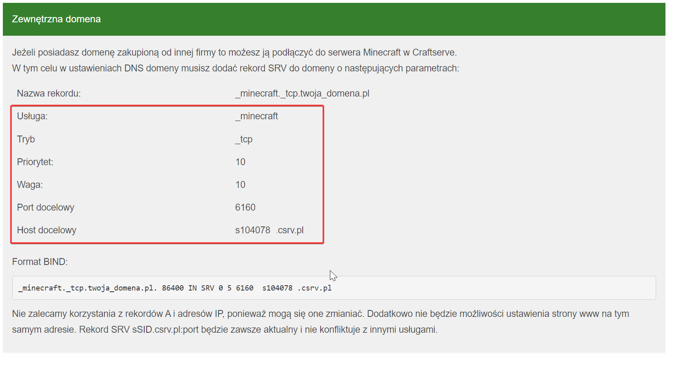

# Setting Up Your Own Domain for a Minecraft Server

### Requirements

  * A purchased domain from one of the available services (e.g., [OVH](https://www.ovhcloud.com/us/domains/))
  * A Minecraft server

### Steps

1. Open the DNS record management panel for your domain.
    - Typically, the panel looks like this:
    - 
2. Add a new SRV record.
    - Copy the required data from the Craftserve panel, specifically from the **Settings** -> **Domain** -> **External Domain** tab. It looks like this:
    - 
    - An example SRV record looks like this:
    - 
    - In the subdomain/name field, enter the subdomain where the server should be available. If you want the server to work on the main domain, leave this field with the value `_minecraft._tcp.domena.pl` (sometimes the suffix is automatically added).
3. Save the changes. **Updating the record may take anywhere from a few minutes to a few hours**.

### Notes
- It should be noted that domain configuration can vary depending on the service where the domain was purchased. For other services, you will need to find the appropriate DNS management panel.
- To connect to the server, enter your domain in the server address field in Minecraft. For the main domain, enter `domena.pl`; for a subdomain, enter
 `subdomena.domena.pl`.
