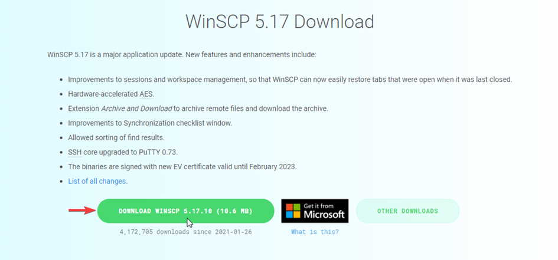
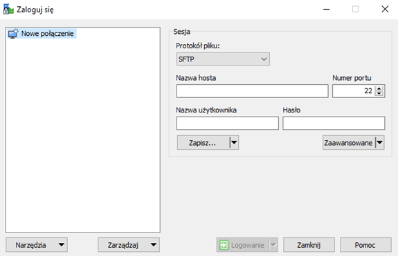
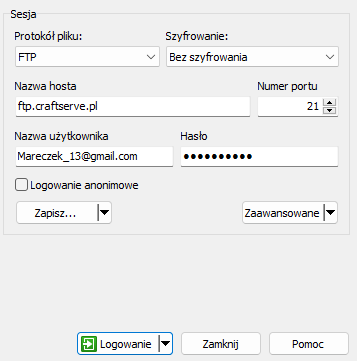
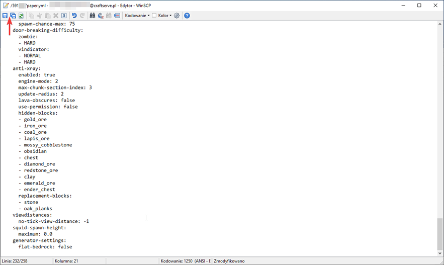

# FTP Guide - Connecting to Craftserve

The most convenient way to edit server files is by using FTP.
One of the best programs that support this protocol is WinSCP.

## Installation
To download it, go to [this page](https://winscp.net/eng/download.php).
Then click the **DOWNLOAD** button.

## Logging into the Server
After installing and opening the program, the following window should appear:

If you don't see it, or if you accidentally closed it, you can open it by clicking the **New session** button in the top-left corner of the program.

To connect to your server, follow these steps:
- Select **File protocol**: FTP
- In **Host name**, enter: ftp.craftserve.pl
- In **User name**, enter the email address associated with your Craftserve account
- In **Password**, enter the password for your Craftserve account
- Select port **21**
Example of correct form filling:

After filling out the form, click the **Login** button. If everything is done correctly, you should be connected to the server.

## How to Use
The WinSCP window is divided into two sections - one for local files (your computer) and one for remote files (the server):

In the window labeled **1**, you’ll find the files on your computer. This allows you to quickly navigate to any folder or drive.

Window **2** shows the server files - each folder with a numerical name corresponds to a server assigned to the account (e.g., `000001` is the server files for `s000001.csrv.pl`).

To access the files of a specific server, open the corresponding folder:

To upload a file to the server, simply drag it from the first window to the second, or from your desktop to the second window.

By double-clicking on a **text file**, you can edit it. After making changes, remember to save it. You can do this using the **Ctrl + S** keyboard shortcut or by clicking the button in the top-left corner:

## Notes

For the server to load all your changes, it must be **restarted**. Using the `/reload` command **is not safe** on servers with mods or plugins, as it often causes errors.

To download a file from the server to your computer, select the file and press **F5** — this will transfer the selected file to the folder open in the left part of WinSCP. Alternatively, you can drag the file to your desktop or into a folder.

**NOTE** Uploading your own server engine will fail. Craftserve only allows the use of engines found in the **Settings/Engines** tab. If you need an engine that is not listed in this tab, you can contact support to request it to be uploaded.
