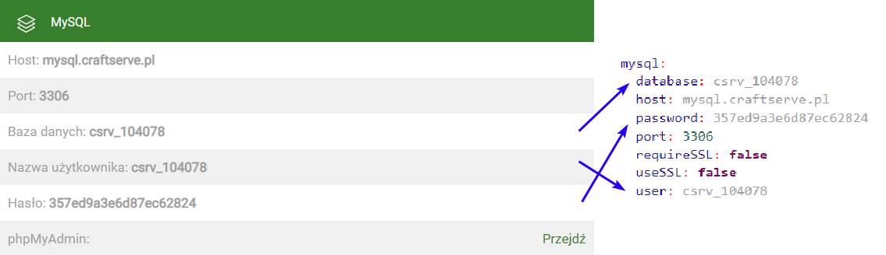

# Installation and Configuration of LogBlock on Craftserve

### Requirements

* A Minecraft server supporting plugins (Spigot, Paper, Purpur, etc.)
* LogBlock plugin
* A created MySQL database (Craftserve panel -> Settings -> MySQL -> Create)

### Installation and Connecting to the Database

1. Stop the server.
2. Download the LogBlock plugin for your server version:
    - [1.13.2](https://www.iani.de/jenkins/job/LogBlock/64/artifact/target/LogBlock.jar)
    - [1.14.4](https://www.iani.de/jenkins/job/LogBlock/90/artifact/target/LogBlock.jar)
    - [1.15.2](https://www.iani.de/jenkins/job/LogBlock/99/artifact/target/LogBlock.jar)
    - [1.16.5](https://www.iani.de/jenkins/job/LogBlock/132/artifact/target/LogBlock.jar)
    - [1.17.1/1.18.2](https://www.iani.de/jenkins/job/LogBlock/161/artifact/target/LogBlock.jar)
    - [1.19](https://www.iani.de/jenkins/job/LogBlock/lastSuccessfulBuild/artifact/target/LogBlock.jar)
3. Place the downloaded plugin into the `plugins` folder on your server. You can use [FTP](ftp.md) or the Craftserve panel (Files tab).
4. Start the server.
5. If the following message does not appear in the console:
   ```
   [de.diddiz.lib.com.zaxxer.hikari.HikariDataSource] LogBlock-Connection-Pool - Start completed.
   ```
   it means the plugin was not automatically configured by Craftserve. **Restart the server**.
6. If the message from step 5 still does not appear, manual configuration is required:
    - Stop the server.
    - Open the `config.yml` file located in the `plugins/LogBlock` folder.
    - Find the `mysql` section in the file and fill it with the data from the Craftserve panel (Settings -> MySQL tab).
    
      The `host`, `port`, `requireSSL`, and `useSSL` values are the same for all servers on Craftserve, as shown in the image above.
    - Save the file.
    - Start the server.

### Configuration

#### Permissions

To allow players to check block history using a wooden pickaxe, appropriate permissions must be granted. This can be done using the [LuckPerms](https://luckperms.net/) plugin.

Permissions can be assigned as follows:

For all players:
```
/lp group default permission set PERMISSION
```

For a specific player:
```
/lp user PLAYER permission set PERMISSION
```

Most commonly used LogBlock permissions:

| Permission         | Description                                                                                                               |
|--------------------|--------------------------------------------------------------------------------------------------------------------------|
| logblock.lookup   | Allows searching for block history using the `/lb lookup` command                                                         |
| logblock.tools.tool | Grants access to the `/lb tool` command to summon a wooden pickaxe and use it to check the history of a clicked block |
| logblock.spawntools | Useful for blocking the ability to summon a wooden pickaxe (set to false)                                               |

The rest of the permissions can be found in the [plugin documentation](https://github.com/LogBlock/LogBlock/wiki/Permissions).

Example commands for assigning permissions:
```
/lp group default permission set logblock.lookup
/lp group default permission set logblock.tools.tool
```
### Logging Chest Access History

By default, the plugin does not log chest access history. To enable this, follow these steps:

1. Open the `world.yml` file (named after the world) in the `plugins/LogBlock` folder.
2. Locate `CHESTACCESS` and set its value to `true`.

   
3. Save the file.
4. Restart the server.

This process must be repeated for each world on the server.

### Notes

* [Plugin Documentation](https://github.com/LogBlock/LogBlock/wiki)
* [Plugin Page on spigotmc.org](https://www.spigotmc.org/resources/logblock.67333/)