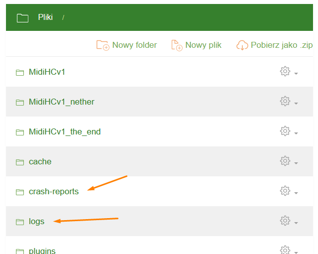

Logs and Crash Reports
=====================

Table of Contents
-----------

* [Basics](#basics)
* [How to Interpret Logs](#interpretation)
* [Common Errors](#errors)

<a name="basics"><h2>Basics</h2></a>

Is your server failing to start, or is a newly installed plugin or mod not working? The first place you should check is the **/logs/** and **/crash-reports/** folders on your server:

Each file in the **/logs/** folder contains a full log of a specific server session. The most important file is **latest.log** (**fml-server-latest.log** in some versions of Forge) - it contains information from the latest server session. **Each time the server starts, this file is overwritten**, and the old log is archived into a **tar.gz** file named with the date of the server launch.

Crash reports can be found in the **crash-reports** folder - their names include the date and time of the crash. A crash report contains a summarized version of the log along with the circumstances under which the server crashed.

# REMEMBER!
**Send the *latest.log* file** before asking any questions about a crashed server or a malfunctioning plugin on our Discord.

<a name="interpretation"><h2>How to Interpret Logs</h2></a>

<h3>What Are Logs?</h3>

A log is a chronologically ordered list of significant events from a single server session. Each log entry is timestamped, making it easier to locate relevant events.

In the log file, you'll find information such as server startup parameters, the loading of each mod or plugin, world generation, and even mob population.

The primary goal of logs is readability - well-structured logs should be understandable for an average server administrator without programming knowledge. Basic English skills combined with Google search are usually enough to interpret them.

<h5>Example 1: Starting a Forge Server</h5>

Let's assume we have a Forge server. Looking into the **latest.log** file, we notice that many lines are written in simple English.

    [17:31:30] [Server thread/INFO] [FML]: MinecraftForge v14.23.5.2847 Initialized
    [17:31:30] [Server thread/INFO] [FML]: Starts to replace vanilla recipe ingredients with ore ingredients.
    [17:31:31] [Server thread/INFO] [FML]: Invalid recipe found with multiple oredict ingredients in the same ingredient...
    [17:31:31] [Server thread/INFO] [FML]: Replaced 1227 ore ingredients
    [17:31:31] [Server thread/INFO] [FML]: Config directory created successfully
    [17:31:31] [Server thread/INFO] [FML]: Searching /home/servers/684256/./mods for mods
    [17:31:32] [Server thread/INFO] [FML]: Forge Mod Loader has identified 4 mods to load
    [17:31:32] [Server thread/WARN] [FML]: Missing English translation for FML: assets/fml/lang/en_us.lang
    [17:31:33] [Server thread/INFO] [FML]: Attempting connection with missing mods [minecraft, mcp, FML, forge] at CLIENT
    [17:31:33] [Server thread/INFO] [FML]: Attempting connection with missing mods [minecraft, mcp, FML, forge] at SERVER
    [17:31:33] [Server thread/INFO] [FML]: Processing ObjectHolder annotations
    [17:31:33] [Server thread/INFO] [FML]: Found 1169 ObjectHolder annotations
    [17:31:33] [Server thread/INFO] [FML]: Identifying ItemStackHolder annotations
    [17:31:33] [Server thread/INFO] [FML]: Found 0 ItemStackHolder annotations
    [17:31:33] [Server thread/INFO] [FML]: Configured a dormant chunk cache size of 0

<h3>Keywords</h3>

When troubleshooting issues, **keywords** preceding each log entry are useful. As shown in **Example 1**, each entry is preceded by tags: `[17:31:33] [Server thread/INFO] [FML]`.

* `[17:31:33]` - This is the timestamp of the event. Sometimes the date is also included.
* `[FML]` - Appears only in Forge server logs - it stands for Forge Mod Loader.
* `[Server thread/INFO]` - The most important tag; `Server thread` refers to the process, while `INFO` **indicates the type of log entry**.

**Knowing the log entry types helps us identify the issue!**
* `INFO` - Informational entry. Usually indicates a successful action. In most cases, we can ignore **INFO** lines when troubleshooting.
* `WARN` - A warning. Often appears when the server encounters an exception but can still run (see **Example 2: AuthMe - protectInventory**).
* `ERROR` - A severe issue preventing the server (or a plugin) from running properly (see **Examples 4 and 5**).

If the server is malfunctioning, the first step is to open **latest.log** (without starting the server - **each launch overwrites latest.log**) and search (**CTRL + F**) for entries labeled `WARN` or `ERROR`.

<a name="errors"><h2>Common Errors and How to Identify Them in Logs</h2></a>

<h5>Example 2: WARN - AuthMeReloaded and Non-Working protectInventory</h5>

Let's assume we've installed AuthMe, and the plugin correctly handles registration, but one of its features - protectInventory - does not work. As a result, an unlogged-in player's inventory is unprotected. If that player dies, they will lose their items (which should not happen).

Searching for `WARN` entries, we find:

    [17:23:17] [Server thread/INFO]: [AuthMe] Enabling AuthMe v5.6.0-SNAPSHOT-b2325
    [17:23:18] [Server thread/INFO]: [AuthMe] SQLite Setup finished
    [17:23:18] [Server thread/INFO]: [AuthMe] No supported permissions system found! Permissions are disabled!
    [17:23:19] [Server thread/INFO]: [AuthMe] [LICENSE] This product includes GeoLite2 data created by MaxMind, available at https://www.maxmind.com
    [17:23:19] [Server thread/INFO]: [AuthMe] Essentials spawn file not found: '/home/servers/683508/plugins/Essentials/spawn.yml'
    [17:23:19] [Server thread/WARN]: [AuthMe] WARNING! The protectInventory feature requires ProtocolLib! Disabling it...

As seen in the last line, labeled with `WARN`, protectInventory requires the ProtocolLib plugin to function. Installing it will ensure that unlogged-in players' inventories are protected!

<h5>Example 3: WARN - AuthMe and a Server That Won't Start</h5>

We've installed AuthMeReloaded, but the server refuses to start. Searching for `WARN`, we find:

    [10:52:08] [Server thread/INFO]: [AuthMe] Enabling AuthMe v5.6.0-beta1-b2226
    [10:52:09] [Server thread/INFO]: [AuthMe] SQLite Setup finished
    [10:52:09] [Server thread/INFO]: [AuthMe] Hooked into LuckPerms!
    [10:52:09] [Server thread/INFO]: [AuthMe] Hooked successfully into Essentials  
    [10:52:09] [Server thread/WARN]: [AuthMe] Aborting initialization of AuthMe: [InjectorReflectionException]: Could not invoke constructor of class 'class fr.xephi.authme.command.CommandHandler'
    [10:52:09] [Server thread/WARN]: [AuthMe] THE SERVER IS GOING TO SHUT DOWN AS DEFINED IN THE CONFIGURATION!

The second-to-last log entry roughly explains the issue. AuthMe was unable to call the constructor (initialization method) of the command handling object, making further plugin loading impossible (or rather pointless).

The last line, however, tells us that to protect our server from griefers, AuthMe simply shut it down because it couldn't handle registration and login.

Since this entire issue is the result of a developer error, in this case, simply installing a newer version of AuthMeReloaded will resolve the problem.

### Example 4. ERROR - Unconfigured Plugin

We uploaded the LogBlock plugin to our server to better protect our cubic world from malicious players. Unfortunately, the plugin does not load, and the `/plugins` command displays it in red.

Searching for `ERROR`, we find:

    [22:50:03] [Server thread/INFO]: [LogBlock] Enabling LogBlock v1.14.1-SNAPSHOT (build #65)
    [22:50:03] [Server thread/INFO]: [LogBlock] Connecting to username@jdbc:mysql://localhost:3306/minecraft...
    [22:50:03] [Server thread/INFO]: LogBlock-Connection-Pool - Starting...
    [22:50:04] [Server thread/ERROR]: LogBlock-Connection-Pool - Exception during pool initialization.
    com.mysql.jdbc.exceptions.jdbc4.CommunicationsException: Communications link failure

The line tagged with `ERROR` (the last one) informs us that an exception occurred during the connection pool initialization. Reading a few lines above, we see that we need to provide MySQL database credentials, as LogBlock attempted to connect using sample data `username@jdbc:mysql://localhost:3306/minecraft`.

<h5>Example 5. ERROR - Map Corruption</h5>

We played for some time on version 1.14.4, but due to severe lag, we downgraded to version 1.12.2. However, now the server won't start. In the logs, we find:

    [17:31:36] [Server thread/INFO] [net.minecraft.server.MinecraftServer]: Preparing start region for level 0
    [17:31:36] [Server thread/WARN] [net.minecraft.world.chunk.Chunk]: Could not set level chunk heightmap, array length is 0 instead of 256
    [17:31:36] [Server thread/ERROR] [net.minecraft.server.MinecraftServer]: Encountered an unexpected exception
    java.lang.IllegalArgumentException: ChunkNibbleArrays should be 2048 bytes not: 0
        at net.minecraft.world.chunk.NibbleArray.<init>(SourceFile:16) ~[axs.class:?]
        at net.minecraft.world.chunk.storage.AnvilChunkLoader.func_75823_a(AnvilChunkLoader.java:450) ~[aye.class:?]
        at net.minecraft.world.chunk.storage.AnvilChunkLoader.checkedReadChunkFromNBT__Async(AnvilChunkLoader.java:129) ~[aye.class:?]
        at net.minecraft.world.chunk.storage.AnvilChunkLoader.loadChunk__Async(AnvilChunkLoader.java:93) ~[aye.class:?]
        at net.minecraftforge.common.chunkio.ChunkIOProvider.run(ChunkIOProvider.java:70) ~[ChunkIOProvider.class:?]
        at net.minecraftforge.common.chunkio.ChunkIOExecutor.syncChunkLoad(ChunkIOExecutor.java:92) ~[ChunkIOExecutor.class:?]
        at net.minecraft.world.gen.ChunkProviderServer.loadChunk(ChunkProviderServer.java:118) ~[on.class:?]
        at net.minecraft.world.gen.ChunkProviderServer.func_186028_c(ChunkProviderServer.java:89) ~[on.class:?]
        at net.minecraft.world.gen.ChunkProviderServer.func_186025_d(ChunkProviderServer.java:135) ~[on.class:?]
        at net.minecraft.server.MinecraftServer.func_71222_d(MinecraftServer.java:344) ~[MinecraftServer.class:?]
        at net.minecraft.server.MinecraftServer.func_71247_a(MinecraftServer.java:314) ~[MinecraftServer.class:?]
        at net.minecraft.server.dedicated.DedicatedServer.func_71197_b(DedicatedServer.java:270) ~[nz.class:?]
        at net.minecraft.server.MinecraftServer.run(MinecraftServer.java:486) [MinecraftServer.class:?]
        at java.lang.Thread.run(Thread.java:748) [?:1.8.0_201]

This time, the log entry contains a fragment of a Java stack trace. We see repeated expressions such as `world.chunk`, `AnvilChunkLoader`, `ChunkProviderServer`, etc., which suggests that our map is corrupted.

In our case, we forgot to delete the map from version 1.14.4. It contains blocks that do not exist in 1.12.2, causing the server to treat it as corrupted. Simply deleting the old world will allow the server to start without any issues.

<h5>Example 6. ERROR - Missing Dependencies</h5>

We uploaded a plugin to the server, but it refuses to load. In the logs, we find:

    [19:23:19] [Server thread/ERROR]: Could not load 'plugins/Modifyworld.jar' in folder 'plugins'
    org.bukkit.plugin.UnknownDependencyException: PermissionsEx

`UnknownDependencyException` means that Modifyworld requires PermissionsEx to function correctly. After installing it, the plugin loads without errors.

<h3>Conclusion</h3>

As we have seen in the examples, diagnosing issues using logs is not difficult. Basic knowledge of English is enough, and if we encounter a problem, it is almost certain that someone else has had the same issue before. **By copying the error line into Google**, we will likely find a solution. And if difficulties arise, feel free to bring the **latest.log** file to the **Craftserve** Discord server for assistance.

